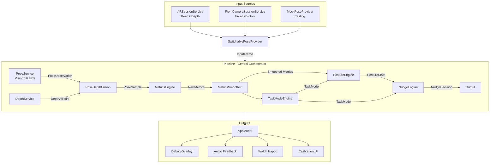

# Detailed Design — Posture Detection App

## Overview

A desk-mounted iPhone app that detects sustained bad posture using computer vision and optionally LiDAR depth sensing, then nudges the user via audio tone and Apple Watch haptic tap. The system prioritizes precision over recall — false alarms erode trust faster than missed slouches.

The architecture separates all posture logic into a testable Swift Package (`PostureLogic`) with protocol-based components, while the app target handles camera input, UI, and device-specific integrations (ARKit, WatchConnectivity, audio).

## Detailed Requirements

### Core Value Loop

Camera → Keypoints → Metrics → Posture State Machine → Nudge → Watch Tap

### Detection Requirements

- **Five posture metrics**: forward creep, head drop, shoulder rounding, lateral lean, twist
- All metrics computed as **deltas from calibrated baseline** (positive = worse)
- Any single metric exceeding its threshold triggers the drifting→bad state timer
- Only **sustained** bad posture (≥5 minutes default) triggers a nudge
- **Never judge posture** when tracking quality is uncertain

### Camera Support

- **Rear camera** (ARKit): RGB + LiDAR depth when available. `ARSessionService` feeds `InputFrame`s
- **Front camera** (AVFoundation): 2D-only. `FrontCameraSessionService` feeds frames with `depthMap: nil`
- Runtime switching via `SwitchablePoseProvider` — Pipeline stays attached once
- Mode persists across launches via UserDefaults

### Calibration

- Guided flow: 3-second countdown → 5-second sampling (≥30 frames)
- Validates positional and angular variance (user held still)
- Median aggregation for baseline computation
- Recalibration triggers: app launch, >5 min absence, manual button, >30% position shift
- Baseline includes: shoulder midpoint, head position, torso angle, shoulder width, shoulder twist, depth availability

### Nudge Behavior

- Dual delivery: audio tone (880Hz sine, ambient category) + Watch haptic
- Cooldown: 10 minutes between nudges
- Max: 2 nudges per hour
- Suppressed during: low tracking quality, stretching, cooldown, max reached
- Nudge reason reflects dominant metric violation
- Acknowledgement: posture correction within 30 seconds resets nudge state

### Task Mode Classification (Phase 2)

- Inferred from 10-second rolling window of movement patterns
- Modes: reading, typing, meeting, stretching, unknown
- Task mode adjusts posture thresholds (reading: 1.3x forward creep leniency; stretching: disabled)

### Success Criteria

| Metric | Target |
|--------|--------|
| Detection rate (golden recordings) | ≥70% of ≥5min slouch episodes trigger nudge |
| False positive rate | <3% of good posture time flagged |
| Task mode accuracy | ≥80% reading/typing correctly classified |
| Recovery detection | Good state within 5s of correction |
| Live nudge count | ≤2/hour during normal work |
| Spurious nudges | Zero during sustained good posture |

### Performance Budgets

| Resource | Limit |
|----------|-------|
| CPU | <15% average on high-performance cores |
| Battery | <5% drain/hour |
| Memory | <100MB steady state |
| Thermal | No `serious` state in 1-hour session |
| Vision FPS | Capped at 10 |
| Depth FPS | Capped at 15 |

### Non-Goals (Until Phase 3+)

- Pretty UI, onboarding, analytics dashboards, cloud sync, accounts
- Custom ML (unless threshold tuning fails after 3 days)
- Saving video by default

## Architecture Overview

### Pipeline Data Flow



### Module Separation

- **PostureLogic (Swift Package)**: All posture math, state machines, engines, models, protocols. Zero UIKit/ARKit dependencies. Fully testable via `swift test`.
- **Quant (App Target)**: Camera services, SwiftUI views, AppModel, WatchConnectivity, audio playback. Device-specific code.

### Runtime Modes

- **DepthFusion mode**: LiDAR depth confidence ≥ medium. 3D positions in meters.
- **TwoDOnly mode**: No depth or low confidence. Normalized 2D positions with shoulder-width scale reference. Automatic switching via `ModeSwitcher` with hysteresis (`depthRecoveryDelay`).

## Components and Interfaces

### Protocols

```swift
protocol PoseProvider {
    var framePublisher: AnyPublisher<InputFrame, Never> { get }
    func start() async throws
    func stop()
}

protocol DebugDumpable {
    var debugState: [String: Any] { get }
}

protocol PoseServiceProtocol: DebugDumpable {
    func process(frame: InputFrame) async -> PoseDetectionResult
}

protocol DepthServiceProtocol: DebugDumpable {
    func sampleDepth(at points: [CGPoint], from frame: InputFrame) -> [DepthAtPoint]
    func computeConfidence(from frame: InputFrame) -> DepthConfidence
}

protocol PoseDepthFusionProtocol: DebugDumpable {
    mutating func fuse(pose: PoseObservation, depthSamples: [DepthAtPoint]?,
                       confidence: DepthConfidence, trackingQuality: TrackingQuality) -> PoseSample?
}

protocol MetricsEngineProtocol: DebugDumpable {
    func compute(from sample: PoseSample, baseline: Baseline?) -> RawMetrics
}

protocol TaskModeEngineProtocol: DebugDumpable {
    func infer(from recentMetrics: [RawMetrics]) -> TaskMode
}

protocol PostureEngineProtocol: DebugDumpable {
    func update(metrics: RawMetrics, taskMode: TaskMode,
                trackingQuality: TrackingQuality) -> PostureState
    func reset()
}

protocol NudgeEngineProtocol: DebugDumpable {
    func evaluate(state: PostureState, trackingQuality: TrackingQuality,
                  movementLevel: Float, taskMode: TaskMode,
                  currentTime: TimeInterval) -> NudgeDecision
    func recordNudgeFired(at currentTime: TimeInterval)
    func recordAcknowledgement()
    func reset()
}

protocol RecorderServiceProtocol: DebugDumpable {
    func startRecording()
    func stopRecording() -> RecordedSession
    func addTag(_ tag: Tag)
    func record(sample: PoseSample)
}

protocol ReplayServiceProtocol: DebugDumpable {
    func load(session: RecordedSession)
    func play() -> AsyncStream<PoseSample>
    func stop()
}

protocol ThermalMonitorProtocol: DebugDumpable {
    var state: AnyPublisher<ThermalState, Never> { get }
}
```

### Pipeline (Central Orchestrator)

```swift
class Pipeline {
    @Published var latestSample: PoseSample?
    @Published var latestMetrics: RawMetrics?
    @Published var currentMode: DepthMode
    @Published var depthConfidence: DepthConfidence
    @Published var trackingQuality: TrackingQuality
    @Published var fps: Float
    @Published var poseConfidence: Float
    @Published var poseKeypointCount: Int
    @Published var missingCriticalJoints: String
    @Published var postureState: PostureState
    @Published var nudgeDecision: NudgeDecision
    @Published var taskMode: TaskMode

    var baseline: Baseline?

    // Orchestrates: PoseService → PoseDepthFusion → MetricsEngine →
    //   MetricsSmoother → PostureEngine → NudgeEngine
    // Includes: frame throttling, temporal tracking quality smoothing
    //   (3-frame majority vote), FPS computation

    func recordNudgeFired()
    func recordNudgeAcknowledgement()
    func resetNudgeEngine()
}
```

## Data Models

### Input

```swift
struct InputFrame {
    let timestamp: TimeInterval
    let pixelBuffer: CVPixelBuffer?
    let depthMap: CVPixelBuffer?
    let cameraIntrinsics: simd_float3x3?
}
```

### Pose Detection

```swift
struct PoseObservation {
    let timestamp: TimeInterval
    let keypoints: [Keypoint]
    let confidence: Float  // 0.0 - 1.0
}

struct Keypoint {
    let joint: Joint
    let position: CGPoint      // Normalized 0-1
    let confidence: Float
}

enum Joint: String, CaseIterable, Codable {
    case nose, leftEye, rightEye, leftEar, rightEar
    case leftShoulder, rightShoulder
    case leftElbow, rightElbow
    case leftWrist, rightWrist
    case leftHip, rightHip
    case leftKnee, rightKnee
    case leftAnkle, rightAnkle
}
```

### Depth

```swift
struct DepthAtPoint {
    let point: CGPoint
    let depth: Float           // Meters
    let confidence: Float
}

enum DepthConfidence: Comparable {
    case unavailable, low, medium, high
}
```

### Fused Sample

```swift
struct PoseSample: Codable {
    let timestamp: TimeInterval
    let depthMode: DepthMode
    let headPosition: SIMD3<Float>
    let shoulderMidpoint: SIMD3<Float>
    let leftShoulder: SIMD3<Float>
    let rightShoulder: SIMD3<Float>
    let torsoAngle: Float
    let headForwardOffset: Float
    let shoulderTwist: Float
    let shoulderWidthRaw: Float    // Raw shoulder width in image coords (0-1)
    let trackingQuality: TrackingQuality
}

enum DepthMode: String, Codable { case depthFusion, twoDOnly }
enum TrackingQuality: Comparable, Codable { case lost, degraded, good }
```

### Metrics

```swift
struct RawMetrics: Codable {
    let timestamp: TimeInterval
    let forwardCreep: Float
    let headDrop: Float
    let shoulderRounding: Float
    let lateralLean: Float
    let twist: Float
    let movementLevel: Float           // 0 = still, 1 = very active
    let headMovementPattern: MovementPattern
}

enum MovementPattern: String, Codable {
    case still, smallOscillations, largeMovements, erratic
}
```

### State & Decisions

```swift
enum PostureState: Codable {
    case absent, calibrating, good
    case drifting(since: TimeInterval)
    case bad(since: TimeInterval)
}

enum TaskMode: String, Codable {
    case unknown, reading, typing, meeting, stretching
}

enum NudgeDecision: Codable {
    case none
    case pending(reason: NudgeReason, timeRemaining: TimeInterval)
    case fire(reason: NudgeReason)
    case suppressed(reason: SuppressionReason)
}

enum NudgeReason: String, Codable { case sustainedSlouch, forwardCreep, headDrop }
enum SuppressionReason: String, Codable {
    case cooldownActive, maxNudgesReached, userStretching
    case lowTrackingQuality, recentAcknowledgement
}
```

### Configurable Thresholds

```swift
struct PostureThresholds: Codable {
    var slouchDurationBeforeNudge: TimeInterval = 300
    var recoveryGracePeriod: TimeInterval = 5
    var driftingToBadThreshold: TimeInterval = 60
    var forwardCreepThreshold: Float = 0.10
    var twistThreshold: Float = 15.0
    var sideLeanThreshold: Float = 0.08
    var headDropThreshold: Float = 0.06
    var shoulderRoundingThreshold: Float = 10.0
    var minTrackingQuality: Float = 0.7
    var minKeypointVisibility: Float = 0.7
    var depthConfidenceThreshold: Float = 0.6
    var nudgeCooldown: TimeInterval = 600
    var maxNudgesPerHour: Int = 2
    var acknowledgementWindow: TimeInterval = 30
    var depthRecoveryDelay: TimeInterval = 2.0
    var absentThreshold: TimeInterval = 3.0
}
```

### Baseline

```swift
struct Baseline: Codable {
    let timestamp: Date
    let shoulderMidpoint: SIMD3<Float>
    let headPosition: SIMD3<Float>
    let torsoAngle: Float
    let shoulderWidth: Float
    let shoulderTwist: Float
    let depthAvailable: Bool
}
```

### Recording

```swift
struct RecordedSession: Codable {
    let id: UUID
    let startTime: Date
    let endTime: Date
    let samples: [PoseSample]
    let tags: [Tag]
    let metadata: SessionMetadata
}

struct Tag: Codable {
    let timestamp: TimeInterval
    let label: TagLabel
    let source: TagSource
}
```

## Error Handling

| Condition | Detection | Response | Timer Behavior |
|-----------|-----------|----------|----------------|
| Vision returns nil pose | `PoseObservation` is nil | Increment `lostFrameCount`, mark quality "degraded" after 10 consecutive frames | Pause slouch timer |
| ARKit tracking lost | `ARFrame.camera.trackingState != .normal` | Set `TrackingQuality.lost`, show "Repositioning..." | Pause slouch timer |
| Depth confidence drops | `DepthConfidence < threshold` | Switch to TwoDOnly mode automatically | Continue timer (2D still works) |
| User leaves frame | No body detected for `absentThreshold` seconds | Set `PostureState.absent` | Reset slouch timer |
| User returns after absence | Body detected after absence | Require new calibration if absence >5 min | Timer starts fresh |
| Thermal throttling | `ProcessInfo.thermalState` changes | Reduce FPS, disable depth, or pause detection | Continue in degraded mode |
| Front camera permission denied | `AVAuthorizationStatus.denied` | Show actionable message with Settings link | Rear mode unaffected |

**Key principle**: When tracking quality is uncertain, *never* judge posture. Only count time toward slouch detection when confidence is high.

## Testing Strategy

### Unit Tests (PostureLogic Package — `swift test`)

- **MetricsEngineTests**: All five metrics computed correctly from known inputs. Baseline subtraction verified. Twist baseline subtraction.
- **PostureEngineTests**: All state transitions. Timer pauses on low quality. Task mode threshold adjustments.
- **NudgeEngineTests**: Fire after duration. Cooldown. Max per hour. Suppression rules. Specific nudge reasons.
- **PoseDepthFusionTests**: 2D fallback. Head position fallback chain. Shoulder width validation.
- **CalibrationTests**: Variance validation. Median aggregation. Stale detection.
- **IntegrationTests**: End-to-end mock frame → pipeline → output.

### App Target Tests (QuantTests — Xcode)

- `SwitchablePoseProvider` forwarding, detach, reattach
- Camera mode persistence in UserDefaults
- AppModel: recalibrate clears persisted baseline
- AppModel: stopMonitoring preserves lifetime subscriptions

### Regression Tests (Golden Recordings — Phase 2)

- Replay recorded sessions through pipeline
- Verify detection rate, false positive rate against success criteria
- At least 4 recordings: good posture, gradual slouch, reading vs typing, depth fallback

### Manual Test Protocol

Each sprint includes manual test steps for on-device verification. Key scenarios:
- 5+ minute run without crash
- Mode switching (depth ↔ 2D, rear ↔ front)
- Calibration accept/reject
- State transitions visible in debug overlay
- Nudge fires at correct time with Watch haptic

## Appendices

### A. Technology Choices

| Choice | Pros | Cons |
|--------|------|------|
| Vision framework (2D) | Works on all iPhones, no ML training needed | Less stable than depth, jittery |
| ARKit + LiDAR (3D) | More stable metrics, absolute distances | Limited devices, higher power |
| Swift Package | Testable without device, fast CI | Can't use UIKit/ARKit directly |
| Combine publishers | Native reactive pipeline, back-pressure | Learning curve, retain cycle risk |
| Exponential moving average | Simple, configurable, low memory | Lag on sudden changes |

### B. Alternative Approaches Considered

- **Custom ML model**: Deferred — protocol architecture supports swap if threshold tuning fails
- **Shadow mode**: Rejected — user prefers immediate feedback
- **ARBodyTrackingConfiguration only**: Rejected — doesn't work on non-LiDAR devices
- **Core Motion for posture**: Rejected — phone is on desk, not on user

### C. Supported Operating Range

- Distance: 0.5m–1.5m (optimal 0.7–1.0m)
- Horizontal: ±15° from center
- Vertical: 0°–30° downward angle
- Good ambient light, no strong backlight
- Phone stable on tripod/stand, upper body visible from shoulders up
