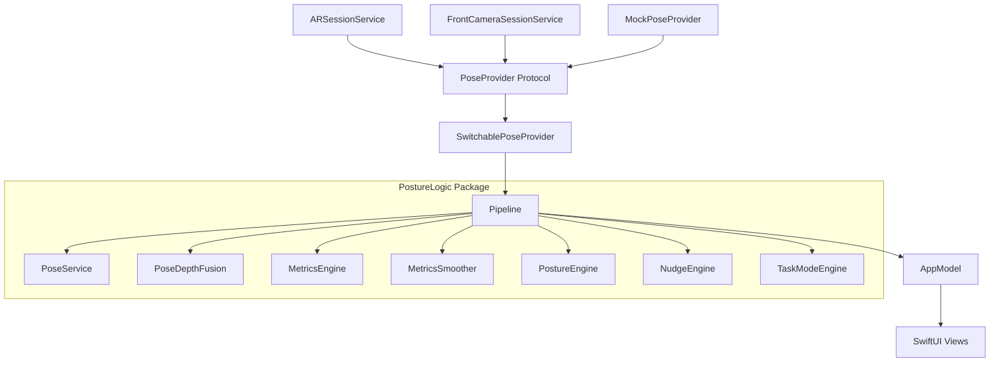
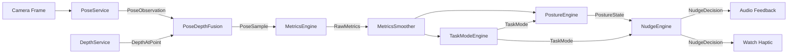

# Research: Architecture & Project Structure

## Project Structure

```
Quant/
├── Quant.xcodeproj
├── Quant/                    # App Target
│   ├── App/
│   │   ├── Quant.swift       # @main entry point
│   │   └── AppModel.swift    # Main observable state
│   ├── Services/
│   │   ├── ARSessionService.swift          # ARKit → PoseProvider
│   │   ├── FrontCameraSessionService.swift # AVFoundation front camera
│   │   ├── SwitchablePoseProvider.swift    # Runtime camera switching
│   │   └── HapticsService.swift            # Audio/haptic feedback
│   ├── Models/
│   │   └── CameraMode.swift               # rearDepth / front2D enum
│   ├── Views/
│   │   ├── ContentView.swift
│   │   ├── DebugOverlayView.swift
│   │   ├── CalibrationView.swift
│   │   └── SettingsView.swift
│   └── Resources/
│       └── Assets.xcassets
│
├── PostureLogic/                           # Swift Package
│   ├── Package.swift
│   ├── Sources/
│   │   └── PostureLogic/
│   │       ├── Protocols/
│   │       │   ├── PoseProvider.swift
│   │       │   ├── DebugDumpable.swift
│   │       │   └── AllProtocols.swift
│   │       ├── Models/
│   │       │   ├── InputFrame.swift
│   │       │   ├── PoseObservation.swift
│   │       │   ├── PoseSample.swift
│   │       │   ├── RawMetrics.swift
│   │       │   ├── PostureState.swift
│   │       │   ├── TaskMode.swift
│   │       │   ├── Baseline.swift
│   │       │   ├── NudgeDecision.swift
│   │       │   ├── TrackingQuality.swift
│   │       │   └── DepthConfidence.swift
│   │       ├── Services/
│   │       │   ├── PoseService.swift
│   │       │   ├── DepthService.swift
│   │       │   ├── PoseDepthFusion.swift
│   │       │   ├── RecorderService.swift
│   │       │   └── ReplayService.swift
│   │       ├── Engines/
│   │       │   ├── MetricsEngine.swift
│   │       │   ├── TaskModeEngine.swift
│   │       │   ├── PostureEngine.swift
│   │       │   └── NudgeEngine.swift
│   │       └── Testing/
│   │           ├── MockPoseProvider.swift
│   │           └── TestScenarios.swift
│   └── Tests/
│       └── PostureLogicTests/
│           ├── PoseServiceTests.swift
│           ├── MetricsEngineTests.swift
│           ├── PostureEngineTests.swift
│           ├── NudgeEngineTests.swift
│           └── IntegrationTests.swift
```

## Module Dependency Graph



## Data Flow Pipeline



## Key Architectural Decisions

| Decision | Rationale |
|----------|-----------|
| Protocol-based architecture | Enables mocking for tests and potential ML swap later |
| Swift Package for logic | Keeps business logic testable and separate from UIKit/ARKit dependencies |
| Pipeline as central orchestrator | Single place for frame throttling, temporal smoothing, FPS computation |
| SwitchablePoseProvider | Allows runtime camera switching without reinitializing Pipeline |
| Exponential moving average for smoothing | Configurable alpha balances responsiveness vs stability |
| 3-frame majority vote for tracking quality | Temporal smoothing prevents jitter in tracking state |
