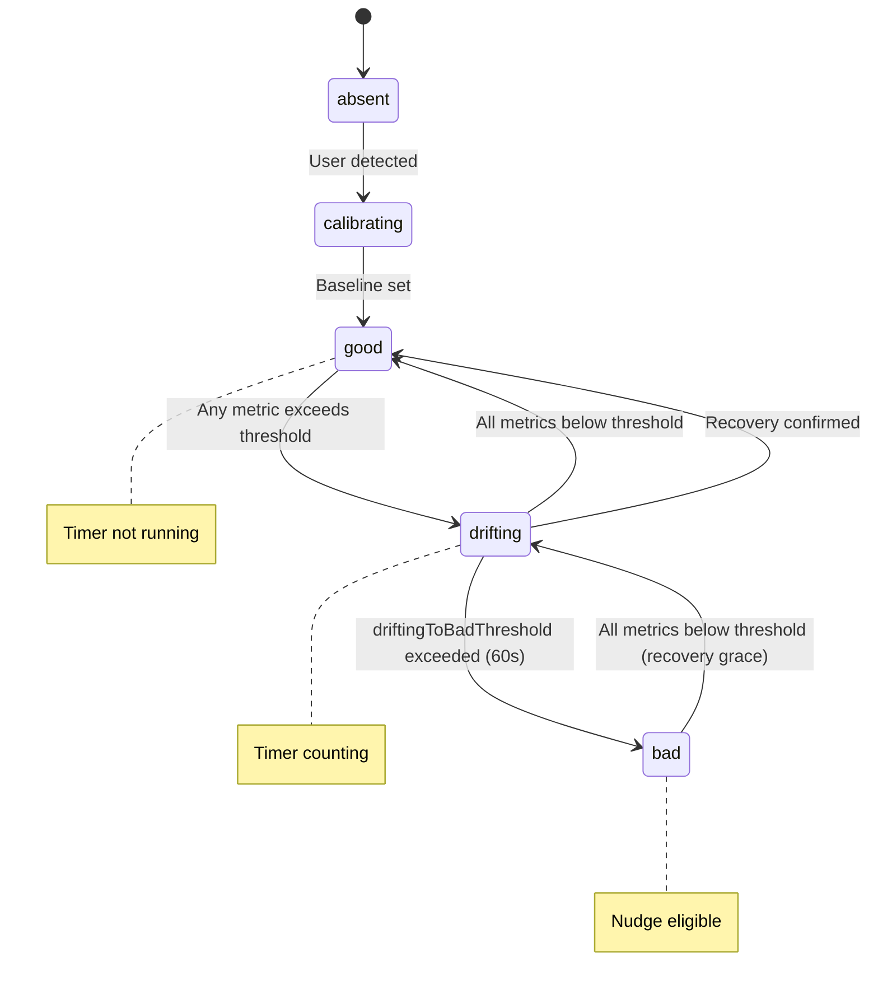

# Research: Calibration & Metrics

## Baseline Calibration

### When Calibration Happens

1. **App launch**: Always prompt for calibration
2. **After extended absence**: If user leaves frame for >5 minutes
3. **Manual trigger**: User taps "Recalibrate" button
4. **Significant position change**: If shoulder position shifts >30% from baseline (suggests phone moved)

### Calibration Process

```swift
struct CalibrationSession {
    let duration: TimeInterval = 5.0  // Sample for 5 seconds
    let requiredSamples: Int = 30     // At least 30 good frames
    let stabilityThreshold: Float = 0.02  // Max variance during calibration
}
```

1. Display "Sit up straight" prompt with visual guide
2. 3-second countdown before sampling begins
3. Collect `PoseSample` frames for 5 seconds
4. Validate: ≥30 frames with good tracking quality
5. Validate: Positional + angular variance < threshold (user held still)
6. Compute baseline as median of collected samples
7. Store baseline with timestamp

### Baseline Data

- `shoulderMidpoint: SIMD3<Float>` — 3D position (or 2D if no depth)
- `headPosition: SIMD3<Float>`
- `torsoAngle: Float` — degrees from vertical
- `shoulderWidth: Float` — for scale normalization
- `shoulderTwist: Float` — for baseline twist subtraction
- `depthAvailable: Bool`
- `timestamp: Date`
- Stale detection: baseline older than 1 hour flags as stale

## Metrics Computation

All metrics are **deltas from baseline** (positive = worse):

| Metric | Description | Threshold (default) |
|--------|-------------|---------------------|
| `forwardCreep` | How much closer to camera vs baseline | 0.10 (meters/ratio) |
| `headDrop` | How much head has dropped from baseline | 0.06 (normalized) |
| `shoulderRounding` | Additional torso angle from baseline | 10.0° |
| `lateralLean` | Side-to-side offset from baseline | 0.08 (normalized) |
| `twist` | Shoulder rotation delta from baseline | 15.0° |

### 2D Fallback Strategy

When depth is unavailable, use shoulder width as scale reference. Express all distances as ratios of shoulder width. Forward creep uses `shoulderWidthRaw` (wider shoulders in frame = closer to camera).

### Input/Output Examples

**Good posture (at baseline):**
- All metrics ≈ 0.0

**Slouching forward (8cm closer, 2cm lower):**
- forwardCreep: 0.08 (approaching 0.10 threshold)
- headDrop: 0.05

**Twisted (left shoulder closer):**
- twist: 12.5° (approaching 15° threshold)

### Smoothing

Exponential moving average with configurable alpha (default 0.3). Also computes:
- `movementLevel`: frame-to-frame velocity of shoulders+head, normalized 0–1
- `headMovementPattern`: classified as `.still`, `.smallOscillations`, `.largeMovements`, or `.erratic` using sliding window mean displacement and variance

## Posture State Machine



**Key rule**: When tracking quality is uncertain, **never** judge posture. Pause slouch timer. Only count time when confidence is high.

## Nudge Decision Rules

1. Must be in `.bad` state for ≥ `slouchDurationBeforeNudge` (5 min default)
2. Cooldown between nudges: 10 minutes
3. Max 2 nudges per hour
4. Suppressed when: low tracking quality, user stretching, cooldown active, max reached, recent acknowledgement
5. Nudge reason based on dominant metric violation (highest value/threshold ratio)
6. Acknowledgement detected when posture returns to good within `acknowledgementWindow` (30s)
