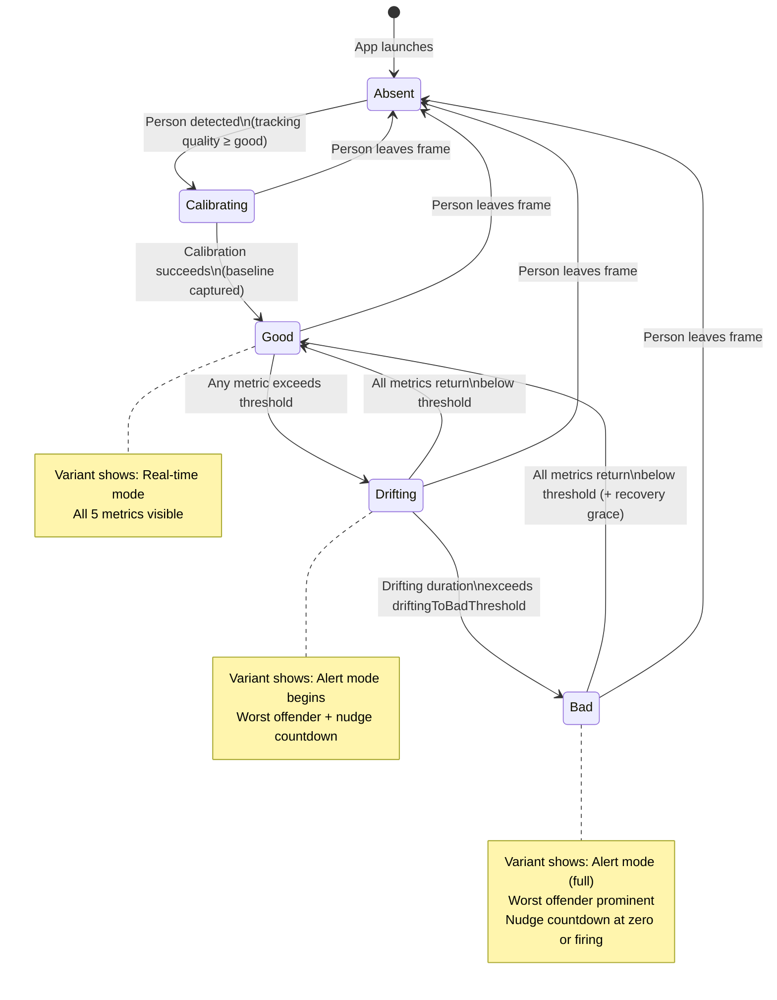
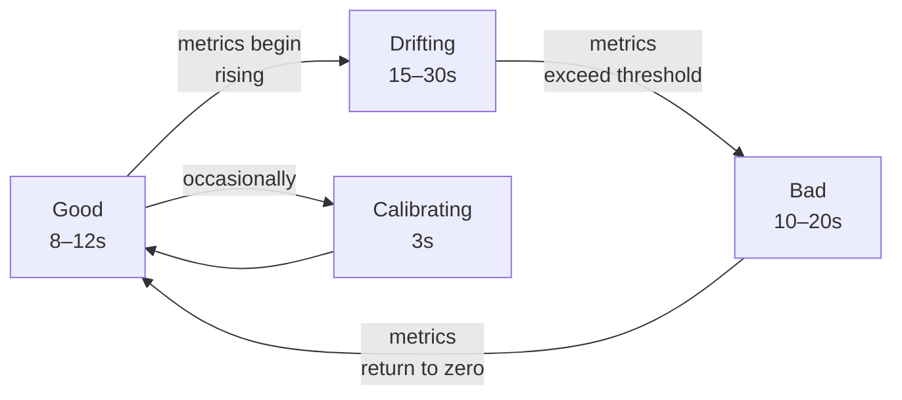

# Detailed Design: Posture Metrics UI Variants

**Project:** Quant — Posture Metrics UI Variants
**Date:** 2026-03-16
**Status:** Design

---

## Table of Contents

1. [Overview](#1-overview)
2. [Detailed Requirements](#2-detailed-requirements)
3. [Architecture Overview](#3-architecture-overview)
4. [Data Models](#4-data-models)
5. [Components and Interfaces](#5-components-and-interfaces)
6. [Error Handling](#6-error-handling)
7. [Testing Strategy](#7-testing-strategy)
8. [Appendices](#8-appendices)

---

## 1. Overview

The Quant posture metrics UI variants project creates 60 unique SwiftUI views for displaying posture monitoring data, all within a single interactive showcase. The current monitoring screen in Quant is a placeholder — all metric display lives in a developer debug overlay (`DebugOverlayView`). This project produces candidate designs that the user can evaluate to decide on a final direction.

Each variant implements two animated visual modes: a real-time mode that displays all five posture metrics live, and an alert mode that surfaces the worst offending metric alongside a nudge countdown when posture has deteriorated. All variants are browseable through a single showcase navigation view that can toggle between simulated mock data and live pipeline data.

The 60 individual variant designs are specified in a separate catalog file. This document defines the shared architecture, data models, and framework that every variant depends on.

---

## 2. Detailed Requirements

### 2.1 Functional Requirements

**Variants**
- 60 unique UI variants, each with a distinct visual identity spanning minimal, data-rich, organic, gamified, 3D, abstract, and artistic approaches
- Each variant implements two visual modes with an animated transition between them:
  - **Real-time mode** (PostureState `.good` or `.calibrating`): all five posture metrics displayed live with continuous updates
  - **Alert mode** (PostureState `.drifting` or `.bad`): the worst offending metric is shown prominently, a nudge countdown timer is visible, and secondary metrics are suppressed or de-emphasized
- Each variant exposes a single settings entry point (gear icon or equivalent) that routes to a shared settings sheet; no per-variant control clutter

**Showcase**
- A single SwiftUI file (`PostureVariantShowcase.swift`) contains all 60 variants and the navigation wrapper
- The showcase lists all variants organized by category in a scrollable navigation list (sidebar in landscape, stack in portrait)
- A mock/live toggle at the top of the showcase switches the data source for all displayed variants simultaneously
- The settings gear icon is accessible from the showcase navigation bar

**Data Sources**
- A mock data source generates realistic posture state cycling and exposes interactive sliders for manually setting each metric value and buttons for triggering state transitions
- A live data source wraps `AppModel`'s published properties into the shared data shape without any additional logic

### 2.2 Visual and Interaction Requirements

**Glanceability**
- Each variant must communicate overall posture state at a glance from a desk distance (roughly 60–90 cm away)
- State-level legibility relies on color, scale, and shape rather than text alone
- Alert mode must create a perceptible visual shift from real-time mode detectable in peripheral vision

**Orientation**
- All variants adapt their layouts to both portrait and landscape iPhone orientations
- Landscape is a primary use case (phone propped sideways on a desk stand)
- Layout changes are achieved via `GeometryReader` and `HorizontalSizeClass` / `VerticalSizeClass` as appropriate per variant

**Appearance**
- All variants support system dark and light mode using semantic SwiftUI colors and materials (`Color.primary`, `.secondary`, `.background`, `Material` blur layers)
- Variants must not hard-code colors that break in the opposite appearance mode
- Camera preview is hidden by default; variants design for a solid background but must remain visually coherent when the camera is revealed behind them

**Animation**
- The mode transition (real-time → alert and back) is animated as part of each variant's design language; the animation is intentional and stylistically consistent with the variant's identity
- Metric value updates animate smoothly using spring or eased transitions; no instant jumps

### 2.3 Technical Requirements

- **Minimum deployment target:** iOS 17.0
- **Preferred frameworks:** SwiftUI, Swift Charts, SceneKit, RealityKit, SpriteKit, Core Animation, Metal shaders via SwiftUI modifier APIs
- **Third-party libraries:** Permitted where they add significant value (e.g., Lottie for keyframe animations); Apple-native preferred
- **Architecture:** All variants are passive views; they receive a `PostureDisplayData`-conforming object and render it; no variant owns pipeline logic
- All state management at the variant level is limited to local UI state (e.g., expanded/collapsed, selected tab)

---

## 3. Architecture Overview

### 3.1 System Diagram

```mermaid
graph TB
    subgraph "Data Sources"
        AM[AppModel\n@MainActor ObservableObject]
        MD[MockPostureDataSource\nObservableObject]
    end

    subgraph "Shared Data Layer"
        PDD[PostureDisplayData\nstruct / protocol]
        LDS[LivePostureDataSource\nObservableObject]
    end

    subgraph "Showcase Shell"
        VS[VariantShowcaseView\nNavigation + Toggle]
        ST[DataSourceToggle\nMock | Live]
    end

    subgraph "Variant Views (60)"
        V1[Variant 1\nPrecision Gauge]
        V2[Variant 2\nTriadic Rings]
        VN[...Variant N]
    end

    subgraph "Shared Settings"
        SS[SettingsEntryPoint\ngear icon / sheet]
    end

    AM -->|Published properties| LDS
    LDS -->|PostureDisplayData| VS
    MD -->|PostureDisplayData| VS

    VS -->|Selected source| V1
    VS -->|Selected source| V2
    VS -->|Selected source| VN

    ST -.->|toggles| VS

    V1 --> SS
    V2 --> SS
    VN --> SS
```

### 3.2 Data Flow

The pipeline runs entirely within `AppModel`. The UI layer never reads from `Pipeline`, `PoseService`, or any engine directly. The data flow from pipeline to variant is:

1. `AppModel` publishes `latestMetrics: RawMetrics?`, `postureState: PostureState`, `nudgeDecision: NudgeDecision`, and `postureThresholds: PostureThresholds`
2. `LivePostureDataSource` subscribes to these published properties via `Combine` and projects them into a `PostureDisplayData` value each frame
3. `MockPostureDataSource` runs an internal timer that drives a simulation loop, producing `PostureDisplayData` on the same schedule
4. `VariantShowcaseView` holds either a `LivePostureDataSource` or `MockPostureDataSource` as its selected source (toggled by the user)
5. The selected source is injected into the currently displayed variant view via `@EnvironmentObject`
6. Each variant reads from the environment object and renders its current state; SwiftUI re-renders the variant whenever the source publishes a new value

### 3.3 State Transition Diagram



### 3.4 Visual Mode Mapping

| PostureState | Visual Mode | Variant Behavior |
|---|---|---|
| `.absent` | Idle / Waiting | Variant shows a neutral placeholder; no metrics displayed; subtle animation indicating "waiting for person" |
| `.calibrating` | Calibrating | Variant shows a calibration progress indicator in its design language; metrics may animate as if loading |
| `.good` | Real-time mode | All 5 metrics displayed with live values; calm, positive visual language |
| `.drifting(since:)` | Alert mode (onset) | Transition animation begins; worst offender moves to prominence; nudge countdown appears if `nudgeDecision` is `.pending` |
| `.bad(since:)` | Alert mode (full) | Alert mode fully established; worst offender maximally prominent; nudge countdown visible; `.fire` nudge decision triggers a brief flash or pulse |

### 3.5 Component Hierarchy

```mermaid
graph TD
    App[QuantApp\nApp entry point]
    CM[ContentView\nExisting monitoring screen]
    VS[VariantShowcaseView\nNavigation list + toggle]

    VS --> DST[DataSourceToggleView\nPicker: Mock | Live]
    VS --> VL[VariantListView\nScrollable list by category]
    VS --> GI[Settings Gear Icon\nNavigationBar item]

    VL --> VC[VariantCell\nName + thumbnail preview]
    VC --> VV[Selected VariantView\nFull-screen display]

    VV --> PDO[PostureDisplayObserver\n@EnvironmentObject]
    PDO --> LDS2[LivePostureDataSource]
    PDO --> MDS[MockPostureDataSource]

    MDS --> MCI[MockControlsInspector\nSliders + state buttons\nIn-app debug panel]

    App --> CM
    App --> VS
```

---

## 4. Data Models

### 4.1 MetricKey

An enumeration identifying each of the five posture metrics. Used as a dictionary key, in `switch` statements, and as a stable identifier in ForEach loops.

```swift
public enum MetricKey: String, CaseIterable, Identifiable {
    case forwardCreep
    case headDrop
    case shoulderRounding
    case lateralLean
    case twist

    public var id: String { rawValue }

    /// Human-readable display name.
    public var displayName: String {
        switch self {
        case .forwardCreep:     return "Forward Creep"
        case .headDrop:         return "Head Drop"
        case .shoulderRounding: return "Shoulder Rounding"
        case .lateralLean:      return "Lateral Lean"
        case .twist:            return "Twist"
        }
    }

    /// SF Symbol name that represents the metric in icon contexts.
    public var symbolName: String {
        switch self {
        case .forwardCreep:     return "arrow.forward.circle"
        case .headDrop:         return "arrow.down.circle"
        case .shoulderRounding: return "person.bust"
        case .lateralLean:      return "arrow.left.and.right"
        case .twist:            return "arrow.triangle.2.circlepath"
        }
    }
}
```

### 4.2 MetricInfo

A value type carrying everything a variant needs to render one posture metric.

```swift
public struct MetricInfo {
    /// The metric this struct describes.
    public let key: MetricKey

    /// Raw pipeline value (units vary per metric; see PostureThresholds documentation).
    /// 0.0 means exactly at baseline (perfect posture).
    public let value: Float

    /// Ratio of current value to its threshold.
    /// - 0.0 = perfect (at baseline)
    /// - 1.0 = exactly at threshold
    /// - >1.0 = threshold exceeded
    /// This is the primary value variants should use for visual encoding.
    public let ratio: Float

    /// The threshold value for this metric (from PostureThresholds).
    public let threshold: Float

    /// True when this metric has the highest ratio among all five metrics
    /// AND ratio > 0. False if all metrics are at zero (perfect posture).
    public let isWorstOffender: Bool

    /// Convenience: true when ratio >= 1.0.
    public var isExceeded: Bool { ratio >= 1.0 }

    /// Convenience: ratio clamped to 0...1 for use as a progress value.
    public var clampedRatio: Float { min(ratio, 1.0) }
}
```

### 4.3 PostureDisplayData

The unified display data structure that both data sources produce and all variant views consume. This is a value type (`struct`). Data sources publish it as a `@Published` property; variants receive it via `@EnvironmentObject` on the wrapping `PostureDisplayObserver`.

```swift
public struct PostureDisplayData {
    // MARK: - Five Metric Infos
    /// Ordered array of all five metrics, always in canonical order:
    /// [forwardCreep, headDrop, shoulderRounding, lateralLean, twist]
    public let metrics: [MetricInfo]

    // MARK: - State
    public let postureState: PostureState
    public let nudgeDecision: NudgeDecision
    public let trackingQuality: TrackingQuality

    // MARK: - Derived Values
    /// The metric with the highest ratio. Nil if no metrics exceed their threshold
    /// or if postureState is .absent or .calibrating.
    public let worstOffender: MetricInfo?

    /// Time elapsed since the current posture state was entered.
    /// Derived from PostureState.durationInCurrentState for .drifting and .bad.
    /// 0 for .good. Nil for .absent and .calibrating.
    public let timeInCurrentState: TimeInterval?

    /// Nudge countdown remaining in seconds. Non-nil only when
    /// nudgeDecision is .pending(reason:timeRemaining:).
    public let nudgeCountdownSeconds: TimeInterval?

    // MARK: - Thresholds (for computing custom ratios in variants)
    public let thresholds: PostureThresholds

    // MARK: - Convenience Accessors
    public func metric(for key: MetricKey) -> MetricInfo {
        // Returns MetricInfo for the given key from the metrics array.
        metrics.first { $0.key == key }!
    }

    /// Aggregate posture score: 1.0 - average of all five clamped ratios.
    /// 1.0 = perfect, 0.0 = all metrics at maximum threshold.
    public var aggregateScore: Float {
        let avgRatio = metrics.map(\.clampedRatio).reduce(0, +) / Float(metrics.count)
        return max(0, 1.0 - avgRatio)
    }

    // MARK: - Visual Mode
    /// Whether the variant should be in alert mode.
    public var isAlertMode: Bool {
        switch postureState {
        case .drifting, .bad: return true
        default: return false
        }
    }
}
```

**Computing MetricInfo ratios:**

Each ratio is computed as:
```swift
ratio = abs(rawValue) / threshold
```

For metrics where the raw value can be negative (e.g., `lateralLean` in either direction), `abs()` is applied before dividing. The threshold for each metric maps to the corresponding property in `PostureThresholds`:

| MetricKey | Raw value source | Threshold |
|---|---|---|
| `.forwardCreep` | `RawMetrics.forwardCreep` | `PostureThresholds.forwardCreepThreshold` |
| `.headDrop` | `RawMetrics.headDrop` | `PostureThresholds.headDropThreshold` |
| `.shoulderRounding` | `RawMetrics.shoulderRounding` | `PostureThresholds.shoulderRoundingThreshold` |
| `.lateralLean` | `RawMetrics.lateralLean` | `PostureThresholds.sideLeanThreshold` |
| `.twist` | `RawMetrics.twist` | `PostureThresholds.twistThreshold` |

### 4.4 PostureDisplayObserver

An `ObservableObject` that wraps a `PostureDisplayData` value for SwiftUI observation. Both data source types conform to a shared protocol and can be substituted at runtime.

```swift
protocol PostureDataSourceProtocol: ObservableObject {
    var currentData: PostureDisplayData { get }
}

/// Thin wrapper that holds whatever data source is currently active.
/// Injected into the environment so all variants can read from it.
@MainActor
class PostureDisplayObserver: ObservableObject {
    @Published var data: PostureDisplayData

    init(source: any PostureDataSourceProtocol) {
        // Initialize with a snapshot and subscribe to future updates.
        self.data = source.currentData
        // Subscription wired up at construction time.
    }

    func switchSource(to newSource: any PostureDataSourceProtocol) {
        // Re-subscribes to the new source's published data.
    }
}
```

### 4.5 PostureDisplayData Factory

A static factory method on `PostureDisplayData` centralizes the construction logic so both data sources use the same algorithm.

```swift
extension PostureDisplayData {
    static func make(
        from metrics: RawMetrics?,
        postureState: PostureState,
        nudgeDecision: NudgeDecision,
        trackingQuality: TrackingQuality,
        thresholds: PostureThresholds
    ) -> PostureDisplayData {
        let raw = metrics ?? RawMetrics.zero  // zero-value sentinel

        let metricInfos: [MetricInfo] = MetricKey.allCases.map { key in
            let value = raw.value(for: key)
            let threshold = thresholds.threshold(for: key)
            let ratio = threshold > 0 ? abs(value) / threshold : 0
            return MetricInfo(
                key: key,
                value: value,
                ratio: ratio,
                threshold: threshold,
                isWorstOffender: false  // filled in after all are computed
            )
        }

        let worstKey = metricInfos.max(by: { $0.ratio < $1.ratio })?.key
        let infosWithWorst = metricInfos.map { info in
            MetricInfo(
                key: info.key,
                value: info.value,
                ratio: info.ratio,
                threshold: info.threshold,
                isWorstOffender: info.key == worstKey && info.ratio > 0
            )
        }

        let nudgeCountdown: TimeInterval?
        if case .pending(_, let remaining) = nudgeDecision {
            nudgeCountdown = remaining
        } else {
            nudgeCountdown = nil
        }

        return PostureDisplayData(
            metrics: infosWithWorst,
            postureState: postureState,
            nudgeDecision: nudgeDecision,
            trackingQuality: trackingQuality,
            worstOffender: infosWithWorst.first(where: \.isWorstOffender),
            timeInCurrentState: postureState.durationInCurrentState,
            nudgeCountdownSeconds: nudgeCountdown,
            thresholds: thresholds
        )
    }
}
```

---

## 5. Components and Interfaces

### 5.1 LivePostureDataSource

Wraps `AppModel` and maps its published properties to `PostureDisplayData` on every pipeline frame.

```swift
@MainActor
final class LivePostureDataSource: ObservableObject, PostureDataSourceProtocol {
    @Published private(set) var currentData: PostureDisplayData

    private var cancellables = Set<AnyCancellable>()

    init(appModel: AppModel) {
        // Initialize with current snapshot.
        self.currentData = PostureDisplayData.make(
            from: appModel.latestMetrics,
            postureState: appModel.postureState,
            nudgeDecision: appModel.nudgeDecision,
            trackingQuality: appModel.trackingQuality,
            thresholds: appModel.postureThresholds
        )

        // Rebuild PostureDisplayData whenever any upstream property changes.
        // Publishers.CombineLatest4 (or zip) combines the four streams.
        Publishers.CombineLatest4(
            appModel.$latestMetrics,
            appModel.$postureState,
            appModel.$nudgeDecision,
            appModel.$trackingQuality
        )
        .map { [weak appModel] metrics, state, nudge, quality in
            PostureDisplayData.make(
                from: metrics,
                postureState: state,
                nudgeDecision: nudge,
                trackingQuality: quality,
                thresholds: appModel?.postureThresholds ?? PostureThresholds()
            )
        }
        .receive(on: RunLoop.main)
        .assign(to: &$currentData)
    }
}
```

**Notes:**
- `LivePostureDataSource` is a thin adapter; it contains no business logic
- It subscribes to `AppModel` using `Combine` and is torn down when the showcase view disappears
- The `thresholds` are re-read from `appModel` on every emission so threshold changes propagate immediately

### 5.2 MockPostureDataSource

Generates realistic posture simulation data autonomously. It has two modes of operation: **auto-simulation** (a timer-driven state machine that cycles through posture states) and **manual control** (sliders and buttons that the user can manipulate directly within the showcase).

```swift
@MainActor
final class MockPostureDataSource: ObservableObject, PostureDataSourceProtocol {
    @Published private(set) var currentData: PostureDisplayData

    // MARK: - Manual Controls (exposed to MockControlsInspector)
    @Published var manualForwardCreep: Float = 0.0
    @Published var manualHeadDrop: Float = 0.0
    @Published var manualShoulderRounding: Float = 0.0
    @Published var manualLateralLean: Float = 0.0
    @Published var manualTwist: Float = 0.0
    @Published var manualPostureState: PostureState = .good
    @Published var isAutoSimulating: Bool = true

    // MARK: - Simulation Configuration
    var simulationThresholds: PostureThresholds = PostureThresholds()

    // MARK: - Private State
    private var simulationTimer: Timer?
    private var simulationPhase: SimulationPhase = .good(elapsed: 0)
    private var simulationClock: TimeInterval = 0
}
```

**Simulation State Machine:**

The auto-simulation cycles through a repeating sequence of posture phases:



Each phase drives different metric trajectories:

- **Good phase:** All metrics animate smoothly around zero with subtle Perlin-noise variation (±5% of threshold). This makes the display feel alive rather than static.
- **Drifting phase:** One or two metrics ramp up from 0 to 1.2× their threshold over the phase duration using an eased curve. The dominant metric is randomly selected each cycle. `postureState` is `.drifting(since:)` and `nudgeDecision` transitions to `.pending(reason:, timeRemaining:)` where `timeRemaining` counts down from `PostureThresholds.slouchDurationBeforeNudge`.
- **Bad phase:** Metrics from drifting phase remain elevated. `postureState` is `.bad(since:)`. `nudgeDecision` fires once (`.fire(reason:)`) at the start of the bad phase, then returns to `.none` after 2 seconds (simulating cooldown).
- **Recovery:** Metrics ease back to zero over 3–5 seconds when transitioning back to Good.

**Manual Control Mode:**

When `isAutoSimulating` is false, the simulation timer pauses and metric values are read directly from the manual sliders. The mock controls inspector UI (a compact panel accessible from the showcase) exposes these sliders. This allows testing specific edge cases without waiting for the simulation cycle.

### 5.3 VariantShowcaseView

The root navigation view of the showcase. It manages the active data source and presents the variant catalog in a navigation list.

```swift
struct VariantShowcaseView: View {
    @StateObject private var mockSource = MockPostureDataSource()
    @EnvironmentObject private var appModel: AppModel

    @State private var dataSourceMode: DataSourceMode = .mock
    @State private var selectedVariant: VariantDescriptor? = nil

    private lazy var liveSource = LivePostureDataSource(appModel: appModel)

    var body: some View {
        NavigationSplitView {
            // Sidebar: list of all 60 variants by category
            VariantCatalogList(selectedVariant: $selectedVariant)
                .toolbar {
                    // Top: mock/live toggle
                    ToolbarItem(placement: .navigationBarLeading) {
                        DataSourceToggleView(mode: $dataSourceMode)
                    }
                    // Top: settings gear
                    ToolbarItem(placement: .navigationBarTrailing) {
                        NavigationLink(destination: SettingsSheetView()) {
                            Image(systemName: "gear")
                        }
                    }
                }
        } detail: {
            if let variant = selectedVariant {
                variant.makeView()
                    .environmentObject(activeObserver)
            } else {
                VariantShowcasePlaceholder()
            }
        }
    }

    private var activeObserver: PostureDisplayObserver {
        switch dataSourceMode {
        case .mock: return PostureDisplayObserver(source: mockSource)
        case .live: return PostureDisplayObserver(source: liveSource)
        }
    }
}
```

**Layout adaptation:**
- Portrait: `NavigationStack` with push navigation (list → detail)
- Landscape (regular width): `NavigationSplitView` with sidebar + detail column
- The `NavigationSplitView` handles this automatically on iPhone with iOS 16+; if a split view is unavailable, a stack-based fallback is used

### 5.4 VariantDescriptor

A lightweight value type describing one of the 60 variants. Used to populate the catalog list and to create variant view instances on demand.

```swift
struct VariantDescriptor: Identifiable, Hashable {
    let id: Int                        // 1–60
    let name: String
    let category: VariantCategory
    let technologies: [TechTag]        // e.g., [.canvas, .sceneKit]
    let makeView: () -> AnyView        // Factory closure
}

enum VariantCategory: String, CaseIterable {
    case scoreCentric     = "Score-Centric"
    case dataVisualization = "Data Visualization"
    case anatomical       = "Anatomical / 3D"
    case ambient          = "Ambient / Atmospheric"
    case abstract         = "Abstract Glyphs"
    case gamified         = "Gamified"
    case typographic      = "Typographic"
    case experimental     = "Experimental"
}

enum TechTag: String {
    case canvas, swiftCharts, sceneKit, realityKit, spriteKit, metal, meshGradient, gauge
}
```

### 5.5 Variant View Contract

Every variant view must satisfy the following interface contract. There is no formal protocol enforcement (SwiftUI views cannot conform to a protocol that requires a `body`), but all variant views follow this structure by convention:

```swift
// Canonical variant structure:
struct VariantNView: View {
    // 1. Read the shared display data from the environment.
    @EnvironmentObject var postureData: PostureDisplayObserver

    // 2. Local UI state only — no pipeline logic.
    @State private var localUIState: SomeLocalState = .initial

    var body: some View {
        // 3. Full-screen content that:
        //    a. Renders real-time mode when postureData.data.isAlertMode == false
        //    b. Renders alert mode when postureData.data.isAlertMode == true
        //    c. Animates the transition between the two modes
        //    d. Shows a settings entry point (gear icon or equivalent)
        //    e. Adapts to portrait and landscape via GeometryReader
        //    f. Supports dark and light mode
    }

    // 4. Settings entry point (each variant decides how to surface it —
    //    a gear icon in a corner, a long-press gesture, etc.)
    private var settingsButton: some View { ... }
}
```

**Mode transition animation:**

The transition between real-time and alert mode should be driven by `postureData.data.isAlertMode` using SwiftUI's `.animation(_:value:)` modifier or explicit `withAnimation` calls. The specific transition style (fade, slide, morph, scale) is part of each variant's design language.

### 5.6 MockControlsInspector

An auxiliary panel in the showcase that exposes mock data source controls. It is accessible from the variant detail view when the data source is set to mock, surfaced as a draggable bottom sheet or a swipe-up drawer so it doesn't obscure the variant being evaluated.

```swift
struct MockControlsInspector: View {
    @EnvironmentObject var mockSource: MockPostureDataSource

    var body: some View {
        VStack(spacing: 16) {
            Toggle("Auto-simulate", isOn: $mockSource.isAutoSimulating)

            if !mockSource.isAutoSimulating {
                // Sliders for each metric (0.0 to 2× threshold = 0.0 to 1.0 normalized)
                MetricSliderRow(label: "Forward Creep", value: $mockSource.manualForwardCreep)
                MetricSliderRow(label: "Head Drop", value: $mockSource.manualHeadDrop)
                MetricSliderRow(label: "Shoulder Rounding", value: $mockSource.manualShoulderRounding)
                MetricSliderRow(label: "Lateral Lean", value: $mockSource.manualLateralLean)
                MetricSliderRow(label: "Twist", value: $mockSource.manualTwist)
            }

            // State override buttons
            HStack {
                ForEach([PostureState.good, .drifting(since: Date().timeIntervalSince1970),
                         .bad(since: Date().timeIntervalSince1970), .calibrating, .absent],
                        id: \.debugLabel) { state in
                    Button(state.debugLabel) {
                        mockSource.manualPostureState = state
                    }
                }
            }
        }
        .padding()
    }
}
```

### 5.7 SettingsSheetView

A shared settings sheet accessible from the showcase gear icon. It routes to the existing `CalibrationSettingsView` and adds a posture thresholds panel. All 60 variants route to this same sheet — no variant ships its own settings logic.

The settings sheet wraps the following panels:
- Calibration settings (recalibrate button, sampling duration, variance sliders) — delegates to existing `CalibrationSettingsView`
- Posture threshold sliders (one per metric, with reset-to-defaults button)
- Camera mode picker (rear depth vs. front 2D)
- Camera preview toggle
- Haptic picker and test nudge button (currently in `DebugOverlayView`, migrated here)

### 5.8 Shared Visual Utilities

A `PostureVisualStyle` namespace provides computed color and semantic values that variants can use as a starting point. Variants are free to override these for their own aesthetic but the defaults provide consistent semantics.

```swift
enum PostureVisualStyle {
    /// Primary color expressing the current posture state.
    static func stateColor(for state: PostureState) -> Color {
        switch state {
        case .absent, .calibrating: return .secondary
        case .good:                 return Color(hue: 0.38, saturation: 0.6, brightness: 0.7)  // calm teal-green
        case .drifting:             return Color(hue: 0.08, saturation: 0.8, brightness: 0.85) // amber
        case .bad:                  return Color(hue: 0.02, saturation: 0.9, brightness: 0.8)  // coral-red
        }
    }

    /// Color for a specific metric's ratio value (0 = green, 1+ = red).
    static func metricColor(ratio: Float) -> Color {
        let t = Double(min(ratio, 1.0))
        return Color(hue: (1.0 - t) * 0.35, saturation: 0.7, brightness: 0.75)
    }

    /// Semantic label for the posture state (used in accessibility and text overlays).
    static func stateLabel(for state: PostureState) -> String {
        switch state {
        case .absent:       return "Waiting"
        case .calibrating:  return "Calibrating"
        case .good:         return "Good"
        case .drifting:     return "Drifting"
        case .bad:          return "Bad"
        }
    }
}
```

### 5.9 Reference to Variant Catalog

The 60 individual variant designs — their visual concepts, metric mapping details, transition descriptions, technology choices, and SwiftUI code skeletons — are specified in:

```
.agents/planning/2026-03-16-ui-variants/implementation/variant-catalog.md
```

Variants are grouped into eight categories:

| # | Category | Count |
|---|---|---|
| 1–8 | Score-Centric | 8 |
| 9–16 | Data Visualization | 8 |
| 17–24 | Anatomical / 3D | 8 |
| 25–32 | Ambient / Atmospheric | 8 |
| 33–40 | Abstract Glyphs | 8 |
| 41–48 | Gamified | 8 |
| 49–54 | Typographic | 6 |
| 55–60 | Experimental | 6 |

---

## 6. Error Handling

### 6.1 Absent State

When `postureState == .absent`, no person is in frame and no valid metrics exist. Variants must handle this state gracefully.

**Required behavior:**
- Render a visually neutral placeholder consistent with the variant's aesthetic. Examples: a dimmed or wireframe version of the metric visualization, a gentle breathing pulse animation, a "Waiting for pose..." text label in the variant's typography
- Do not render metric values, ratios, or state indicators that would be misleading
- The placeholder should be identifiable as belonging to the same variant family as the live display

**What not to do:**
- Do not crash or produce layout errors when `latestMetrics` is nil
- Do not show metric bars/rings at zero that look like "all metrics are perfect" — absent is distinct from good

### 6.2 Calibrating State

When `postureState == .calibrating`, the baseline is being established. Metric values may be non-zero but are not yet meaningful as posture deviations.

**Required behavior:**
- Show a calibration progress indicator appropriate to the variant's visual language (e.g., a ring filling in the Gauge variant, a pulsing glow in the Ambient variant, a progress bar in the Dashboard variant)
- `calibrationProgress` from `AppModel` (0.0–1.0) is available through the showcase for variants that want to show precise progress; for most variants, a simple "calibrating" animation suffices
- Metric values are shown only after calibration completes

### 6.3 Degraded Tracking Quality

When `trackingQuality == .degraded` or `.lost`, metrics may be unreliable.

**Required behavior:**
- Variants that show individual metric values should indicate reduced confidence (e.g., slightly desaturated colors, a small warning icon, reduced opacity)
- The existing `DebugOverlayView` handles detailed tracking quality display; variants only need a minimal visual cue

**PostureDisplayData provides:** `trackingQuality: TrackingQuality` — variants can branch on `.lost`, `.degraded`, `.good`

### 6.4 Nil Metrics with Non-Absent State

In theory, `latestMetrics` could be nil while `postureState` is `.good` during a brief pipeline gap. The `PostureDisplayData.make` factory handles this by substituting `RawMetrics.zero` (all metric values at 0.0) so variants always receive a fully populated `PostureDisplayData` struct. Variants never need to handle nil metrics directly.

### 6.5 Extreme Metric Values

Metrics can exceed their thresholds by arbitrary amounts (e.g., ratio = 3.0 if someone is severely slouching). Variants must not crash or produce visual artifacts with any ratio value.

**Required behavior:**
- All visual encodings must be bounded. Use `min(ratio, someMaxValue)` when mapping to visual dimensions like height, radius, or opacity
- The `MetricInfo.clampedRatio` property (ratio clamped to 0...1) is provided for convenience and is the recommended input for visual encodings that should cap at threshold

### 6.6 Rapid State Changes

The pipeline can transition between states rapidly under noisy conditions. Variants should use `withAnimation(.spring())` or equivalent transitions so that rapid state changes produce smooth visual evolution rather than jarring jumps.

---

## 7. Testing Strategy

### 7.1 Xcode Previews

Each variant provides at least three `#Preview` blocks:

```swift
#Preview("Real-time mode — good posture") {
    VariantNView()
        .environmentObject(PostureDisplayObserver(
            source: MockPostureDataSource.preview(state: .good)
        ))
}

#Preview("Alert mode — forward creep") {
    VariantNView()
        .environmentObject(PostureDisplayObserver(
            source: MockPostureDataSource.preview(
                state: .drifting(since: Date().timeIntervalSince1970 - 45),
                worstMetric: .forwardCreep,
                worstRatio: 1.3
            )
        ))
}

#Preview("Absent state") {
    VariantNView()
        .environmentObject(PostureDisplayObserver(
            source: MockPostureDataSource.preview(state: .absent)
        ))
}
```

A static `MockPostureDataSource.preview(state:...)` factory creates non-animating snapshots for Xcode preview rendering. These previews run in both light and dark mode (using `preferredColorScheme`) and at both portrait and landscape sizes (using `.previewInterfaceOrientation`).

### 7.2 Auto-Simulation Testing

The mock data source's auto-simulation provides an integration test path:

1. Launch the showcase in the simulator with mock data enabled
2. Let the simulation run for 2–3 full cycles (approximately 90–120 seconds)
3. Verify that each variant correctly transitions between real-time and alert modes
4. Check that metric values animate smoothly without visible glitches or constraint errors
5. Verify the settings gear is reachable from each variant

A helper in `MockPostureDataSource` allows overriding the phase duration to fast-forward simulation:

```swift
mockSource.simulationSpeedMultiplier = 5.0  // 5× speed for rapid testing
```

### 7.3 Live Data Testing

With the data source toggled to live:

1. Point the device camera at a person and verify metrics populate
2. Walk through posture deviations and verify alert mode triggers correctly
3. Correct posture and verify real-time mode resumes with proper animation
4. Test recalibration from the settings sheet
5. Verify the camera toggle (rear depth / front 2D) switches correctly

### 7.4 Orientation Testing

For each variant, test:
- Rotation from portrait to landscape while in real-time mode
- Rotation from portrait to landscape while in alert mode
- No layout breakage (no clipped content, no overlapping elements, no views off-screen)

Orientation testing is done on physical devices at both iPhone SE size class (small screen) and iPhone Pro Max size class (large screen).

### 7.5 Performance Testing

Variants using `TimelineView(.animation)` for continuous redraw must maintain 60 fps on the target device range. Performance is validated using Instruments > Animation Hitches profiler.

Acceptable thresholds:
- `Canvas`-based variants: <2ms render time per frame at 60 fps
- `SceneKit` variants: <5ms render time per frame
- `Metal` shader variants: <3ms per frame
- No variant should cause the main thread CPU to exceed 30% during steady-state animation

### 7.6 Accessibility Testing

Each variant must pass:
- **VoiceOver:** A brief accessibility label is attached to the variant's root container that summarizes the current posture state and worst offender (e.g., "Posture: Drifting. Worst metric: Forward creep at 120% of threshold.")
- **Dynamic Type:** Any text labels in the variant respect Dynamic Type size categories (using `Font.body` and semantic font styles rather than fixed sizes)
- **Reduced Motion:** Variants check `accessibilityReduceMotion` and substitute instant transitions for continuous animations when it is enabled

---

## 8. Appendices

### 8.1 Technology Decision Guide

When implementing variants, use this guide to select the appropriate rendering technology.

#### SwiftUI Canvas + TimelineView
**Use for:** Particle systems, waveforms, seismograph traces, custom gauges, stick figures, abstract glyphs, any visualization requiring frame-by-frame rendering with full creative control.

**When preferred over alternatives:** When no third-party library is needed, when the visualization is 2D, and when the drawing logic is straightforward to express as paths and fills.

**Key APIs:** `Canvas`, `TimelineView(.animation)`, `GraphicsContext`, `Path`, `context.withCGContext`

#### SceneKit (via UIViewRepresentable)
**Use for:** 3D skeleton mannequins, 3D body visualizations that don't require a live AR camera feed, gyroscope ring visualizations with true 3D perspective.

**When preferred over RealityKit:** When the visualization is standalone (no AR camera), when the metric-to-joint mapping is driven by the five high-level metrics rather than raw joint positions, and when the development effort must be contained.

**Key APIs:** `SCNView`, `SCNCylinder`, `SCNSphere`, `SCNNode`, `SCNTransaction` for smooth metric-driven transitions

**Note on SceneKit deprecation:** Apple has signaled a long-term preference for RealityKit, but SceneKit remains fully functional and is not deprecated in any current SDK. For the purposes of this project (standalone 3D figures without AR), SceneKit is the practical choice.

#### RealityKit + ARKit Body Tracking
**Use for:** The one or two variants that feature a live AR body mirror — the user's own skeleton rendered in real-time using the rear camera and ARKit's `ARBodyTrackingConfiguration`.

**Device requirement:** A12 Bionic or later. Rear camera only. This must be clearly documented in the variant descriptor and the showcase must display a compatibility warning for unsupported devices.

**Key APIs:** `ARBodyTrackingConfiguration`, `ARBodyAnchor`, `BodyTrackedEntity`, `RealityView` (iOS 18+) or `ARView` via `UIViewRepresentable`

#### Metal Shaders (SwiftUI Modifier APIs)
**Use for:** Atmospheric background effects, ripple distortions, fluid mesh deformations, shimmer overlays, noise-based texture effects. Driven as SwiftUI view modifiers rather than a raw `MTKView`.

**Key modifier APIs:** `.colorEffect(shader:)`, `.distortionEffect(shader:)`, `.layerEffect(shader:isEnabled:)` — all introduced in iOS 17

**Shader library:** The open-source [Inferno library](https://github.com/twostraws/Inferno) provides pre-built shaders for common effects (wave, shimmer, emboss, circular wave). Using these as a starting point for atmospheric variants reduces implementation time.

**Animate shaders:** Wrap in `TimelineView(.animation)` and pass `Float(timeline.date.timeIntervalSinceReferenceDate)` as a time argument to the shader.

#### MeshGradient (iOS 18+)
**Use for:** Animated atmospheric backgrounds where the overall background color slowly shifts in response to posture state. The mesh's interior control points are animated with `sin()` / `cos()` functions to create organic motion.

**Compatibility note:** `MeshGradient` requires iOS 18. Variants that use it should provide a `LinearGradient` fallback for iOS 17 devices using `#available(iOS 18, *)`.

#### Swift Charts
**Use for:** Bar charts (frequency bars), line charts (real-time waveforms), scatter plots (concentric target dot plots), area charts (posture history fills).

**Key capability:** Swift Charts renders directly inside SwiftUI without UIKit bridging, supports smooth animated updates when the data binding changes, and integrates with SwiftUI's accessibility layer automatically.

#### SpriteKit
**Use for:** Particle effects (e.g., an ember-particle system for the fire/alert state), physics-based pendulum simulations, sprite-based game-like variants.

**When preferred over Canvas:** When physics simulation is needed (springs, gravity, collision), when pre-authored SpriteKit particle emitter files (`.sks`) provide the desired effect more easily than manual Canvas drawing.

#### Technology Compatibility Matrix

| Technology | iOS Min | Device Req | Render Mode | Complexity |
|---|---|---|---|---|
| SwiftUI Canvas | 15.0 | Any | GPU | Low–Medium |
| Swift Charts | 16.0 | Any | GPU | Low |
| MeshGradient | 18.0 | Any | GPU | Low |
| Metal Shaders | 17.0 | Any | GPU | Medium |
| SceneKit | 8.0 | Any | Metal | Medium |
| SpriteKit | 8.0 | Any | Metal | Medium |
| RealityKit (no AR) | 13.0 | Any | Metal | Medium–High |
| RealityKit + ARKit | 13.0 | A12+ (rear) | Metal | High |
| Vision 3D Pose | 17.0 | LiDAR preferred | CPU+GPU | High |

### 8.2 Color Strategy

All variants share a semantic color vocabulary for posture state. Individual variants may deviate from these defaults to serve their aesthetic, but the deviation should be intentional and documented.

| State | Default Hue | Semantic |
|---|---|---|
| Absent / Waiting | Neutral gray | No data; no judgment |
| Calibrating | Soft blue, pulsing | Active measurement in progress |
| Good | Teal-green (hue ~140°) | Calm, natural, organic |
| Drifting | Amber (hue ~30°) | Warm warning; not yet urgent |
| Bad | Coral-red (hue ~5°) | Alert; action recommended |

The transition from good to bad should feel like a temperature shift (cool → warm) rather than a binary alarm. Red should never feel alarming or punitive — posture monitoring is a wellness app, not an emergency system.

### 8.3 Research File Cross-Reference

The following research files in `.agents/planning/2026-03-16-ui-variants/research/` informed this design:

| File | Contents | Relevant sections |
|---|---|---|
| `ui-patterns.md` | Industry analysis of posture apps, health fitness dashboards, and gamification patterns; 20 high-level variant archetypes | Sections 3.1–3.2 (architecture patterns), 5.3 (showcase structure) |
| `3d-visualization.md` | Technical implementation paths for SceneKit, RealityKit, ARKit, Canvas 2D stick figures; code samples | Section 8.1 (technology guide), Anatomical category variants |
| `abstract-visualizations.md` | 20 abstract glyph concepts (Attitude Indicator, Stacked Totem, Radar Glyph, Plumb Line, etc.) with SwiftUI feasibility analysis | Abstract Glyphs and Score-Centric variant categories |
| `metal-shaders.md` | SwiftUI shader modifier APIs, Inferno library, posture-specific shader concepts | Section 8.1, Ambient category variants |
| `swiftui-techniques.md` | Canvas API, TimelineView, MeshGradient, Metal shaders, Swift Charts, TextRenderer, Gauge styles | Section 8.1, Data Visualization variants |

### 8.4 Variant Catalog Cross-Reference

Full variant specifications are in:

```
.agents/planning/2026-03-16-ui-variants/implementation/variant-catalog.md
```

The catalog includes for each of the 60 variants:
- Variant number (1–60) and name
- Category assignment
- Visual concept description
- Metric mapping table (which metric changes which visual property)
- Real-time to alert mode transition description
- Technology tags
- Orientation adaptation notes
- SwiftUI code skeleton

### 8.5 Key Design Principles

These principles apply to all 60 variants and were derived from the requirements clarification process:

1. **Glanceability over information density.** The primary use case is a phone propped on a desk. The most important communication is overall state (good/drifting/bad) at a distance. Specific metric values are secondary.

2. **Zero-state beauty.** When all metrics are zero (perfect posture), the visualization should be at its most aesthetically pleasing. Good posture should look good. This creates a positive feedback loop where users are rewarded visually for correct alignment.

3. **Proportional degradation.** Each metric's visual encoding changes continuously and proportionally with the metric's ratio. No sudden jumps. The visual change is linearly or mildly eased from 0 (perfect) through 1 (at threshold) to higher values (exceeded).

4. **Alert mode is a shift, not a replacement.** The transition from real-time to alert mode should feel like a transformation of the same visual language, not a switch to a completely different screen. The variant's identity persists through both modes.

5. **Emotional resonance over clinical precision.** The app communicates wellness, not diagnosis. Visualizations that feel alive, organic, and relatable are preferred over purely clinical or data-forward displays.

6. **Settings stay out of the way.** The monitoring view is clean. All controls live behind a single settings entry point. Each variant needs exactly one settings entry point — no more.
