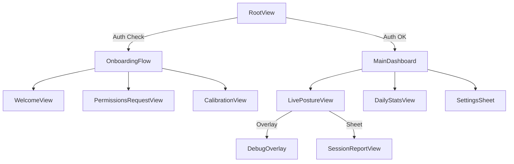

# Posture Detection App — Project Contract (AI Optimized v2)

## Goal

Desk-mounted posture detection using rear camera + LiDAR when available, with graceful 2D fallback, and feedback via audio + Apple Watch (later).

## Non-goals (until Sprint 7+)

- No "pretty" UI, onboarding, analytics dashboards, cloud sync, accounts.
- No custom ML unless the explicit pivot trigger occurs.
- No saving video by default.
- **Shadow Mode** (User rejected: immediate feedback preferred).

---

## Decisions Log

| Decision | Rationale |
|----------|-----------|
| Shadow Mode rejected | User prefers immediate feedback over delayed batch reports |
| Precision over recall | False alarms are more annoying than missed slouches — users will lose trust |
| 5-minute slouch threshold | Brief posture shifts are normal; only sustained bad posture warrants nudging |
| Protocol-based architecture | Enables mocking for tests and potential ML swap later |
| Swift Package for logic | Keeps business logic testable and separate from UIKit/ARKit dependencies |

---

## Success Criteria

Measured against golden recordings with ground-truth tags:

- **Detection rate**: ≥70% of slouch episodes (≥5 minutes sustained) trigger a nudge
- **False positive rate**: <3% of "good posture" time incorrectly flagged (priority metric)
- **Task mode accuracy**: ≥80% of reading/typing segments correctly classified
- **Recovery detection**: When user corrects posture, state returns to Good within 5 seconds

Measured during live 60-minute sessions:

- **Nudge count**: ≤2 nudges per hour during normal work
- **No spurious nudges**: Zero nudges during periods of sustained good posture
- **Precision priority**: Better to miss a slouch than fire a false alarm

---

## Performance Budgets

Strict limits to ensure the app remains lightweight and battery-efficient:

- **CPU Usage**: Average < 15% on high-performance cores during active monitoring.
- **Battery Impact**: < 5% drain per hour of background monitoring.
- **Memory Footprint**: < 100MB steady state (excluding ARKit buffers).
- **Thermal State**: Must not trigger `serious` thermal state during standard 1-hour session.
- **Frame Processing**: Vision requests capped at 10 FPS; Depth sampling capped at 15 FPS.

---

## Configurable Thresholds

These values should be adjustable in a debug/settings screen without rebuilding the app:

```swift
struct PostureThresholds: Codable {
    // MARK: - Detection Timing
    var slouchDurationBeforeNudge: TimeInterval = 300  // 5 minutes default
    var recoveryGracePeriod: TimeInterval = 5          // Seconds to confirm correction
    var driftingToBadThreshold: TimeInterval = 60      // Seconds in "drifting" before "bad"
    
    // MARK: - Posture Metrics
    var forwardCreepThreshold: Float = 0.10            // Meters (depth) or ratio (2D)
    var twistThreshold: Float = 15.0                   // Degrees
    var sideLeanThreshold: Float = 0.08                // Normalized offset
    
    // MARK: - Confidence Gates
    var minTrackingQuality: Float = 0.7                // Below this, don't judge posture
    var minKeypointVisibility: Float = 0.7             // Required keypoints ratio
    var depthConfidenceThreshold: Float = 0.6          // Below this, switch to 2D mode
    
    // MARK: - Nudge Behavior
    var nudgeCooldown: TimeInterval = 600              // 10 minutes between nudges
    var maxNudgesPerHour: Int = 2
    var acknowledgementWindow: TimeInterval = 30       // Seconds to detect correction after nudge
    
    // MARK: - Mode Switching
    var depthRecoveryDelay: TimeInterval = 2.0         // Seconds of good depth before switching back
    var absentThreshold: TimeInterval = 3.0            // Seconds without tracking before "absent"
}
```

Store in `UserDefaults` or a JSON file. Load at app launch, apply immediately when changed.

---

## Runtime Modes

- **DepthFusion mode**: When depth confidence is good.
- **TwoDOnly mode**: When depth confidence is weak/unavailable.

---

## Error States & Recovery

| Condition | Detection | Response | Timer Behavior |
|-----------|-----------|----------|----------------|
| Vision returns nil pose | `PoseObservation` is nil | Increment `lostFrameCount`, mark quality "degraded" after 10 consecutive frames | Pause slouch timer |
| ARKit tracking lost | `ARFrame.camera.trackingState != .normal` | Set `TrackingQuality.lost`, show "Repositioning..." in debug UI | Pause slouch timer |
| Depth confidence drops | `DepthConfidence < threshold` | Switch to TwoDOnly mode automatically | Continue timer (2D still works) |
| User leaves frame | No body detected for `absentThreshold` seconds | Set `PostureState.absent` | Reset slouch timer |
| User returns to frame | Body detected after absence | Require new baseline calibration if absence > 5 minutes | Timer starts fresh |
| Thermal throttling | `ProcessInfo.thermalState` changes | Reduce FPS or disable depth (see Sprint 6) | Continue with degraded mode |

**Key principle**: When tracking quality is uncertain, *never* judge posture. Only count time toward slouch detection when confidence is high.

---

## Known Gotchas

Common pitfalls that will trip you up — learn from past mistakes:

| Issue | Solution |
|-------|----------|
| Vision pose detection returns flipped Y coordinates | Flip Y: `1.0 - point.y` before using |
| ARKit depth map is lower resolution than RGB | Scale coordinates: `depthPoint = rgbPoint * (depthSize / rgbSize)` |
| `CVPixelBuffer` must be locked before reading | Always use `CVPixelBufferLockBaseAddress(buffer, .readOnly)` and unlock after |
| Combine publishers retain self strongly | Use `[weak self]` in all `sink` closures to avoid retain cycles |
| Simulator has no ARKit/LiDAR | Must use `MockPoseProvider` for all Simulator testing — no workarounds |
| `VNDetectHumanBodyPoseRequest` is slow | Throttle to 10 FPS max; don't call on every frame |
| ARSession can silently fail after interruption | Always check `trackingState` before trusting frame data |
| Depth values near edges are unreliable | Ignore depth samples within 5% of frame edges |
| `simd_float3x3` column-major ordering | Camera intrinsics: `fx = intrinsics[0,0]`, `cx = intrinsics[2,0]` (not `[0,2]`) |
| JSON encoding `TimeInterval` loses precision | Use `Int64` milliseconds for timestamps in recordings |
| SwiftUI view updates on background thread crash | Always dispatch engine outputs to `@MainActor` before publishing |
| `ProcessInfo.thermalState` doesn't work in Simulator | Mock thermal states for testing; only real behavior on device |

---

## Debugging Checklist

When something's not working, check these in order:

### Posture not being detected at all

1. **Check Debug UI**: Is `trackingQuality` showing "good"?
   - If "lost" → User not in frame, or camera blocked
   - If "degraded" → Vision failing to find keypoints (lighting? distance?)
2. **Check Debug UI**: Is `depthMode` correct for your device?
   - Non-LiDAR devices should show "twoDOnly"
3. **Check keypoint visibility**: Are shoulders and head detected?
   - Look at `PoseObservation.keypoints` count in debug state
4. **Is baseline set?** Check `baseline` is not nil
   - If nil → Calibration never completed or failed

### Nudges not firing

1. **Is posture state actually "bad"?** Check Debug UI
   - If "good" or "drifting" → Thresholds not exceeded yet
2. **Has slouch duration exceeded threshold?** (Default: 5 minutes)
   - Check `PostureState.bad(since:)` timestamp vs current time
3. **Is cooldown active?** Check `NudgeEngine.debugState["cooldownRemaining"]`
   - Wait for cooldown to expire, or adjust threshold for testing
4. **Has max nudges per hour been reached?** Check `nudgesThisHour`
5. **Is task mode "stretching"?** This suppresses nudges intentionally

### False positives (nudging when posture is fine)

1. **Is baseline stale?** Check `baseline.timestamp`
   - Recalibrate if phone or user position changed
2. **Are thresholds too sensitive?** Check current values
   - Increase `forwardCreepThreshold`, `twistThreshold`, etc.
3. **Is 2D mode active on a LiDAR device?** Check why depth failed
   - Depth adds stability; 2D is more jittery

### Mode switching too frequently

1. **Check depth confidence variance** in debug output
   - If fluctuating around threshold → Increase `depthRecoveryDelay`
2. **Is lighting consistent?** Shadows can affect depth quality
3. **Is phone stable?** Vibration affects depth readings

### App crashing or freezing

1. **Check for memory leaks**: Profile with Instruments
   - RecorderService can accumulate samples if not stopped
2. **Check for main thread blocking**: Vision processing should be async
3. **Check thermal state**: Device may be throttling or shutting down

---

## Baseline Calibration

### When Calibration Happens

1. **App launch**: Always prompt for calibration
2. **After extended absence**: If user leaves frame for >5 minutes
3. **Manual trigger**: User taps "Recalibrate" button
4. **Significant position change**: If detected shoulder position shifts >30% from baseline (suggests phone moved)

### Calibration Process

```swift
struct CalibrationSession {
    let duration: TimeInterval = 5.0  // Sample for 5 seconds
    let requiredSamples: Int = 30     // At least 30 good frames
    let stabilityThreshold: Float = 0.02  // Max variance during calibration
}
```

1. Display "Sit up straight" prompt with visual guide
2. Collect `PoseSample` frames for `duration` seconds
3. Validate: At least `requiredSamples` frames with good tracking quality
4. Validate: Pose variance < `stabilityThreshold` (user held still)
5. Compute baseline as median of collected samples
6. Store baseline with timestamp

### Baseline Data

```swift
struct Baseline: Codable {
    let timestamp: Date
    let shoulderMidpoint: SIMD3<Float>      // 3D position (or 2D if no depth)
    let headPosition: SIMD3<Float>
    let torsoAngle: Float                    // Degrees from vertical
    let shoulderWidth: Float                 // For scale normalization
    let depthAvailable: Bool
    
    func isStale(after interval: TimeInterval = 3600) -> Bool {
        Date().timeIntervalSince(timestamp) > interval
    }
}
```

---

## Architecture

### Project Structure

```
Quant/
├── Quant.xcodeproj
├── Quant/                    # App Target
│   ├── App/
│   │   ├── Quant.swift       # @main entry point
│   │   └── AppModel.swift                  # Main observable state
│   ├── Services/
│   │   ├── ARSessionService.swift          # ARKit → PoseProvider
│   │   └── HapticsService.swift            # Audio/haptic feedback
│   ├── Views/
│   │   ├── ContentView.swift
│   │   ├── DebugOverlayView.swift
│   │   ├── CalibrationView.swift
│   │   └── SettingsView.swift
│   └── Resources/
│       └── Assets.xcassets
│
├── PostureLogic/                           # Swift Package
│   ├── Package.swift
│   ├── Sources/
│   │   └── PostureLogic/
│   │       ├── Protocols/
│   │       │   ├── PoseProvider.swift
│   │       │   ├── DebugDumpable.swift
│   │       │   └── AllProtocols.swift      # Re-exports all protocols
│   │       ├── Models/
│   │       │   ├── InputFrame.swift
│   │       │   ├── PoseObservation.swift
│   │       │   ├── PoseSample.swift
│   │       │   ├── RawMetrics.swift
│   │       │   ├── PostureState.swift
│   │       │   ├── TaskMode.swift
│   │       │   ├── Baseline.swift
│   │       │   ├── NudgeDecision.swift
│   │       │   ├── TrackingQuality.swift
│   │       │   └── DepthConfidence.swift
│   │       ├── Services/
│   │       │   ├── PoseService.swift
│   │       │   ├── DepthService.swift
│   │       │   ├── PoseDepthFusion.swift
│   │       │   ├── RecorderService.swift
│   │       │   └── ReplayService.swift
│   │       ├── Engines/
│   │       │   ├── MetricsEngine.swift
│   │       │   ├── TaskModeEngine.swift
│   │       │   ├── PostureEngine.swift
│   │       │   └── NudgeEngine.swift
│   │       └── Testing/
│   │           ├── MockPoseProvider.swift
│   │           └── TestScenarios.swift
│   └── Tests/
│       └── PostureLogicTests/
│           ├── PoseServiceTests.swift
│           ├── MetricsEngineTests.swift
│           ├── PostureEngineTests.swift
│           ├── NudgeEngineTests.swift
│           ├── IntegrationTests.swift
│           └── Resources/                  # Test fixtures
│               ├── good_posture_5min.json
│               ├── gradual_slouch.json
│               ├── reading_vs_typing.json
│               └── depth_fallback_scenario.json
│

```

## UI/UX Architecture

### View Hierarchy (MVVM)



### User Flow

1.  **Onboarding**:
    - Welcome & Value Prop
    - **Permissions Prime**: Explain why Camera/Motion is needed.
    - **System Request**: Trigger iOS permission dialogs.
    - **Initial Calibration**: Guide user to sit straight and capture baseline.
2.  **Active Monitoring**:
    - Minimalist UI: Subtle status indicator (Green/Amber/Red).
    - Background Operation: App minimizes but keeps "Live Activity" or background audio active.
3.  **Intervention**:
    - **Nudge**: Gentle haptic/audio cue.
    - **Correction**: User adjusts, status returns to Green.

### Module Dependency Graph

```
┌─────────────────┐      ┌──────────────────┐
│ ARSessionService│      │ MockPoseProvider │
└────────┬────────┘      └────────┬─────────┘
         │                        │
         └───────────┬────────────┘
                     │ (PoseProvider Protocol)
                     ▼
            ┌─────────────────┐
            │  PostureLogic   │ (Swift Package)
            │                 │
            │  ┌───────────┐  │
            │  │PoseService│  │
            │  └─────┬─────┘  │
            │        │        │
            │       ...       │
            └─────────────────┘
                     │
                     ▼
            ┌─────────────────┐
            │     AppModel    │
            └─────────────────┘
```

### Ticket Dependency Graph

```
Sprint 0:
    0.1 ──→ 0.2 ──→ 0.3
     │
     ▼
Sprint 1:
    1.1 ──→ 1.2 ──→ 1.3 ──→ 1.4
     │
     ▼
Sprint 2:
    2.1 ──→ 2.2 ──→ 2.3 ──→ 2.4 ──→ 2.5 ──→ 2.6
                    │
                    ▼
Sprint 3:
    3.1 ──→ 3.2 ──→ 3.3 ──→ 3.4
                    │
                    ▼
Sprint 4:
    4.1 ──→ 4.2 ──→ 4.3
     │
     ▼
Sprint 5:
    5.1 ──→ 5.2 ──→ 5.3
     │
     ▼
Sprint 6:
    6.1 ──→ 6.2 ──→ 6.3
     │
     ▼
Sprint 7:
    7.1 ──→ 7.2 ──→ 7.3
     │
     ▼
Sprint 8:
    8.1 ──→ 8.2
```

---

## Type Signatures (Key Interfaces)

```swift
// MARK: - Input Abstraction

protocol PoseProvider {
    var framePublisher: AnyPublisher<InputFrame, Never> { get }
    func start() async throws
    func stop()
}

// MARK: - Thermal Management

enum ThermalState {
    case nominal
    case fair
    case serious
    case critical
}

protocol ThermalMonitorProtocol: DebugDumpable {
    var state: AnyPublisher<ThermalState, Never> { get }
}

// MARK: - Introspection

protocol DebugDumpable {
    var debugState: [String: Any] { get }
}

// MARK: - Pose

protocol PoseServiceProtocol: DebugDumpable {
    func process(frame: InputFrame) async -> PoseObservation?
}

// MARK: - Depth

protocol DepthServiceProtocol: DebugDumpable {
    func sampleDepth(at points: [CGPoint], from frame: InputFrame) -> [DepthAtPoint]
    func computeConfidence(from frame: InputFrame) -> DepthConfidence
}

// MARK: - Fusion

protocol PoseDepthFusionProtocol: DebugDumpable {
    func fuse(pose: PoseObservation, depthSamples: [DepthAtPoint]?, confidence: DepthConfidence) -> PoseSample
}

// MARK: - Metrics

protocol MetricsEngineProtocol: DebugDumpable {
    func compute(from sample: PoseSample, baseline: Baseline?) -> RawMetrics
}

// MARK: - Decisioning

protocol TaskModeEngineProtocol: DebugDumpable {
    func infer(from recentMetrics: [RawMetrics]) -> TaskMode
}

protocol PostureEngineProtocol: DebugDumpable {
    func update(metrics: RawMetrics, taskMode: TaskMode, trackingQuality: TrackingQuality) -> PostureState
    func reset()
}

// MARK: - Recording

protocol RecorderServiceProtocol: DebugDumpable {
    func startRecording()
    func stopRecording() -> RecordedSession
    func addTag(_ tag: Tag)
    func record(sample: PoseSample)
}

protocol ReplayServiceProtocol: DebugDumpable {
    func load(session: RecordedSession)
    func play() -> AsyncStream<PoseSample>
    func stop()
}

// MARK: - Nudge

protocol NudgeEngineProtocol: DebugDumpable {
    func evaluate(state: PostureState, trackingQuality: TrackingQuality, movementLevel: Float, taskMode: TaskMode) -> NudgeDecision
    func recordAcknowledgement()
}
```

---

## Data Models (Complete)

```swift
// MARK: - Input

struct InputFrame {
    let timestamp: TimeInterval
    let pixelBuffer: CVPixelBuffer?
    let depthMap: CVPixelBuffer?
    let cameraIntrinsics: simd_float3x3?
}

// MARK: - Pose Detection

struct PoseObservation {
    let timestamp: TimeInterval
    let keypoints: [Keypoint]
    let confidence: Float  // 0.0 - 1.0
}

struct Keypoint {
    let joint: Joint
    let position: CGPoint      // Normalized 0-1
    let confidence: Float
}

enum Joint: String, CaseIterable, Codable {
    case nose, leftEye, rightEye, leftEar, rightEar
    case leftShoulder, rightShoulder
    case leftElbow, rightElbow
    case leftWrist, rightWrist
    case leftHip, rightHip
    case leftKnee, rightKnee
    case leftAnkle, rightAnkle
}

// MARK: - Depth

struct DepthAtPoint {
    let point: CGPoint
    let depth: Float           // Meters
    let confidence: Float
}

enum DepthConfidence: Comparable {
    case unavailable
    case low
    case medium
    case high
    
    var numericValue: Float {
        switch self {
        case .unavailable: return 0.0
        case .low: return 0.3
        case .medium: return 0.6
        case .high: return 0.9
        }
    }
}

// MARK: - Fused Sample

struct PoseSample: Codable {
    let timestamp: TimeInterval
    let depthMode: DepthMode
    
    // Key positions (3D if depth available, 2D otherwise)
    let headPosition: SIMD3<Float>
    let shoulderMidpoint: SIMD3<Float>
    let leftShoulder: SIMD3<Float>
    let rightShoulder: SIMD3<Float>
    
    // Derived angles
    let torsoAngle: Float              // Degrees from vertical
    let headForwardOffset: Float       // How far head is forward of shoulders
    let shoulderTwist: Float           // Rotation in degrees
    
    let trackingQuality: TrackingQuality
}

enum DepthMode: String, Codable {
    case depthFusion
    case twoDOnly
}

// MARK: - Tracking Quality

enum TrackingQuality: Comparable, Codable {
    case lost
    case degraded
    case good
    
    var allowsPostureJudgement: Bool {
        self == .good
    }
}

// MARK: - Metrics

struct RawMetrics: Codable {
    let timestamp: TimeInterval
    
    // Deltas from baseline (positive = worse)
    let forwardCreep: Float            // How much closer to camera vs baseline
    let headDrop: Float                // How much head has dropped
    let shoulderRounding: Float        // Shoulder forward rotation
    let lateralLean: Float             // Side-to-side offset
    let twist: Float                   // Shoulder rotation from square
    
    // Activity indicators
    let movementLevel: Float           // 0 = still, 1 = very active
    let headMovementPattern: MovementPattern
}

enum MovementPattern: String, Codable {
    case still
    case smallOscillations    // Reading
    case largeMovements       // Typing, gesturing
    case erratic              // Adjusting position
}

// MARK: - Task Mode

enum TaskMode: String, Codable {
    case unknown
    case reading              // Small head movements, still hands
    case typing               // Regular arm movements, stable torso
    case meeting              // More head movement, varied posture
    case stretching           // Large movements, ignore posture
}

// MARK: - Posture State

enum PostureState: Codable {
    case absent                        // User not in frame
    case calibrating                   // Establishing baseline
    case good                          // Within thresholds
    case drifting(since: TimeInterval) // Starting to slouch
    case bad(since: TimeInterval)      // Sustained bad posture
    
    var isBad: Bool {
        if case .bad = self { return true }
        return false
    }
    
    var durationInCurrentState: TimeInterval? {
        switch self {
        case .drifting(let since), .bad(let since):
            return Date().timeIntervalSince1970 - since
        default:
            return nil
        }
    }
}

// MARK: - Nudge

enum NudgeDecision: Codable {
    case none
    case pending(reason: NudgeReason, timeRemaining: TimeInterval)
    case fire(reason: NudgeReason)
    case suppressed(reason: SuppressionReason)
}

enum NudgeReason: String, Codable {
    case sustainedSlouch
    case forwardCreep
    case headDrop
}

enum SuppressionReason: String, Codable {
    case cooldownActive
    case maxNudgesReached
    case userStretching
    case lowTrackingQuality
    case recentAcknowledgement
}

// MARK: - Recording

struct RecordedSession: Codable {
    let id: UUID
    let startTime: Date
    let endTime: Date
    let samples: [PoseSample]
    let tags: [Tag]
    let metadata: SessionMetadata
}

struct Tag: Codable {
    let timestamp: TimeInterval
    let label: TagLabel
    let source: TagSource
}

enum TagLabel: String, Codable {
    case goodPosture
    case slouching
    case reading
    case typing
    case stretching
    case absent
}

enum TagSource: String, Codable {
    case manual           // Button tap
    case voice            // Speech recognition
    case automatic        // System-detected
}

struct SessionMetadata: Codable {
    let deviceModel: String
    let depthAvailable: Bool
    let thresholds: PostureThresholds
}
```

---

## Sprints

---

### Sprint 0 — Research & Infrastructure

#### Ticket 0.1 — Logic Package & Test Harness

| Field | Value |
|-------|-------|
| **Goal** | Create `PostureLogic` Swift Package and `MockPoseProvider` |
| **Depends on** | — |
| **Inputs** | None |
| **Outputs** | Swift Package with XCTest target |
| **Acceptance** | `swift test` passes for basic "Mock Frame → Pipeline → Output" flow |

**File to create**: `PostureLogic/Package.swift`

```swift
// swift-tools-version: 5.9
import PackageDescription

let package = Package(
    name: "PostureLogic",
    platforms: [.iOS(.v17), .macOS(.v14)],
    products: [
        .library(name: "PostureLogic", targets: ["PostureLogic"]),
    ],
    targets: [
        .target(name: "PostureLogic"),
        .testTarget(
            name: "PostureLogicTests",
            dependencies: ["PostureLogic"],
            resources: [.process("Resources")]
        ),
    ]
)
```

**File to create**: `PostureLogic/Sources/PostureLogic/Testing/MockPoseProvider.swift`

```swift
import Foundation
import Combine

public final class MockPoseProvider: PoseProvider {
    public var framePublisher: AnyPublisher<InputFrame, Never> {
        frameSubject.eraseToAnyPublisher()
    }
    
    private let frameSubject = PassthroughSubject<InputFrame, Never>()
    private var isRunning = false
    
    public init() {}
    
    public func start() async throws {
        isRunning = true
    }
    
    public func stop() {
        isRunning = false
    }
    
    // MARK: - Test Helpers
    
    public func emit(frame: InputFrame) {
        guard isRunning else { return }
        frameSubject.send(frame)
    }
    
    public func emit(scenario: TestScenario) {
        for frame in scenario.frames {
            emit(frame: frame)
        }
    }
}
```

**Test to write**: `PostureLogicTests/IntegrationTests.swift`

```swift
import XCTest
@testable import PostureLogic

final class IntegrationTests: XCTestCase {
    func test_mockFrameFlowsThroughPipeline() async throws {
        // Given
        let mock = MockPoseProvider()
        let pipeline = Pipeline(provider: mock)  // You'll create this
        
        try await mock.start()
        
        // When
        mock.emit(frame: TestScenarios.goodPosture.frames[0])
        
        // Then
        let output = await pipeline.latestSample
        XCTAssertNotNil(output)
        XCTAssertEqual(output?.trackingQuality, .good)
    }
}
```

---

#### Ticket 0.2 — Spike Harness (ARKit Integration)

| Field | Value |
|-------|-------|
| **Goal** | Connect ARKit to the `PoseProvider` protocol |
| **Depends on** | 0.1 |
| **Inputs** | Live camera |
| **Outputs** | App running `ARSessionService` feeding the Logic Package |
| **Acceptance** | Camera frames reach the pipeline; console logs frame timestamps |

**File to create**: `Quant/Services/ARSessionService.swift`

```swift
import ARKit
import Combine

final class ARSessionService: NSObject, PoseProvider {
    var framePublisher: AnyPublisher<InputFrame, Never> {
        frameSubject.eraseToAnyPublisher()
    }
    
    private let session = ARSession()
    private let frameSubject = PassthroughSubject<InputFrame, Never>()
    
    func start() async throws {
        let config = ARBodyTrackingConfiguration()
        config.frameSemantics = .bodyDetection
        
        session.delegate = self
        session.run(config)
    }
    
    func stop() {
        session.pause()
    }
}

extension ARSessionService: ARSessionDelegate {
    func session(_ session: ARSession, didUpdate frame: ARFrame) {
        let inputFrame = InputFrame(
            timestamp: frame.timestamp,
            pixelBuffer: frame.capturedImage,
            depthMap: frame.sceneDepth?.depthMap,
            cameraIntrinsics: frame.camera.intrinsics
        )
        frameSubject.send(inputFrame)
    }
}
```

---

#### Ticket 0.3 — Supported Range Placeholder Artifact

| Field | Value |
|-------|-------|
| **Goal** | Document expected operating conditions |
| **Depends on** | 0.2 |
| **Inputs** | Manual testing observations |
| **Outputs** | `SUPPORTED_RANGE.md` file |
| **Acceptance** | Document exists with distance/angle constraints |

**File to create**: `SUPPORTED_RANGE.md`

```markdown
# Supported Operating Range

## Distance
- **Minimum**: 0.5m (arm's length)
- **Maximum**: 1.5m (desk depth)
- **Optimal**: 0.7m - 1.0m

## Angle
- **Horizontal**: Camera should face user's torso directly (±15°)
- **Vertical**: Slight downward angle acceptable (0° - 30° down)

## Lighting
- Sufficient ambient light for camera
- Avoid strong backlight (window behind user)

## Position
- Phone should be stable (tripod/stand recommended)
- Upper body visible from shoulders up
```

#### ✅ Sprint 0 — Definition of Done

- [ ] `PostureLogic` Swift Package created and builds
- [ ] `MockPoseProvider` can emit test frames
- [ ] `swift test` passes with at least one integration test
- [ ] App runs on device and logs frame timestamps
- [ ] `SUPPORTED_RANGE.md` document exists
- [ ] No compiler warnings

---

### Sprint 1 — Sensors + Depth Confidence + 2D Fallback

#### Ticket 1.1 — ARSessionService + Lifecycle

| Field | Value |
|-------|-------|
| **Goal** | Robust ARSession lifecycle with proper start/stop/interrupt handling |
| **Depends on** | 0.2 |
| **Inputs** | ARKit session events |
| **Outputs** | `ARSessionService` that handles interruptions gracefully |
| **Acceptance** | App survives phone calls, backgrounding, camera access dialogs |

**Add to** `ARSessionService.swift`:

```swift
func session(_ session: ARSession, didFailWithError error: Error) {
    // Log error, attempt recovery
}

func sessionWasInterrupted(_ session: ARSession) {
    // Pause posture detection, show "Paused" state
}

func sessionInterruptionEnded(_ session: ARSession) {
    // Resume with fresh configuration
}
```

---

#### Ticket 1.2 — DepthService + Depth Confidence Indicator

| Field | Value |
|-------|-------|
| **Goal** | Sample depth at keypoint locations, compute overall confidence |
| **Depends on** | 1.1 |
| **Inputs** | `InputFrame` with depth map |
| **Outputs** | `[DepthAtPoint]` and `DepthConfidence` |
| **Acceptance** | Unit test shows correct depth sampling; confidence degrades when depth map is nil |

**File to create**: `PostureLogic/Sources/PostureLogic/Services/DepthService.swift`

```swift
public struct DepthService: DepthServiceProtocol {
    public var debugState: [String: Any] {
        ["lastConfidence": lastConfidence.rawValue]
    }
    
    private var lastConfidence: DepthConfidence = .unavailable
    
    public init() {}
    
    public func sampleDepth(at points: [CGPoint], from frame: InputFrame) -> [DepthAtPoint] {
        guard let depthMap = frame.depthMap else {
            return points.map { DepthAtPoint(point: $0, depth: 0, confidence: 0) }
        }
        
        // TODO: Implement CVPixelBuffer sampling
        return []
    }
    
    public func computeConfidence(from frame: InputFrame) -> DepthConfidence {
        guard frame.depthMap != nil else { return .unavailable }
        
        // TODO: Analyze depth map quality
        // - Check for holes/invalid values
        // - Check temporal consistency
        return .high
    }
}
```

**Test to write**:

```swift
func test_depthConfidence_returnsUnavailable_whenNoDepthMap() {
    let service = DepthService()
    let frame = InputFrame(timestamp: 0, pixelBuffer: nil, depthMap: nil, cameraIntrinsics: nil)
    
    let confidence = service.computeConfidence(from: frame)
    
    XCTAssertEqual(confidence, .unavailable)
}
```

---

#### Ticket 1.3 — Mode Switcher (DepthFusion ↔ TwoDOnly)

| Field | Value |
|-------|-------|
| **Goal** | Automatically switch modes based on depth confidence |
| **Depends on** | 1.2 |
| **Inputs** | Stream of `DepthConfidence` values |
| **Outputs** | Current `DepthMode` |
| **Acceptance** | Mode switches to 2D when confidence drops; waits `depthRecoveryDelay` before switching back |

**File to create**: `PostureLogic/Sources/PostureLogic/Services/ModeSwitcher.swift`

```swift
public final class ModeSwitcher {
    public private(set) var currentMode: DepthMode = .depthFusion
    
    private let thresholds: PostureThresholds
    private var goodDepthStartTime: TimeInterval?
    
    public init(thresholds: PostureThresholds) {
        self.thresholds = thresholds
    }
    
    public func update(confidence: DepthConfidence, timestamp: TimeInterval) -> DepthMode {
        switch currentMode {
        case .depthFusion:
            if confidence < .medium {
                currentMode = .twoDOnly
                goodDepthStartTime = nil
            }
            
        case .twoDOnly:
            if confidence >= .medium {
                if let start = goodDepthStartTime {
                    if timestamp - start >= thresholds.depthRecoveryDelay {
                        currentMode = .depthFusion
                        goodDepthStartTime = nil
                    }
                } else {
                    goodDepthStartTime = timestamp
                }
            } else {
                goodDepthStartTime = nil
            }
        }
        
        return currentMode
    }
}
```

---

#### Ticket 1.4 — Debug UI v1 (Minimal)

| Field | Value |
|-------|-------|
| **Goal** | Show live state from all `DebugDumpable` components |
| **Depends on** | 1.3 |
| **Inputs** | `debugState` from all engines/services |
| **Outputs** | Overlay view showing current mode, confidence, frame rate |
| **Acceptance** | Can see mode switches happen in real-time |

**File to create**: `Quant/Views/DebugOverlayView.swift`

```swift
import SwiftUI

struct DebugOverlayView: View {
    @ObservedObject var appModel: AppModel
    
    var body: some View {
        VStack(alignment: .leading, spacing: 4) {
            Text("Mode: \(appModel.currentMode.rawValue)")
            Text("Depth: \(appModel.depthConfidence.rawValue)")
            Text("Tracking: \(appModel.trackingQuality.rawValue)")
            Text("FPS: \(appModel.fps, specifier: "%.1f")")
        }
        .font(.system(.caption, design: .monospaced))
        .padding(8)
        .background(.ultraThinMaterial)
        .cornerRadius(8)
    }
}
```

#### ✅ Sprint 1 — Definition of Done

- [ ] App runs on device for 5+ minutes without crashing
- [ ] Debug UI shows live depth confidence and mode
- [ ] Mode switches from DepthFusion → TwoDOnly when depth unavailable
- [ ] Mode switches back after `depthRecoveryDelay` seconds of good depth
- [ ] App handles phone calls and backgrounding gracefully
- [ ] All unit tests pass for `DepthService` and `ModeSwitcher`

---

### Sprint 2 — Keypoints + Recorder + Tagged Replay

#### Ticket 2.1 — PoseService (Vision Pose, Throttled)

| Field | Value |
|-------|-------|
| **Goal** | Extract body keypoints using Vision framework, throttle to ~10 FPS |
| **Depends on** | 1.1 |
| **Inputs** | `InputFrame.pixelBuffer` |
| **Outputs** | `PoseObservation` |
| **Acceptance** | Keypoints extracted at ~10 FPS; handles nil gracefully |

**File to create**: `PostureLogic/Sources/PostureLogic/Services/PoseService.swift`

```swift
import Vision

public final class PoseService: PoseServiceProtocol {
    public var debugState: [String: Any] {
        [
            "lastProcessTime": lastProcessTime,
            "keypointsFound": lastKeypointCount
        ]
    }
    
    private var lastProcessTime: TimeInterval = 0
    private var lastKeypointCount: Int = 0
    private let minFrameInterval: TimeInterval = 0.1  // ~10 FPS
    
    public init() {}
    
    public func process(frame: InputFrame) async -> PoseObservation? {
        guard frame.timestamp - lastProcessTime >= minFrameInterval else {
            return nil  // Throttled
        }
        
        guard let pixelBuffer = frame.pixelBuffer else {
            return nil
        }
        
        lastProcessTime = frame.timestamp
        
        let request = VNDetectHumanBodyPoseRequest()
        let handler = VNImageRequestHandler(cvPixelBuffer: pixelBuffer)
        
        do {
            try handler.perform([request])
            guard let observation = request.results?.first else { return nil }
            
            let keypoints = try extractKeypoints(from: observation)
            lastKeypointCount = keypoints.count
            
            return PoseObservation(
                timestamp: frame.timestamp,
                keypoints: keypoints,
                confidence: observation.confidence
            )
        } catch {
            return nil
        }
    }
    
    private func extractKeypoints(from observation: VNHumanBodyPoseObservation) throws -> [Keypoint] {
        // TODO: Map VNRecognizedPoint to Keypoint for each Joint
        return []
    }
}
```

---

#### Ticket 2.2 — PoseSample Builder (Fusion Skeleton)

| Field | Value |
|-------|-------|
| **Goal** | Combine pose + depth into unified `PoseSample` |
| **Depends on** | 2.1, 1.2 |
| **Inputs** | `PoseObservation`, `[DepthAtPoint]`, `DepthConfidence` |
| **Outputs** | `PoseSample` with 3D positions (or 2D if no depth) |
| **Acceptance** | Produces valid samples in both depth and 2D modes |

**File to create**: `PostureLogic/Sources/PostureLogic/Services/PoseDepthFusion.swift`

```swift
public struct PoseDepthFusion: PoseDepthFusionProtocol {
    public var debugState: [String: Any] { [:] }
    
    public init() {}
    
    public func fuse(
        pose: PoseObservation,
        depthSamples: [DepthAtPoint]?,
        confidence: DepthConfidence
    ) -> PoseSample {
        let mode: DepthMode = confidence >= .medium ? .depthFusion : .twoDOnly
        
        // TODO: Compute 3D positions from 2D keypoints + depth
        // TODO: Calculate derived angles (torsoAngle, headForwardOffset, etc.)
        
        return PoseSample(
            timestamp: pose.timestamp,
            depthMode: mode,
            headPosition: .zero,
            shoulderMidpoint: .zero,
            leftShoulder: .zero,
            rightShoulder: .zero,
            torsoAngle: 0,
            headForwardOffset: 0,
            shoulderTwist: 0,
            trackingQuality: .good
        )
    }
}
```

---

#### Ticket 2.3 — RecorderService (Timestamped Samples)

| Field | Value |
|-------|-------|
| **Goal** | Record stream of `PoseSample` to memory, export to JSON |
| **Depends on** | 2.2 |
| **Inputs** | Stream of `PoseSample` |
| **Outputs** | `RecordedSession` |
| **Acceptance** | Can record 5 minutes, export to JSON, file size < 5MB |

**File to create**: `PostureLogic/Sources/PostureLogic/Services/RecorderService.swift`

```swift
public final class RecorderService: RecorderServiceProtocol {
    public var debugState: [String: Any] {
        [
            "isRecording": isRecording,
            "sampleCount": samples.count,
            "tagCount": tags.count
        ]
    }
    
    private var isRecording = false
    private var startTime: Date?
    private var samples: [PoseSample] = []
    private var tags: [Tag] = []
    
    public init() {}
    
    public func startRecording() {
        isRecording = true
        startTime = Date()
        samples = []
        tags = []
    }
    
    public func record(sample: PoseSample) {
        guard isRecording else { return }
        samples.append(sample)
    }
    
    public func addTag(_ tag: Tag) {
        guard isRecording else { return }
        tags.append(tag)
    }
    
    public func stopRecording() -> RecordedSession {
        isRecording = false
        
        return RecordedSession(
            id: UUID(),
            startTime: startTime ?? Date(),
            endTime: Date(),
            samples: samples,
            tags: tags,
            metadata: SessionMetadata(
                deviceModel: "iPhone",  // TODO: Get actual model
                depthAvailable: true,
                thresholds: PostureThresholds()
            )
        )
    }
}
```

---

#### Ticket 2.4 — Tagging During Record

| Field | Value |
|-------|-------|
| **Goal** | Add manual + voice tags during recording |
| **Depends on** | 2.3 |
| **Inputs** | Button taps, voice commands via Speech framework |
| **Outputs** | `Tag` objects with timestamp and source |
| **Acceptance** | Can say "Mark slouch" and see tag appear in recording |

**Add voice recognition to Debug UI**:

```swift
import Speech

final class VoiceTagService: ObservableObject {
    private let recognizer = SFSpeechRecognizer()
    private var recognitionTask: SFSpeechRecognitionTask?
    
    func startListening(onTag: @escaping (TagLabel) -> Void) {
        // TODO: Implement continuous listening
        // Recognize: "mark good", "mark slouch", "mark reading", etc.
    }
}
```

---

#### Ticket 2.5 — ReplayService (Simulator-Friendly)

| Field | Value |
|-------|-------|
| **Goal** | Play back recorded sessions as if live |
| **Depends on** | 2.3 |
| **Inputs** | `RecordedSession` |
| **Outputs** | `AsyncStream<PoseSample>` |
| **Acceptance** | Can replay in Simulator; playback speed adjustable (1x, 2x, 10x) |

**File to create**: `PostureLogic/Sources/PostureLogic/Services/ReplayService.swift`

```swift
public final class ReplayService: ReplayServiceProtocol {
    public var debugState: [String: Any] {
        ["isPlaying": isPlaying, "progress": progress]
    }
    
    private var session: RecordedSession?
    private var isPlaying = false
    private var progress: Float = 0
    public var playbackSpeed: Float = 1.0
    
    public init() {}
    
    public func load(session: RecordedSession) {
        self.session = session
    }
    
    public func play() -> AsyncStream<PoseSample> {
        AsyncStream { continuation in
            guard let session = session else {
                continuation.finish()
                return
            }
            
            isPlaying = true
            
            Task {
                var lastTimestamp: TimeInterval = 0
                
                for (index, sample) in session.samples.enumerated() {
                    guard isPlaying else { break }
                    
                    let delay = (sample.timestamp - lastTimestamp) / Double(playbackSpeed)
                    if delay > 0 {
                        try? await Task.sleep(nanoseconds: UInt64(delay * 1_000_000_000))
                    }
                    
                    continuation.yield(sample)
                    lastTimestamp = sample.timestamp
                    progress = Float(index) / Float(session.samples.count)
                }
                
                isPlaying = false
                continuation.finish()
            }
        }
    }
    
    public func stop() {
        isPlaying = false
    }
}
```

---

#### Ticket 2.6 — Golden Recordings Requirement

| Field | Value |
|-------|-------|
| **Goal** | Create reference recordings for regression testing |
| **Depends on** | 2.4, 2.5 |
| **Inputs** | Real recording sessions with accurate tags |
| **Outputs** | JSON files in `GoldenRecordings/` |
| **Acceptance** | At least 4 recordings covering: good posture, gradual slouch, reading vs typing, depth fallback |

**Required recordings**:

1. `good_posture_5min.json` — 5 minutes of sustained good posture
2. `gradual_slouch.json` — Starts good, gradually deteriorates over 10 minutes
3. `reading_vs_typing.json` — Alternates between reading and typing tasks
4. `depth_fallback_scenario.json` — Includes moments where depth is lost

**Usage in tests**:

```swift
func test_detectsSlouchInGoldenRecording() async {
    let session = loadGoldenRecording("gradual_slouch")
    let engine = PostureEngine(thresholds: .default)
    
    var badPostureDetected = false
    
    for sample in session.samples {
        let metrics = metricsEngine.compute(from: sample, baseline: session.baseline)
        let state = engine.update(metrics: metrics, taskMode: .unknown, trackingQuality: .good)
        
        if state.isBad {
            badPostureDetected = true
        }
    }
    
    XCTAssertTrue(badPostureDetected, "Should detect slouch in this recording")
}
```

#### ✅ Sprint 2 — Definition of Done

- [ ] Keypoints visible in Debug UI (at least shoulders + head)
- [ ] Can record a 5-minute session and export to JSON
- [ ] Voice tagging works ("Mark slouch" recognized)
- [ ] Can replay a recording in Simulator at 1x and 10x speed
- [ ] At least 4 golden recordings created and committed
- [ ] Replay test passes using golden recording
- [ ] All unit tests pass for `PoseService`, `RecorderService`, `ReplayService`

---

### Sprint 3 — Depth Fusion + Robust Metrics

#### Ticket 3.1 — 3D Position Calculation

| Field | Value |
|-------|-------|
| **Goal** | Convert 2D keypoints + depth to 3D world coordinates |
| **Depends on** | 2.2 |
| **Inputs** | 2D keypoint, depth value, camera intrinsics |
| **Outputs** | 3D position in meters |
| **Acceptance** | Unit test with known values produces correct 3D position |

```swift
func unproject(point: CGPoint, depth: Float, intrinsics: simd_float3x3) -> SIMD3<Float> {
    let fx = intrinsics[0, 0]
    let fy = intrinsics[1, 1]
    let cx = intrinsics[2, 0]
    let cy = intrinsics[2, 1]
    
    let x = (Float(point.x) - cx) * depth / fx
    let y = (Float(point.y) - cy) * depth / fy
    let z = depth
    
    return SIMD3(x, y, z)
}
```

---

#### Ticket 3.2 — 2D Fallback Metrics

| Field | Value |
|-------|-------|
| **Goal** | Compute meaningful metrics without depth |
| **Depends on** | 3.1 |
| **Inputs** | 2D keypoints only |
| **Outputs** | `RawMetrics` using ratios instead of absolute distances |
| **Acceptance** | Metrics are comparable between depth and 2D modes |

**Approach**: Use shoulder width as scale reference. Express all distances as ratios of shoulder width.

---

#### Ticket 3.3 — MetricsEngine Implementation

| Field | Value |
|-------|-------|
| **Goal** | Compute all `RawMetrics` from `PoseSample` and `Baseline` |
| **Depends on** | 3.1, 3.2 |
| **Inputs** | `PoseSample`, `Baseline?` |
| **Outputs** | `RawMetrics` |
| **Acceptance** | All metric fields populated; values reasonable for good/bad posture |

**File to create**: `PostureLogic/Sources/PostureLogic/Engines/MetricsEngine.swift`

```swift
public struct MetricsEngine: MetricsEngineProtocol {
    public var debugState: [String: Any] { [:] }
    
    public init() {}
    
    public func compute(from sample: PoseSample, baseline: Baseline?) -> RawMetrics {
        guard let baseline = baseline else {
            // No baseline = can't compute deltas, return zeros
            return RawMetrics(
                timestamp: sample.timestamp,
                forwardCreep: 0,
                headDrop: 0,
                shoulderRounding: 0,
                lateralLean: 0,
                twist: 0,
                movementLevel: 0,
                headMovementPattern: .still
            )
        }
        
        // TODO: Compute each metric as delta from baseline
        let forwardCreep = baseline.shoulderMidpoint.z - sample.shoulderMidpoint.z
        let headDrop = baseline.headPosition.y - sample.headPosition.y
        // ... etc
        
        return RawMetrics(
            timestamp: sample.timestamp,
            forwardCreep: forwardCreep,
            headDrop: headDrop,
            shoulderRounding: 0,  // TODO
            lateralLean: 0,       // TODO
            twist: 0,             // TODO
            movementLevel: 0,     // TODO
            headMovementPattern: .still
        )
    }
}
```

**Input/Output Examples**:

These concrete examples show what the engine should produce for given inputs:

**Example 1: Good posture (no change from baseline)**

```
Input PoseSample:
  shoulderMidpoint: (0.0, 0.0, 0.90)  // Same as baseline
  headPosition: (0.0, 0.15, 0.88)     // Same as baseline
  torsoAngle: 2.0°

Input Baseline:
  shoulderMidpoint: (0.0, 0.0, 0.90)
  headPosition: (0.0, 0.15, 0.88)

Output RawMetrics:
  forwardCreep: 0.0      ✓ No forward movement
  headDrop: 0.0          ✓ Head at same height
  lateralLean: 0.0       ✓ Centered
  twist: 0.0             ✓ Square to camera
```

**Example 2: Slouching forward**

```
Input PoseSample:
  shoulderMidpoint: (0.0, -0.02, 0.82)  // 8cm closer, 2cm lower
  headPosition: (0.0, 0.10, 0.78)       // 10cm closer, 5cm lower
  torsoAngle: 15.0°

Input Baseline:
  shoulderMidpoint: (0.0, 0.0, 0.90)
  headPosition: (0.0, 0.15, 0.88)

Output RawMetrics:
  forwardCreep: 0.08     ⚠️ Exceeds 0.10 threshold soon
  headDrop: 0.05         ⚠️ Head dropping
  headForwardOffset: 0.04  // Head 4cm ahead of shoulders (was 2cm)
  lateralLean: 0.0
  twist: 0.0
```

**Example 3: Twisted posture**

```
Input PoseSample:
  leftShoulder: (-0.18, 0.0, 0.88)   // Left shoulder closer
  rightShoulder: (0.18, 0.0, 0.92)   // Right shoulder further

Output RawMetrics:
  twist: 12.5°           ⚠️ Approaching 15° threshold
  forwardCreep: 0.0
  lateralLean: 0.0
```

---

#### Ticket 3.4 — Metrics Smoothing

| Field | Value |
|-------|-------|
| **Goal** | Apply temporal smoothing to reduce jitter |
| **Depends on** | 3.3 |
| **Inputs** | Raw metrics stream |
| **Outputs** | Smoothed metrics |
| **Acceptance** | Noisy input produces stable output; smoothing doesn't hide real changes |

**Approach**: Exponential moving average with configurable alpha. Higher alpha = more responsive, more jittery.

```swift
struct MetricsSmoother {
    var alpha: Float = 0.3
    private var previous: RawMetrics?
    
    mutating func smooth(_ current: RawMetrics) -> RawMetrics {
        guard let prev = previous else {
            previous = current
            return current
        }
        
        let smoothed = RawMetrics(
            timestamp: current.timestamp,
            forwardCreep: lerp(prev.forwardCreep, current.forwardCreep, alpha),
            // ... etc for all fields
        )
        
        previous = smoothed
        return smoothed
    }
}
```

#### ✅ Sprint 3 — Definition of Done

- [ ] 3D unprojection produces correct world coordinates (verified with test)
- [ ] 2D fallback metrics produce comparable values to 3D mode
- [ ] MetricsEngine outputs match expected values for all example cases
- [ ] Smoothing reduces jitter without hiding real posture changes
- [ ] Debug UI shows live metrics values
- [ ] All unit tests pass for `MetricsEngine` and `MetricsSmoother`

---

### Sprint 4 — Posture Judgement + Task Mode

#### Ticket 4.1 — PostureEngine State Machine

| Field | Value |
|-------|-------|
| **Goal** | Implement state transitions: Good ↔ Drifting ↔ Bad |
| **Depends on** | 3.3 |
| **Inputs** | `RawMetrics`, `TaskMode`, `TrackingQuality` |
| **Outputs** | `PostureState` |
| **Acceptance** | State machine follows rules; pauses timer when quality is low |

**File to create**: `PostureLogic/Sources/PostureLogic/Engines/PostureEngine.swift`

```swift
public final class PostureEngine: PostureEngineProtocol {
    public var debugState: [String: Any] {
        ["state": String(describing: currentState)]
    }
    
    private var currentState: PostureState = .absent
    private let thresholds: PostureThresholds
    
    public init(thresholds: PostureThresholds) {
        self.thresholds = thresholds
    }
    
    public func update(
        metrics: RawMetrics,
        taskMode: TaskMode,
        trackingQuality: TrackingQuality
    ) -> PostureState {
        // Don't judge if tracking is bad
        guard trackingQuality.allowsPostureJudgement else {
            // Don't change state, just pause timers
            return currentState
        }
        
        let isPostureBad = checkPostureBad(metrics: metrics, taskMode: taskMode)
        
        switch currentState {
        case .absent, .calibrating:
            currentState = .good
            
        case .good:
            if isPostureBad {
                currentState = .drifting(since: metrics.timestamp)
            }
            
        case .drifting(let since):
            if !isPostureBad {
                currentState = .good
            } else if metrics.timestamp - since >= thresholds.driftingToBadThreshold {
                currentState = .bad(since: since)
            }
            
        case .bad:
            if !isPostureBad {
                // Start grace period for recovery
                currentState = .drifting(since: metrics.timestamp)
            }
        }
        
        return currentState
    }
    
    private func checkPostureBad(metrics: RawMetrics, taskMode: TaskMode) -> Bool {
        // Apply different thresholds based on task mode
        let forwardThreshold = taskMode == .reading 
            ? thresholds.forwardCreepThreshold * 1.2  // More lenient when reading
            : thresholds.forwardCreepThreshold
        
        return metrics.forwardCreep > forwardThreshold
            || metrics.twist > thresholds.twistThreshold
            || metrics.lateralLean > thresholds.sideLeanThreshold
    }
    
    public func reset() {
        currentState = .absent
    }
}
```

**Tests to write**:

```swift
func test_transitionsToGood_afterCalibration() { ... }
func test_transitionsToDrifting_whenPostureBad() { ... }
func test_transitionsToBad_afterDriftingTimeout() { ... }
func test_recoversToGood_whenPostureImproves() { ... }
func test_pausesTimer_whenTrackingQualityLow() { ... }
```

---

#### Ticket 4.2 — TaskModeEngine Implementation

| Field | Value |
|-------|-------|
| **Goal** | Classify current activity from movement patterns |
| **Depends on** | 3.3 |
| **Inputs** | Recent `RawMetrics` (last 10 seconds) |
| **Outputs** | `TaskMode` |
| **Acceptance** | Correctly distinguishes reading from typing in golden recordings |

**File to create**: `PostureLogic/Sources/PostureLogic/Engines/TaskModeEngine.swift`

```swift
public struct TaskModeEngine: TaskModeEngineProtocol {
    public var debugState: [String: Any] { [:] }
    
    public init() {}
    
    public func infer(from recentMetrics: [RawMetrics]) -> TaskMode {
        guard recentMetrics.count >= 10 else { return .unknown }
        
        let avgMovement = recentMetrics.map(\.movementLevel).reduce(0, +) / Float(recentMetrics.count)
        let patterns = recentMetrics.map(\.headMovementPattern)
        
        // Reading: low movement, small oscillations
        if avgMovement < 0.2 && patterns.allSatisfy({ $0 == .still || $0 == .smallOscillations }) {
            return .reading
        }
        
        // Typing: moderate movement, stable torso
        if avgMovement < 0.4 && patterns.contains(.largeMovements) {
            return .typing
        }
        
        // Stretching: high movement
        if avgMovement > 0.7 {
            return .stretching
        }
        
        return .unknown
    }
}
```

---

#### Ticket 4.3 — Task-Adjusted Thresholds

| Field | Value |
|-------|-------|
| **Goal** | Apply different posture thresholds per task mode |
| **Depends on** | 4.1, 4.2 |
| **Inputs** | `TaskMode` |
| **Outputs** | Adjusted thresholds |
| **Acceptance** | Reading allows more forward lean; stretching disables judgement |

**Threshold multipliers by mode**:

| Mode | Forward Creep | Twist | Side Lean |
|------|---------------|-------|-----------|
| Unknown | 1.0x | 1.0x | 1.0x |
| Reading | 1.3x | 1.0x | 1.0x |
| Typing | 1.0x | 1.2x | 1.0x |
| Meeting | 1.2x | 1.5x | 1.2x |
| Stretching | ∞ (disabled) | ∞ | ∞ |

#### ✅ Sprint 4 — Definition of Done

- [ ] PostureEngine transitions through all states correctly
- [ ] State machine pauses timing when tracking quality drops
- [ ] TaskModeEngine correctly classifies reading vs typing in golden recordings
- [ ] Task-adjusted thresholds applied (reading more lenient)
- [ ] Stretching mode disables posture judgement
- [ ] All state machine unit tests pass
- [ ] Debug UI shows current posture state and task mode

---

### Sprint 5 — Calibration + Setup Validation

#### Ticket 5.1 — Calibration Flow

| Field | Value |
|-------|-------|
| **Goal** | Implement guided calibration with validation |
| **Depends on** | 4.1 |
| **Inputs** | User sitting upright |
| **Outputs** | Validated `Baseline` |
| **Acceptance** | Rejects calibration if user moves too much or tracking is poor |

**File to create**: `Quant/Views/CalibrationView.swift`

```swift
struct CalibrationView: View {
    @ObservedObject var appModel: AppModel
    @State private var progress: Float = 0
    @State private var status: CalibrationStatus = .waiting
    
    var body: some View {
        VStack(spacing: 24) {
            Image(systemName: "figure.stand")
                .font(.system(size: 80))
            
            Text("Sit up straight")
                .font(.title)
            
            Text("Hold still for 5 seconds")
                .foregroundStyle(.secondary)
            
            ProgressView(value: progress)
                .padding(.horizontal, 40)
            
            switch status {
            case .waiting:
                Text("Position yourself in frame...")
            case .sampling:
                Text("Hold still...")
            case .validating:
                Text("Validating...")
            case .success:
                Text("Calibration complete!")
                    .foregroundStyle(.green)
            case .failed(let reason):
                Text(reason)
                    .foregroundStyle(.red)
            }
        }
    }
}
```

---

#### Ticket 5.2 — Setup Validation

| Field | Value |
|-------|-------|
| **Goal** | Verify phone position is within supported range |
| **Depends on** | 5.1 |
| **Inputs** | Calibration `PoseSample`s |
| **Outputs** | `SetupValidation` result |
| **Acceptance** | Warns if too close, too far, or wrong angle |

```swift
struct SetupValidator {
    func validate(samples: [PoseSample]) -> SetupValidation {
        let avgDepth = samples.map { $0.shoulderMidpoint.z }.reduce(0, +) / Float(samples.count)
        
        if avgDepth < 0.5 {
            return .failed("Phone is too close. Move it back.")
        }
        if avgDepth > 1.5 {
            return .failed("Phone is too far. Move it closer.")
        }
        
        // Check vertical angle
        // Check if full upper body visible
        
        return .success
    }
}
```

---

#### Ticket 5.3 — Stale Baseline Detection

| Field | Value |
|-------|-------|
| **Goal** | Detect when baseline no longer matches user position |
| **Depends on** | 5.1 |
| **Inputs** | Current samples vs baseline |
| **Outputs** | "Recalibrate" suggestion |
| **Acceptance** | Suggests recalibration if position shifted significantly |

#### ✅ Sprint 5 — Definition of Done

- [ ] Calibration flow guides user through setup
- [ ] Calibration rejects if user moves too much
- [ ] Calibration rejects if tracking quality is poor
- [ ] Setup validation warns if phone too close/far
- [ ] Stale baseline detection triggers recalibration prompt
- [ ] Baseline persists across app launches
- [ ] All calibration unit tests pass

---

### Sprint 6 — Reliability Hardening

#### Ticket 6.1 — Thresholds Settings Screen

| Field | Value |
|-------|-------|
| **Goal** | UI to adjust all thresholds without rebuilding |
| **Depends on** | 4.1 |
| **Inputs** | Current `PostureThresholds` |
| **Outputs** | Updated thresholds saved to disk |
| **Acceptance** | Changes apply immediately; persist across launches |

---

#### Ticket 6.2 — Long-Run Stability Harness

| Field | Value |
|-------|-------|
| **Goal** | Automated test for 90-minute session stability |
| **Depends on** | 2.5 |
| **Inputs** | MockPoseProvider emitting 90 minutes at 10x speed |
| **Outputs** | Memory usage graph, any crashes logged |
| **Acceptance** | No memory leaks, no crashes, CPU stays reasonable |

```swift
func test_90MinuteSession_noMemoryLeak() async {
    let mock = MockPoseProvider()
    let pipeline = Pipeline(provider: mock)
    
    try await mock.start()
    
    // Emit 90 minutes of frames at 10 FPS = 54,000 frames
    for i in 0..<54_000 {
        mock.emit(frame: generateFrame(at: Double(i) * 0.1))
    }
    
    // Check memory didn't grow unbounded
    let memoryUsage = getMemoryUsage()
    XCTAssertLessThan(memoryUsage, 100_000_000)  // 100MB max
}
```

---

#### Ticket 6.3 — Thermal Throttling Strategy

| Field | Value |
|-------|-------|
| **Goal** | Prevent overheating by degrading service gracefully |
| **Depends on** | 1.1 |
| **Inputs** | `ProcessInfo.thermalState` |
| **Outputs** | Reduced FPS, disabled LiDAR, or "Cooling down" screen |
| **Acceptance** | Simulating thermal pressure triggers fallback modes |

```swift
final class ThermalMonitor: ThermalMonitorProtocol {
    var debugState: [String: Any] { ["state": currentState.rawValue] }
    
    var state: AnyPublisher<ThermalState, Never> {
        NotificationCenter.default.publisher(for: ProcessInfo.thermalStateDidChangeNotification)
            .map { _ in self.mapThermalState(ProcessInfo.processInfo.thermalState) }
            .eraseToAnyPublisher()
    }
    
    private var currentState: ThermalState = .nominal
    
    private func mapThermalState(_ state: ProcessInfo.ThermalState) -> ThermalState {
        switch state {
        case .nominal: return .nominal
        case .fair: return .fair
        case .serious: return .serious
        case .critical: return .critical
        @unknown default: return .nominal
        }
    }
}
```

**Throttling response**:

| Thermal State | Action |
|---------------|--------|
| Nominal | Full operation |
| Fair | Reduce to 5 FPS |
| Serious | Disable depth, 3 FPS |
| Critical | Pause detection, show "Cooling down..." |

#### ✅ Sprint 6 — Definition of Done

- [ ] Settings screen allows adjusting all thresholds
- [ ] Threshold changes apply immediately without restart
- [ ] Thresholds persist across app launches
- [ ] 90-minute stability test passes with no memory leaks
- [ ] Thermal throttling reduces FPS appropriately
- [ ] "Cooling down" screen appears at critical thermal state
- [ ] App runs for 60 minutes on device without crash

---

### Sprint 7 — Nudges + Compliance Logic

#### Ticket 7.1 — NudgeEngine Implementation

| Field | Value |
|-------|-------|
| **Goal** | Decide when to fire nudges based on posture state and rules |
| **Depends on** | 4.1 |
| **Inputs** | `PostureState`, tracking quality, task mode |
| **Outputs** | `NudgeDecision` |
| **Acceptance** | Respects cooldown, max per hour, suppression rules |

**File to create**: `PostureLogic/Sources/PostureLogic/Engines/NudgeEngine.swift`

```swift
public final class NudgeEngine: NudgeEngineProtocol {
    public var debugState: [String: Any] {
        [
            "nudgesThisHour": nudgesThisHour,
            "lastNudgeTime": lastNudgeTime ?? 0,
            "cooldownRemaining": cooldownRemaining
        ]
    }
    
    private let thresholds: PostureThresholds
    private var nudgesThisHour: Int = 0
    private var lastNudgeTime: TimeInterval?
    private var hourStartTime: TimeInterval = 0
    
    public init(thresholds: PostureThresholds) {
        self.thresholds = thresholds
    }
    
    public func evaluate(
        state: PostureState,
        trackingQuality: TrackingQuality,
        movementLevel: Float,
        taskMode: TaskMode
    ) -> NudgeDecision {
        // Check suppression conditions
        if !trackingQuality.allowsPostureJudgement {
            return .suppressed(reason: .lowTrackingQuality)
        }
        
        if taskMode == .stretching {
            return .suppressed(reason: .userStretching)
        }
        
        if let last = lastNudgeTime, Date().timeIntervalSince1970 - last < thresholds.nudgeCooldown {
            return .suppressed(reason: .cooldownActive)
        }
        
        if nudgesThisHour >= thresholds.maxNudgesPerHour {
            return .suppressed(reason: .maxNudgesReached)
        }
        
        // Check if should fire
        guard case .bad(let since) = state else {
            return .none
        }
        
        let duration = Date().timeIntervalSince1970 - since
        
        if duration >= thresholds.slouchDurationBeforeNudge {
            return .fire(reason: .sustainedSlouch)
        }
        
        let remaining = thresholds.slouchDurationBeforeNudge - duration
        return .pending(reason: .sustainedSlouch, timeRemaining: remaining)
    }
    
    public func recordAcknowledgement() {
        lastNudgeTime = Date().timeIntervalSince1970
        nudgesThisHour += 1
    }
    
    private var cooldownRemaining: TimeInterval {
        guard let last = lastNudgeTime else { return 0 }
        return max(0, thresholds.nudgeCooldown - (Date().timeIntervalSince1970 - last))
    }
}
```

---

#### Ticket 7.2 — Audio Feedback

| Field | Value |
|-------|-------|
| **Goal** | Play subtle audio cue when nudge fires |
| **Depends on** | 7.1 |
| **Inputs** | `NudgeDecision.fire` |
| **Outputs** | Audio playback |
| **Acceptance** | Sound is pleasant, not jarring; respects system volume |

---

#### Ticket 7.3 — Acknowledgement Detection

| Field | Value |
|-------|-------|
| **Goal** | Detect when user corrects posture after nudge |
| **Depends on** | 7.1 |
| **Inputs** | Posture state transitions |
| **Outputs** | `recordAcknowledgement()` called |
| **Acceptance** | Resets nudge state when user returns to good posture within window |

#### ✅ Sprint 7 — Definition of Done

- [ ] Nudge fires after sustained slouch (default 5 minutes)
- [ ] Cooldown prevents rapid re-nudging
- [ ] Max nudges per hour limit respected
- [ ] Audio feedback plays on nudge
- [ ] Acknowledgement detection works when user corrects posture
- [ ] Stretching mode suppresses nudges
- [ ] All NudgeEngine unit tests pass
- [ ] End-to-end test: slouch → wait → nudge → correct → no re-nudge

---

### Sprint 8 — Watch Nudges + Background Backlog

#### Ticket 8.1 — WatchConnectivity Setup

| Field | Value |
|-------|-------|
| **Goal** | Send nudge events to Apple Watch |
| **Depends on** | 7.1 |
| **Inputs** | `NudgeDecision.fire` |
| **Outputs** | Haptic on Watch |
| **Acceptance** | Watch receives haptic within 2 seconds of nudge |

---

#### Ticket 8.2 — Background Mode Investigation

| Field | Value |
|-------|-------|
| **Goal** | Research options for background operation |
| **Depends on** | 8.1 |
| **Inputs** | iOS background mode documentation |
| **Outputs** | Decision document on viable approaches |
| **Acceptance** | Clear recommendation with trade-offs |

#### ✅ Sprint 8 — Definition of Done

- [ ] Watch receives haptic within 2 seconds of phone nudge
- [ ] Watch app installs and pairs correctly
- [ ] Background mode investigation document complete
- [ ] Decision made on background approach with trade-offs documented

---

### Sprint 9 — Mac Companion (Stretch Goal)

#### Ticket 9.1 — Mac Companion App

| Field | Value |
|-------|-------|
| **Goal** | Broadcast "User Active" state from Mac to Phone via BLE |
| **Depends on** | — |
| **Inputs** | Keyboard/Mouse activity |
| **Outputs** | BLE Advertising packet |
| **Logic** | **Enhances** context (confirms "Working") but **does not suppress** slouch detection. If user is typing but slouching, they should still be nudged. |

---

## Contingency: ML Pivot

**Trigger**: After 3 full days of threshold tuning, if success criteria still not met.

**Process**:
1. Use recorded + tagged `PoseSample` streams as training features
2. Export features to CreateML-compatible format
3. Train classifier for `PostureState`
4. Swap `PostureEngine` implementation behind the protocol (no other changes needed)

**Why the architecture supports this**:
- All engines use protocols — swap implementation without touching consumers
- Golden recordings provide labeled training data
- Metrics already extracted — can be used as ML features directly

---

## Appendix: Test Scenarios

These scenarios should be implemented in `TestScenarios.swift` for use with `MockPoseProvider`:

```swift
public enum TestScenarios {
    /// 60 seconds of perfect posture
    public static var goodPosture: TestScenario { ... }
    
    /// Starts good, gradually slouches over 10 minutes
    public static var gradualSlouch: TestScenario { ... }
    
    /// Good posture but depth drops out intermittently
    public static var intermittentDepth: TestScenario { ... }
    
    /// User leaves and returns to frame
    public static var userAbsent: TestScenario { ... }
    
    /// Rapid movements (stretching)
    public static var stretching: TestScenario { ... }
    
    /// Alternating reading and typing
    public static var mixedTasks: TestScenario { ... }
}

public struct TestScenario {
    public let name: String
    public let frames: [InputFrame]
    public let expectedStates: [(timestamp: TimeInterval, state: PostureState)]
}
```

---

## Privacy & Permissions

Privacy is paramount. No image data leaves the device.

### Permission Flow
1.  **Camera**: Required for posture tracking.
    - *Denied Handling*: Show "Camera Required" screen with link to Settings.
2.  **Motion (Optional)**: For detecting movement when camera is off (future).
3.  **Notifications**: For "Time to Stand" alerts (not posture nudges).

### Data Handling
- **Images/Video**: Processed in memory (`CVPixelBuffer`), discarded immediately after analysis. NEVER saved to disk unless user explicitly triggers "Debug Recording".
- **Depth Data**: Same as images.
- **Metrics**: Only numerical data (angles, timestamps) is stored locally.

## Accessibility

Ensure the app is usable by everyone, including those with visual impairments who care about posture.

- **VoiceOver**:
    - All status changes (Good -> Slouching) must announce via VoiceOver if active.
    - "Live View" should describe current state: "Posture Good", "Leaning Forward".
    - Calibration instructions must be spoken clearly.
- **Haptics**:
    - Use distinct haptic patterns for "Slouch Detected" vs "Success/Correction".
- **Dynamic Type**:
    - All text must scale with system font size settings.
- **Contrast**:
    - Ensure status colors (Green/Red) have high contrast or secondary indicators (icons/shapes).

---

## Revision History

| Version | Date | Changes |
|---------|------|---------|
| 1.0 | Initial | Original plan from user |
| 2.0 | Updated | Added: file structure, stub code, complete data models, ticket dependency graph |
| 2.1 | Updated | Added: Known Gotchas, Debugging Checklist, Input/Output Examples, Definition of Done per sprint, Revision History |
