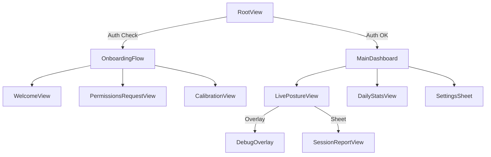

# Posture Detection App — Project Contract (AI Optimized v2)

## Goal

Desk-mounted posture detection using rear camera + LiDAR when available, with graceful 2D fallback, and feedback via audio + Apple Watch (later).

## Non-goals (until Sprint 7+)

- No "pretty" UI, onboarding, analytics dashboards, cloud sync, accounts.
- No custom ML unless the explicit pivot trigger occurs.
- No saving video by default.
- **Shadow Mode** (User rejected: immediate feedback preferred).

---

## Decisions Log

| Decision | Rationale |
|----------|-----------|
| Shadow Mode rejected | User prefers immediate feedback over delayed batch reports |
| Precision over recall | False alarms are more annoying than missed slouches — users will lose trust |
| 5-minute slouch threshold | Brief posture shifts are normal; only sustained bad posture warrants nudging |
| Protocol-based architecture | Enables mocking for tests and potential ML swap later |
| Swift Package for logic | Keeps business logic testable and separate from UIKit/ARKit dependencies |
| Front camera support | Enables posture tracking while user faces screen; uses existing 2D pipeline with switchable provider layer |

---

## Success Criteria

Measured against golden recordings with ground-truth tags:

- **Detection rate**: ≥70% of slouch episodes (≥5 minutes sustained) trigger a nudge
- **False positive rate**: <3% of "good posture" time incorrectly flagged (priority metric)
- **Task mode accuracy**: ≥80% of reading/typing segments correctly classified
- **Recovery detection**: When user corrects posture, state returns to Good within 5 seconds

Measured during live 60-minute sessions:

- **Nudge count**: ≤2 nudges per hour during normal work
- **No spurious nudges**: Zero nudges during periods of sustained good posture
- **Precision priority**: Better to miss a slouch than fire a false alarm

---

## Performance Budgets

Strict limits to ensure the app remains lightweight and battery-efficient:

- **CPU Usage**: Average < 15% on high-performance cores during active monitoring.
- **Battery Impact**: < 5% drain per hour of background monitoring.
- **Memory Footprint**: < 100MB steady state (excluding ARKit buffers).
- **Thermal State**: Must not trigger `serious` thermal state during standard 1-hour session.
- **Frame Processing**: Vision requests capped at 10 FPS; Depth sampling capped at 15 FPS.

---

## Configurable Thresholds

These values should be adjustable in a debug/settings screen without rebuilding the app:

```swift
struct PostureThresholds: Codable {
    // MARK: - Detection Timing
    var slouchDurationBeforeNudge: TimeInterval = 300  // 5 minutes default
    var recoveryGracePeriod: TimeInterval = 5          // Seconds to confirm correction
    var driftingToBadThreshold: TimeInterval = 60      // Seconds in "drifting" before "bad"

    // MARK: - Posture Metrics
    var forwardCreepThreshold: Float = 0.10            // Meters (depth) or ratio (2D)
    var twistThreshold: Float = 15.0                   // Degrees
    var sideLeanThreshold: Float = 0.08                // Normalized offset
    var headDropThreshold: Float = 0.06                // Normalized head drop from baseline
    var shoulderRoundingThreshold: Float = 10.0        // Degrees of additional torso angle

    // MARK: - Confidence Gates
    var minTrackingQuality: Float = 0.7                // Below this, don't judge posture
    var minKeypointVisibility: Float = 0.7             // Required keypoints ratio
    var depthConfidenceThreshold: Float = 0.6          // Below this, switch to 2D mode

    // MARK: - Nudge Behavior
    var nudgeCooldown: TimeInterval = 600              // 10 minutes between nudges
    var maxNudgesPerHour: Int = 2
    var acknowledgementWindow: TimeInterval = 30       // Seconds to detect correction after nudge

    // MARK: - Mode Switching
    var depthRecoveryDelay: TimeInterval = 2.0         // Seconds of good depth before switching back
    var absentThreshold: TimeInterval = 3.0            // Seconds without tracking before "absent"
}
```

Store in `UserDefaults` or a JSON file. Load at app launch, apply immediately when changed.

---

## Runtime Modes

- **DepthFusion mode**: When depth confidence is good.
- **TwoDOnly mode**: When depth confidence is weak/unavailable.

---

## Error States & Recovery

| Condition | Detection | Response | Timer Behavior |
|-----------|-----------|----------|----------------|
| Vision returns nil pose | `PoseObservation` is nil | Increment `lostFrameCount`, mark quality "degraded" after 10 consecutive frames | Pause slouch timer |
| ARKit tracking lost | `ARFrame.camera.trackingState != .normal` | Set `TrackingQuality.lost`, show "Repositioning..." in debug UI | Pause slouch timer |
| Depth confidence drops | `DepthConfidence < threshold` | Switch to TwoDOnly mode automatically | Continue timer (2D still works) |
| User leaves frame | No body detected for `absentThreshold` seconds | Set `PostureState.absent` | Reset slouch timer |
| User returns to frame | Body detected after absence | Require new baseline calibration if absence > 5 minutes | Timer starts fresh |
| Thermal throttling | `ProcessInfo.thermalState` changes | Reduce FPS or disable depth (see Sprint 9) | Continue with degraded mode |

**Key principle**: When tracking quality is uncertain, *never* judge posture. Only count time toward slouch detection when confidence is high.

---

## Known Gotchas

Common pitfalls that will trip you up — learn from past mistakes:

| Issue | Solution |
|-------|----------|
| Vision pose detection returns flipped Y coordinates | Flip Y: `1.0 - point.y` before using |
| ARKit depth map is lower resolution than RGB | Scale coordinates: `depthPoint = rgbPoint * (depthSize / rgbSize)` |
| `CVPixelBuffer` must be locked before reading | Always use `CVPixelBufferLockBaseAddress(buffer, .readOnly)` and unlock after |
| Combine publishers retain self strongly | Use `[weak self]` in all `sink` closures to avoid retain cycles |
| Simulator has no ARKit/LiDAR | Must use `MockPoseProvider` for all Simulator testing — no workarounds |
| `VNDetectHumanBodyPoseRequest` is slow | Throttle to 10 FPS max; don't call on every frame |
| ARSession can silently fail after interruption | Always check `trackingState` before trusting frame data |
| Depth values near edges are unreliable | Ignore depth samples within 5% of frame edges |
| `simd_float3x3` column-major ordering | Camera intrinsics: `fx = intrinsics[0,0]`, `cx = intrinsics[2,0]` (not `[0,2]`) |
| JSON encoding `TimeInterval` loses precision | Use `Int64` milliseconds for timestamps in recordings |
| SwiftUI view updates on background thread crash | Always dispatch engine outputs to `@MainActor` before publishing |
| `ProcessInfo.thermalState` doesn't work in Simulator | Mock thermal states for testing; only real behavior on device |

---

## Debugging Checklist

When something's not working, check these in order:

### Posture not being detected at all

1. **Check Debug UI**: Is `trackingQuality` showing "good"?
   - If "lost" → User not in frame, or camera blocked
   - If "degraded" → Vision failing to find keypoints (lighting? distance?)
2. **Check Debug UI**: Is `depthMode` correct for your device?
   - Non-LiDAR devices should show "twoDOnly"
3. **Check keypoint visibility**: Are shoulders and head detected?
   - Look at `PoseObservation.keypoints` count in debug state
4. **Is baseline set?** Check `baseline` is not nil
   - If nil → Calibration never completed or failed

### Nudges not firing

1. **Is posture state actually "bad"?** Check Debug UI
   - If "good" or "drifting" → Thresholds not exceeded yet
2. **Has slouch duration exceeded threshold?** (Default: 5 minutes)
   - Check `PostureState.bad(since:)` timestamp vs current time
3. **Is cooldown active?** Check `NudgeEngine.debugState["cooldownRemaining"]`
   - Wait for cooldown to expire, or adjust threshold for testing
4. **Has max nudges per hour been reached?** Check `nudgesThisHour`
5. **Is task mode "stretching"?** This suppresses nudges intentionally

### False positives (nudging when posture is fine)

1. **Is baseline stale?** Check `baseline.timestamp`
   - Recalibrate if phone or user position changed
2. **Are thresholds too sensitive?** Check current values
   - Increase `forwardCreepThreshold`, `twistThreshold`, etc.
3. **Is 2D mode active on a LiDAR device?** Check why depth failed
   - Depth adds stability; 2D is more jittery

### Mode switching too frequently

1. **Check depth confidence variance** in debug output
   - If fluctuating around threshold → Increase `depthRecoveryDelay`
2. **Is lighting consistent?** Shadows can affect depth quality
3. **Is phone stable?** Vibration affects depth readings

### App crashing or freezing

1. **Check for memory leaks**: Profile with Instruments
   - RecorderService can accumulate samples if not stopped
2. **Check for main thread blocking**: Vision processing should be async
3. **Check thermal state**: Device may be throttling or shutting down

---

## Baseline Calibration

### When Calibration Happens

1. **App launch**: Always prompt for calibration
2. **After extended absence**: If user leaves frame for >5 minutes
3. **Manual trigger**: User taps "Recalibrate" button
4. **Significant position change**: If detected shoulder position shifts >30% from baseline (suggests phone moved)

### Calibration Process

```swift
struct CalibrationSession {
    let duration: TimeInterval = 5.0  // Sample for 5 seconds
    let requiredSamples: Int = 30     // At least 30 good frames
    let stabilityThreshold: Float = 0.02  // Max variance during calibration
}
```

1. Display "Sit up straight" prompt with visual guide
2. Collect `PoseSample` frames for `duration` seconds
3. Validate: At least `requiredSamples` frames with good tracking quality
4. Validate: Pose variance < `stabilityThreshold` (user held still)
5. Compute baseline as median of collected samples
6. Store baseline with timestamp

### Baseline Data

```swift
struct Baseline: Codable {
    let timestamp: Date
    let shoulderMidpoint: SIMD3<Float>      // 3D position (or 2D if no depth)
    let headPosition: SIMD3<Float>
    let torsoAngle: Float                    // Degrees from vertical
    let shoulderWidth: Float                 // For scale normalization
    let depthAvailable: Bool

    func isStale(after interval: TimeInterval = 3600) -> Bool {
        Date().timeIntervalSince(timestamp) > interval
    }
}
```

---

## Architecture

### Project Structure

```
Quant/
├── Quant.xcodeproj
├── Quant/                    # App Target
│   ├── App/
│   │   ├── Quant.swift       # @main entry point
│   │   └── AppModel.swift                  # Main observable state
│   ├── Services/
│   │   ├── ARSessionService.swift          # ARKit → PoseProvider
│   │   └── HapticsService.swift            # Audio/haptic feedback
│   ├── Views/
│   │   ├── ContentView.swift
│   │   ├── DebugOverlayView.swift
│   │   ├── CalibrationView.swift
│   │   └── SettingsView.swift
│   └── Resources/
│       └── Assets.xcassets
│
├── PostureLogic/                           # Swift Package
│   ├── Package.swift
│   ├── Sources/
│   │   └── PostureLogic/
│   │       ├── Protocols/
│   │       │   ├── PoseProvider.swift
│   │       │   ├── DebugDumpable.swift
│   │       │   └── AllProtocols.swift      # Re-exports all protocols
│   │       ├── Models/
│   │       │   ├── InputFrame.swift
│   │       │   ├── PoseObservation.swift
│   │       │   ├── PoseSample.swift
│   │       │   ├── RawMetrics.swift
│   │       │   ├── PostureState.swift
│   │       │   ├── TaskMode.swift
│   │       │   ├── Baseline.swift
│   │       │   ├── NudgeDecision.swift
│   │       │   ├── TrackingQuality.swift
│   │       │   └── DepthConfidence.swift
│   │       ├── Services/
│   │       │   ├── PoseService.swift
│   │       │   ├── DepthService.swift
│   │       │   ├── PoseDepthFusion.swift
│   │       │   ├── RecorderService.swift
│   │       │   └── ReplayService.swift
│   │       ├── Engines/
│   │       │   ├── MetricsEngine.swift
│   │       │   ├── TaskModeEngine.swift
│   │       │   ├── PostureEngine.swift
│   │       │   └── NudgeEngine.swift
│   │       └── Testing/
│   │           ├── MockPoseProvider.swift
│   │           └── TestScenarios.swift
│   └── Tests/
│       └── PostureLogicTests/
│           ├── PoseServiceTests.swift
│           ├── MetricsEngineTests.swift
│           ├── PostureEngineTests.swift
│           ├── NudgeEngineTests.swift
│           ├── IntegrationTests.swift
│           └── Resources/                  # Test fixtures
│               ├── good_posture_5min.json
│               ├── gradual_slouch.json
│               ├── reading_vs_typing.json
│               └── depth_fallback_scenario.json
│

```

## UI/UX Architecture

### View Hierarchy (MVVM)



### User Flow

1.  **Onboarding**:
    - Welcome & Value Prop
    - **Permissions Prime**: Explain why Camera/Motion is needed.
    - **System Request**: Trigger iOS permission dialogs.
    - **Initial Calibration**: Guide user to sit straight and capture baseline.
2.  **Active Monitoring**:
    - Minimalist UI: Subtle status indicator (Green/Amber/Red).
    - Background Operation: App minimizes but keeps "Live Activity" or background audio active.
3.  **Intervention**:
    - **Nudge**: Gentle haptic/audio cue.
    - **Correction**: User adjusts, status returns to Green.

### Module Dependency Graph

```
┌─────────────────┐      ┌──────────────────┐
│ ARSessionService│      │ MockPoseProvider │
└────────┬────────┘      └────────┬─────────┘
         │                        │
         └───────────┬────────────┘
                     │ (PoseProvider Protocol)
                     ▼
            ┌─────────────────┐
            │  PostureLogic   │ (Swift Package)
            │                 │
            │  ┌───────────┐  │
            │  │PoseService│  │
            │  └─────┬─────┘  │
            │        │        │
            │       ...       │
            └─────────────────┘
                     │
                     ▼
            ┌─────────────────┐
            │     AppModel    │
            └─────────────────┘
```

### Ticket Dependency Graph

```
═══════════════════════════════════════
  PHASE 1 — MVP: Camera → Watch Tap
═══════════════════════════════════════

Sprint 0 (DONE):
    0.1 ──→ 0.2 ──→ 0.3
     │
     ▼
Sprint 1 (DONE):
    1.1 ──→ 1.2 ──→ 1.3 ──→ 1.4
     │
     ▼
Sprint 2 (DONE):
    2.1 ──→ 2.2 ──→ 2.3 ──→ 2.4 ──→ 2.5
              │                │
              ▼                ▼
Sprint 3 (DONE):
             3.1              3.2
              │                │
              ▼                ▼
Sprint 4 (DONE):
             4.1 ──→ 4.2
              │──→ 4.3
              │──→ 4.4

═══════════════════════════════════════
  ✅ MVP COMPLETE — Bad posture → Watch tap
═══════════════════════════════════════

Sprint 4.5 (detection completeness):
    4.5 ──→ 4.6

Sprint 4.7 (front camera support):
    4.7.1 ──→ 4.7.2 ──→ 4.7.3 ──→ 4.7.4 ──→ 4.7.5 ──→ 4.7.6

Sprint 4.8 (calibrated metrics debug display):
    4.8.1 ──→ 4.8.2

  PHASE 2 — Enhancement
═══════════════════════════════════════

Sprint 5 (3D depth fusion):
    5.1 ──→ 5.2

Sprint 6 (recording + replay):
    6.1 ──→ 6.2
     │──→ 6.3
     │      │
     ▼      ▼
    6.5    6.4

Sprint 7 (task mode + settings):
    7.1 ──→ 7.2
     │──→ 7.4
    7.3

Sprint 8 (setup hardening):
    8.1
    8.2

═══════════════════════════════════════
  PHASE 3 — Hardening
═══════════════════════════════════════

Sprint 9 (stability + thermal):
    9.1
    9.2

Sprint 10 (background + Mac):
    10.1
    10.2
```

---

## Type Signatures (Key Interfaces)

```swift
// MARK: - Input Abstraction

protocol PoseProvider {
    var framePublisher: AnyPublisher<InputFrame, Never> { get }
    func start() async throws
    func stop()
}

// MARK: - Thermal Management

enum ThermalState {
    case nominal
    case fair
    case serious
    case critical
}

protocol ThermalMonitorProtocol: DebugDumpable {
    var state: AnyPublisher<ThermalState, Never> { get }
}

// MARK: - Introspection

protocol DebugDumpable {
    var debugState: [String: Any] { get }
}

// MARK: - Pose

enum PoseDetectionResult {
    case observation(PoseObservation)
    case throttled
    case noPose
    case failed
}

protocol PoseServiceProtocol: DebugDumpable {
    func process(frame: InputFrame) async -> PoseDetectionResult
}

// MARK: - Depth

protocol DepthServiceProtocol: DebugDumpable {
    func sampleDepth(at points: [CGPoint], from frame: InputFrame) -> [DepthAtPoint]
    func computeConfidence(from frame: InputFrame) -> DepthConfidence
}

// MARK: - Fusion

protocol PoseDepthFusionProtocol: DebugDumpable {
    mutating func fuse(pose: PoseObservation, depthSamples: [DepthAtPoint]?, confidence: DepthConfidence, trackingQuality: TrackingQuality) -> PoseSample?
}

// MARK: - Metrics

protocol MetricsEngineProtocol: DebugDumpable {
    func compute(from sample: PoseSample, baseline: Baseline?) -> RawMetrics
}

// MARK: - Decisioning

protocol TaskModeEngineProtocol: DebugDumpable {
    func infer(from recentMetrics: [RawMetrics]) -> TaskMode
}

protocol PostureEngineProtocol: DebugDumpable {
    func update(metrics: RawMetrics, taskMode: TaskMode, trackingQuality: TrackingQuality) -> PostureState
    func reset()
}

// MARK: - Recording

protocol RecorderServiceProtocol: DebugDumpable {
    func startRecording()
    func stopRecording() -> RecordedSession
    func addTag(_ tag: Tag)
    func record(sample: PoseSample)
}

protocol ReplayServiceProtocol: DebugDumpable {
    func load(session: RecordedSession)
    func play() -> AsyncStream<PoseSample>
    func stop()
}

// MARK: - Nudge

protocol NudgeEngineProtocol: DebugDumpable {
    func evaluate(state: PostureState, trackingQuality: TrackingQuality, movementLevel: Float, taskMode: TaskMode, currentTime: TimeInterval) -> NudgeDecision
    func recordNudgeFired(at currentTime: TimeInterval)
    func recordAcknowledgement()
    func reset()
}

// MARK: - Pipeline (Central Orchestrator)

class Pipeline {
    // Published outputs
    @Published var latestSample: PoseSample?
    @Published var latestMetrics: RawMetrics?
    @Published var currentMode: DepthMode
    @Published var depthConfidence: DepthConfidence
    @Published var trackingQuality: TrackingQuality
    @Published var fps: Float
    @Published var poseConfidence: Float
    @Published var poseKeypointCount: Int
    @Published var missingCriticalJoints: String
    @Published var postureState: PostureState
    @Published var nudgeDecision: NudgeDecision

    var baseline: Baseline?

    // Orchestrates: PoseService → PoseDepthFusion → MetricsEngine → MetricsSmoother → PostureEngine → NudgeEngine
    // Includes: frame throttling, temporal tracking quality smoothing (3-frame majority vote), FPS computation

    func recordNudgeFired()
    func recordNudgeAcknowledgement()
    func resetNudgeEngine()
}
```

---

## Data Models (Complete)

```swift
// MARK: - Input

struct InputFrame {
    let timestamp: TimeInterval
    let pixelBuffer: CVPixelBuffer?
    let depthMap: CVPixelBuffer?
    let cameraIntrinsics: simd_float3x3?
}

// MARK: - Pose Detection

struct PoseObservation {
    let timestamp: TimeInterval
    let keypoints: [Keypoint]
    let confidence: Float  // 0.0 - 1.0
}

struct Keypoint {
    let joint: Joint
    let position: CGPoint      // Normalized 0-1
    let confidence: Float
}

enum Joint: String, CaseIterable, Codable {
    case nose, leftEye, rightEye, leftEar, rightEar
    case leftShoulder, rightShoulder
    case leftElbow, rightElbow
    case leftWrist, rightWrist
    case leftHip, rightHip
    case leftKnee, rightKnee
    case leftAnkle, rightAnkle
}

// MARK: - Depth

struct DepthAtPoint {
    let point: CGPoint
    let depth: Float           // Meters
    let confidence: Float
}

enum DepthConfidence: Comparable {
    case unavailable
    case low
    case medium
    case high

    var numericValue: Float {
        switch self {
        case .unavailable: return 0.0
        case .low: return 0.3
        case .medium: return 0.6
        case .high: return 0.9
        }
    }
}

// MARK: - Fused Sample

struct PoseSample: Codable {
    let timestamp: TimeInterval
    let depthMode: DepthMode

    // Key positions (3D if depth available, 2D otherwise)
    let headPosition: SIMD3<Float>
    let shoulderMidpoint: SIMD3<Float>
    let leftShoulder: SIMD3<Float>
    let rightShoulder: SIMD3<Float>

    // Derived angles
    let torsoAngle: Float              // Degrees from vertical
    let headForwardOffset: Float       // How far head is forward of shoulders
    let shoulderTwist: Float           // Rotation in degrees

    let shoulderWidthRaw: Float        // Raw shoulder width in image coords (0-1), preserves scale signal for forward creep
    let trackingQuality: TrackingQuality
}

enum DepthMode: String, Codable {
    case depthFusion
    case twoDOnly
}

// MARK: - Tracking Quality

enum TrackingQuality: Comparable, Codable {
    case lost
    case degraded
    case good

    var allowsPostureJudgement: Bool {
        self == .good
    }
}

// MARK: - Metrics

struct RawMetrics: Codable {
    let timestamp: TimeInterval

    // Deltas from baseline (positive = worse)
    let forwardCreep: Float            // How much closer to camera vs baseline
    let headDrop: Float                // How much head has dropped
    let shoulderRounding: Float        // Shoulder forward rotation
    let lateralLean: Float             // Side-to-side offset
    let twist: Float                   // Shoulder rotation from square

    // Activity indicators
    let movementLevel: Float           // 0 = still, 1 = very active
    let headMovementPattern: MovementPattern
}

enum MovementPattern: String, Codable {
    case still
    case smallOscillations    // Reading
    case largeMovements       // Typing, gesturing
    case erratic              // Adjusting position
}

// MARK: - Task Mode

enum TaskMode: String, Codable {
    case unknown
    case reading              // Small head movements, still hands
    case typing               // Regular arm movements, stable torso
    case meeting              // More head movement, varied posture
    case stretching           // Large movements, ignore posture
}

// MARK: - Posture State

enum PostureState: Codable {
    case absent                        // User not in frame
    case calibrating                   // Establishing baseline
    case good                          // Within thresholds
    case drifting(since: TimeInterval) // Starting to slouch
    case bad(since: TimeInterval)      // Sustained bad posture

    var isBad: Bool {
        if case .bad = self { return true }
        return false
    }

    var durationInCurrentState: TimeInterval? {
        switch self {
        case .drifting(let since), .bad(let since):
            return Date().timeIntervalSince1970 - since
        default:
            return nil
        }
    }
}

// MARK: - Nudge

enum NudgeDecision: Codable {
    case none
    case pending(reason: NudgeReason, timeRemaining: TimeInterval)
    case fire(reason: NudgeReason)
    case suppressed(reason: SuppressionReason)
}

enum NudgeReason: String, Codable {
    case sustainedSlouch
    case forwardCreep
    case headDrop
}

enum SuppressionReason: String, Codable {
    case cooldownActive
    case maxNudgesReached
    case userStretching
    case lowTrackingQuality
    case recentAcknowledgement
}

// MARK: - Recording

struct RecordedSession: Codable {
    let id: UUID
    let startTime: Date
    let endTime: Date
    let samples: [PoseSample]
    let tags: [Tag]
    let metadata: SessionMetadata
}

struct Tag: Codable {
    let timestamp: TimeInterval
    let label: TagLabel
    let source: TagSource
}

enum TagLabel: String, Codable {
    case goodPosture
    case slouching
    case reading
    case typing
    case stretching
    case absent
}

enum TagSource: String, Codable {
    case manual           // Button tap
    case voice            // Speech recognition
    case automatic        // System-detected
}

struct SessionMetadata: Codable {
    let deviceModel: String
    let depthAvailable: Bool
    let thresholds: PostureThresholds
}
```

---

## Sprints

---

# Phase 1 — MVP: Camera to Watch Tap

> **Goal**: Deliver the core value loop — detect bad posture from camera, nudge via Apple Watch — as fast as possible. 2D-only; no depth fusion, recording, or task classification needed yet.

---

### Sprint 0 — Research & Infrastructure  ✅ DONE

#### Ticket 0.1 — Logic Package & Test Harness

| Field | Value |
|-------|-------|
| **Goal** | Create `PostureLogic` Swift Package and `MockPoseProvider` |
| **Depends on** | — |
| **Inputs** | None |
| **Outputs** | Swift Package with XCTest target |
| **Acceptance** | `swift test` passes for basic "Mock Frame → Pipeline → Output" flow |

**File to create**: `PostureLogic/Package.swift`

```swift
// swift-tools-version: 5.9
import PackageDescription

let package = Package(
    name: "PostureLogic",
    platforms: [.iOS(.v17), .macOS(.v14)],
    products: [
        .library(name: "PostureLogic", targets: ["PostureLogic"]),
    ],
    targets: [
        .target(name: "PostureLogic"),
        .testTarget(
            name: "PostureLogicTests",
            dependencies: ["PostureLogic"],
            resources: [.process("Resources")]
        ),
    ]
)
```

**File to create**: `PostureLogic/Sources/PostureLogic/Testing/MockPoseProvider.swift`

```swift
import Foundation
import Combine

public final class MockPoseProvider: PoseProvider {
    public var framePublisher: AnyPublisher<InputFrame, Never> {
        frameSubject.eraseToAnyPublisher()
    }

    private let frameSubject = PassthroughSubject<InputFrame, Never>()
    private var isRunning = false

    public init() {}

    public func start() async throws {
        isRunning = true
    }

    public func stop() {
        isRunning = false
    }

    // MARK: - Test Helpers

    public func emit(frame: InputFrame) {
        guard isRunning else { return }
        frameSubject.send(frame)
    }

    public func emit(scenario: TestScenario) {
        for frame in scenario.frames {
            emit(frame: frame)
        }
    }
}
```

**Test to write**: `PostureLogicTests/IntegrationTests.swift`

```swift
import XCTest
@testable import PostureLogic

final class IntegrationTests: XCTestCase {
    func test_mockFrameFlowsThroughPipeline() async throws {
        // Given
        let mock = MockPoseProvider()
        let pipeline = Pipeline(provider: mock)  // You'll create this

        try await mock.start()

        // When
        mock.emit(frame: TestScenarios.goodPosture.frames[0])

        // Then
        let output = await pipeline.latestSample
        XCTAssertNotNil(output)
        XCTAssertEqual(output?.trackingQuality, .good)
    }
}
```

**Manual test steps**

1. From Terminal at the repo root, run `swift test` and confirm it completes with **0 failures**.
2. In Xcode, open the `PostureLogic` package and confirm it builds for iOS (no red errors).
3. Run the `IntegrationTests.test_mockFrameFlowsThroughPipeline` test and confirm `latestSample` becomes non-nil (or your equivalent pipeline output updates).

---

#### Ticket 0.2 — Spike Harness (ARKit Integration)

| Field | Value |
|-------|-------|
| **Goal** | Connect ARKit to the `PoseProvider` protocol |
| **Depends on** | 0.1 |
| **Inputs** | Live camera |
| **Outputs** | App running `ARSessionService` feeding the Logic Package |
| **Acceptance** | Camera frames reach the pipeline; console logs frame timestamps |

**File to create**: `Quant/Services/ARSessionService.swift`

```swift
import ARKit
import Combine

final class ARSessionService: NSObject, PoseProvider {
    var framePublisher: AnyPublisher<InputFrame, Never> {
        frameSubject.eraseToAnyPublisher()
    }

    private let session = ARSession()
    private let frameSubject = PassthroughSubject<InputFrame, Never>()

    func start() async throws {
        let config = ARBodyTrackingConfiguration()
        config.frameSemantics = .bodyDetection

        session.delegate = self
        session.run(config)
    }

    func stop() {
        session.pause()
    }
}

extension ARSessionService: ARSessionDelegate {
    func session(_ session: ARSession, didUpdate frame: ARFrame) {
        let inputFrame = InputFrame(
            timestamp: frame.timestamp,
            pixelBuffer: frame.capturedImage,
            depthMap: frame.sceneDepth?.depthMap,
            cameraIntrinsics: frame.camera.intrinsics
        )
        frameSubject.send(inputFrame)
    }
}
```

**Manual test steps**

1. Build & run the iOS app on a **real device** (not Simulator).
2. Grant camera permissions when prompted.
3. Confirm the console logs a steady stream of frame timestamps (e.g., increasing `frame.timestamp` values) while the camera is open.
4. Background the app and return; confirm frames resume (even if you haven't added full lifecycle handling yet).

---

#### Ticket 0.3 — Supported Range Placeholder Artifact

| Field | Value |
|-------|-------|
| **Goal** | Document expected operating conditions |
| **Depends on** | 0.2 |
| **Inputs** | Manual testing observations |
| **Outputs** | `SUPPORTED_RANGE.md` file |
| **Acceptance** | Document exists with distance/angle constraints |

**File to create**: `SUPPORTED_RANGE.md`

```markdown
# Supported Operating Range

## Distance
- **Minimum**: 0.5m (arm's length)
- **Maximum**: 1.5m (desk depth)
- **Optimal**: 0.7m - 1.0m

## Angle
- **Horizontal**: Camera should face user's torso directly (±15°)
- **Vertical**: Slight downward angle acceptable (0° - 30° down)

## Lighting
- Sufficient ambient light for camera
- Avoid strong backlight (window behind user)

## Position
- Phone should be stable (tripod/stand recommended)
- Upper body visible from shoulders up
```

**Manual test steps**

1. Confirm `SUPPORTED_RANGE.md` exists in the repo and is committed/visible in Xcode or your file browser.
2. Open the file and verify it includes sections for **Distance**, **Angle**, **Lighting**, and **Position** with specific numeric ranges.

#### Sprint 0 — Definition of Done

- [x] `PostureLogic` Swift Package created and builds
- [x] `MockPoseProvider` can emit test frames
- [x] `swift test` passes with at least one integration test
- [x] App runs on device and logs frame timestamps
- [x] `SUPPORTED_RANGE.md` document exists
- [x] No compiler warnings

---

### Sprint 1 — Sensors + Depth Confidence + 2D Fallback  ✅ DONE

#### Ticket 1.1 — ARSessionService + Lifecycle

| Field | Value |
|-------|-------|
| **Goal** | Robust ARSession lifecycle with proper start/stop/interrupt handling |
| **Depends on** | 0.2 |
| **Inputs** | ARKit session events |
| **Outputs** | `ARSessionService` that handles interruptions gracefully |
| **Acceptance** | App survives phone calls, backgrounding, camera access dialogs |

**Add to** `ARSessionService.swift`:

```swift
func session(_ session: ARSession, didFailWithError error: Error) {
    // Log error, attempt recovery
}

func sessionWasInterrupted(_ session: ARSession) {
    // Pause posture detection, show "Paused" state
}

func sessionInterruptionEnded(_ session: ARSession) {
    // Resume with fresh configuration
}
```

**Manual test steps**

1. Run the app on device, start the AR session, then simulate an interruption: lock/unlock the phone or switch apps briefly.
2. Return to the app and confirm it does not crash and the session resumes (or shows your intended paused state).
3. Trigger a camera permission change scenario (Settings → Privacy → Camera) and relaunch; confirm the app handles denial gracefully (e.g., shows paused/error state).

---

#### Ticket 1.2 — DepthService + Depth Confidence Indicator

| Field | Value |
|-------|-------|
| **Goal** | Sample depth at keypoint locations, compute overall confidence |
| **Depends on** | 1.1 |
| **Inputs** | `InputFrame` with depth map |
| **Outputs** | `[DepthAtPoint]` and `DepthConfidence` |
| **Acceptance** | Unit test shows correct depth sampling; confidence degrades when depth map is nil |

**File to create**: `PostureLogic/Sources/PostureLogic/Services/DepthService.swift`

```swift
public struct DepthService: DepthServiceProtocol {
    public var debugState: [String: Any] {
        ["lastConfidence": lastConfidence.rawValue]
    }

    private var lastConfidence: DepthConfidence = .unavailable

    public init() {}

    public func sampleDepth(at points: [CGPoint], from frame: InputFrame) -> [DepthAtPoint] {
        guard let depthMap = frame.depthMap else {
            return points.map { DepthAtPoint(point: $0, depth: 0, confidence: 0) }
        }

        // TODO: Implement CVPixelBuffer sampling
        return []
    }

    public func computeConfidence(from frame: InputFrame) -> DepthConfidence {
        guard frame.depthMap != nil else { return .unavailable }

        // TODO: Analyze depth map quality
        // - Check for holes/invalid values
        // - Check temporal consistency
        return .high
    }
}
```

**Test to write**:

```swift
func test_depthConfidence_returnsUnavailable_whenNoDepthMap() {
    let service = DepthService()
    let frame = InputFrame(timestamp: 0, pixelBuffer: nil, depthMap: nil, cameraIntrinsics: nil)

    let confidence = service.computeConfidence(from: frame)

    XCTAssertEqual(confidence, .unavailable)
}
```

**Manual test steps**

1. Run unit tests for `DepthService` and confirm the `nil depthMap → .unavailable` case passes.
2. On a LiDAR-capable device, run the app and confirm `DepthConfidence` is **not** `.unavailable` while depth is available.
3. Cover the LiDAR sensor / create a scenario where `sceneDepth` is nil and confirm confidence drops (or the UI/debug output reflects missing depth).

---

#### Ticket 1.3 — Mode Switcher (DepthFusion ↔ TwoDOnly)

| Field | Value |
|-------|-------|
| **Goal** | Automatically switch modes based on depth confidence |
| **Depends on** | 1.2 |
| **Inputs** | Stream of `DepthConfidence` values |
| **Outputs** | Current `DepthMode` |
| **Acceptance** | Mode switches to 2D when confidence drops; waits `depthRecoveryDelay` before switching back |

**File to create**: `PostureLogic/Sources/PostureLogic/Services/ModeSwitcher.swift`

```swift
public final class ModeSwitcher {
    public private(set) var currentMode: DepthMode = .depthFusion

    private let thresholds: PostureThresholds
    private var goodDepthStartTime: TimeInterval?

    public init(thresholds: PostureThresholds) {
        self.thresholds = thresholds
    }

    public func update(confidence: DepthConfidence, timestamp: TimeInterval) -> DepthMode {
        switch currentMode {
        case .depthFusion:
            if confidence < .medium {
                currentMode = .twoDOnly
                goodDepthStartTime = nil
            }

        case .twoDOnly:
            if confidence >= .medium {
                if let start = goodDepthStartTime {
                    if timestamp - start >= thresholds.depthRecoveryDelay {
                        currentMode = .depthFusion
                        goodDepthStartTime = nil
                    }
                } else {
                    goodDepthStartTime = timestamp
                }
            } else {
                goodDepthStartTime = nil
            }
        }

        return currentMode
    }
}
```

**Manual test steps**

1. Run on device and watch the reported mode (`depthFusion` vs `twoDOnly`) in logs or debug UI.
2. Force depth to be unavailable (e.g., by running on a non-LiDAR device, or by making `sceneDepth` nil) and confirm it switches to `twoDOnly` quickly.
3. Restore good depth and confirm it waits at least `depthRecoveryDelay` seconds of good confidence before switching back to `depthFusion`.

---

#### Ticket 1.4 — Debug UI v1 (Minimal)

| Field | Value |
|-------|-------|
| **Goal** | Show live state from all `DebugDumpable` components |
| **Depends on** | 1.3 |
| **Inputs** | `debugState` from all engines/services |
| **Outputs** | Overlay view showing current mode, confidence, frame rate |
| **Acceptance** | Can see mode switches happen in real-time |

**File to create**: `Quant/Views/DebugOverlayView.swift`

```swift
import SwiftUI

struct DebugOverlayView: View {
    @ObservedObject var appModel: AppModel

    var body: some View {
        VStack(alignment: .leading, spacing: 4) {
            Text("Mode: \(appModel.currentMode.rawValue)")
            Text("Depth: \(appModel.depthConfidence.rawValue)")
            Text("Tracking: \(appModel.trackingQuality.rawValue)")
            Text("FPS: \(appModel.fps, specifier: "%.1f")")
        }
        .font(.system(.caption, design: .monospaced))
        .padding(8)
        .background(.ultraThinMaterial)
        .cornerRadius(8)
    }
}
```

**Implementation notes** (actual): The debug overlay expanded beyond the minimal version to include:
- Posture state with duration timing
- Nudge decision with countdown timers
- Audio feedback status (enable state, play count)
- Watch connectivity status (paired/reachable, send count)
- Full pose sample readout (head, shoulders, torso angle, twist, shoulder width)

**Manual test steps**

1. Run on device and verify the debug overlay is visible and updates live (mode, depth, tracking, FPS).
2. Move in/out of frame or change lighting and confirm the overlay values change accordingly (no frozen numbers).
3. Rotate the device / background-foreground the app and confirm the overlay still appears and updates.

#### Sprint 1 — Definition of Done

- [x] App runs on device for 5+ minutes without crashing
- [x] Debug UI shows live depth confidence and mode
- [x] Mode switches from DepthFusion → TwoDOnly when depth unavailable
- [x] Mode switches back after `depthRecoveryDelay` seconds of good depth
- [x] App handles phone calls and backgrounding gracefully
- [x] All unit tests pass for `DepthService` and `ModeSwitcher`

---

### Sprint 2 — 2D Keypoints + Metrics (MVP Path)  ✅ DONE

> **Focus**: Extract pose keypoints, build 2D PoseSamples, and compute metrics — all without depth. This is the minimum signal path needed for posture judgement. 3D depth fusion is deferred to Sprint 5.

#### Ticket 2.1 — PoseService (Vision Pose, Throttled)

| Field | Value |
|-------|-------|
| **Goal** | Extract body keypoints using Vision framework, throttle to ~10 FPS |
| **Depends on** | 1.1 |
| **Inputs** | `InputFrame.pixelBuffer` |
| **Outputs** | `PoseObservation` |
| **Acceptance** | Keypoints extracted at ~10 FPS; handles nil gracefully |

**File to create**: `PostureLogic/Sources/PostureLogic/Services/PoseService.swift`

```swift
import Vision

public final class PoseService: PoseServiceProtocol {
    public var debugState: [String: Any] {
        [
            "lastProcessTime": lastProcessTime,
            "keypointsFound": lastKeypointCount
        ]
    }

    private var lastProcessTime: TimeInterval = 0
    private var lastKeypointCount: Int = 0
    private let minFrameInterval: TimeInterval = 0.1  // ~10 FPS

    public init() {}

    public func process(frame: InputFrame) async -> PoseObservation? {
        guard frame.timestamp - lastProcessTime >= minFrameInterval else {
            return nil  // Throttled
        }

        guard let pixelBuffer = frame.pixelBuffer else {
            return nil
        }

        lastProcessTime = frame.timestamp

        let request = VNDetectHumanBodyPoseRequest()
        let handler = VNImageRequestHandler(cvPixelBuffer: pixelBuffer)

        do {
            try handler.perform([request])
            guard let observation = request.results?.first else { return nil }

            let keypoints = try extractKeypoints(from: observation)
            lastKeypointCount = keypoints.count

            return PoseObservation(
                timestamp: frame.timestamp,
                keypoints: keypoints,
                confidence: observation.confidence
            )
        } catch {
            return nil
        }
    }

    private func extractKeypoints(from observation: VNHumanBodyPoseObservation) throws -> [Keypoint] {
        // TODO: Map VNRecognizedPoint to Keypoint for each Joint
        return []
    }
}
```

**Manual test steps**

1. Run on device and confirm keypoints are produced (at minimum shoulders + head) and do not spam every frame (roughly ~10 updates/sec).
2. Temporarily point the camera at a blank scene (no person) and confirm the app handles `nil` pose results without crashing.
3. Check console or debug UI to confirm throttling is working (e.g., keypoint count updates but not at full camera FPS).

---

#### Ticket 2.2 — PoseSample Builder (2D-First)

| Field | Value |
|-------|-------|
| **Goal** | Build `PoseSample` from 2D keypoints using normalized coordinates. Depth fusion deferred to Sprint 5. |
| **Depends on** | 2.1 |
| **Inputs** | `PoseObservation` |
| **Outputs** | `PoseSample` with 2D-derived positions (z=0) and derived angles |
| **Acceptance** | Produces valid samples in `twoDOnly` mode; angles computed from 2D geometry |

**File to create**: `PostureLogic/Sources/PostureLogic/Services/PoseDepthFusion.swift`

```swift
public struct PoseDepthFusion: PoseDepthFusionProtocol {
    public var debugState: [String: Any] { [:] }

    public init() {}

    public func fuse(
        pose: PoseObservation,
        depthSamples: [DepthAtPoint]?,
        confidence: DepthConfidence
    ) -> PoseSample {
        let mode: DepthMode = confidence >= .medium ? .depthFusion : .twoDOnly

        // MVP: Build sample from 2D keypoints only
        // Use normalized (0-1) coordinates with z=0
        // Shoulder width serves as scale reference for all distances
        // TODO: Compute 2D positions from keypoints
        // TODO: Calculate derived angles (torsoAngle, headForwardOffset, shoulderTwist) from 2D geometry
        // NOTE: 3D depth fusion added in Sprint 5 (Ticket 5.2)

        return PoseSample(
            timestamp: pose.timestamp,
            depthMode: mode,
            headPosition: .zero,
            shoulderMidpoint: .zero,
            leftShoulder: .zero,
            rightShoulder: .zero,
            torsoAngle: 0,
            headForwardOffset: 0,
            shoulderTwist: 0,
            trackingQuality: .good
        )
    }
}
```

**Implementation notes** (actual):
- Returns `PoseSample?` (optional) — returns nil on missing critical keypoints
- Head position fallback chain: nose → eye midpoint → single eye → ear midpoint
- Validates shoulder width is not degenerate
- Accepts `trackingQuality` parameter

**Manual test steps**

1. Run the pipeline and confirm a `PoseSample` is produced with `depthMode: .twoDOnly` on non-LiDAR devices.
2. Inspect a few samples (logs or debug UI) and confirm key fields (head/shoulder positions) are non-zero once implemented.
3. Verify derived angles change when you move (lean forward → torsoAngle changes).

---

#### Ticket 2.3 — 2D Fallback Metrics

| Field | Value |
|-------|-------|
| **Goal** | Compute meaningful metrics without depth |
| **Depends on** | 2.2 |
| **Inputs** | 2D keypoints only |
| **Outputs** | `RawMetrics` using ratios instead of absolute distances |
| **Acceptance** | Metrics are directionally correct (worse posture → higher values) |

**Approach**: Use shoulder width as scale reference. Express all distances as ratios of shoulder width.

**Manual test steps**

1. Run on a non-LiDAR device (or force twoDOnly mode) and confirm the app still produces `RawMetrics` values.
2. Compare a simple scenario (sit upright then lean forward) in twoDOnly mode; confirm the metric direction is consistent (worse posture → higher 'bad' metrics).

---

#### Ticket 2.4 — MetricsEngine Implementation

| Field | Value |
|-------|-------|
| **Goal** | Compute all `RawMetrics` from `PoseSample` and `Baseline` |
| **Depends on** | 2.2, 2.3 |
| **Inputs** | `PoseSample`, `Baseline?` |
| **Outputs** | `RawMetrics` |
| **Acceptance** | All metric fields populated; values reasonable for good/bad posture |

**File to create**: `PostureLogic/Sources/PostureLogic/Engines/MetricsEngine.swift`

```swift
public struct MetricsEngine: MetricsEngineProtocol {
    public var debugState: [String: Any] { [:] }

    public init() {}

    public func compute(from sample: PoseSample, baseline: Baseline?) -> RawMetrics {
        guard let baseline = baseline else {
            // No baseline = can't compute deltas, return zeros
            return RawMetrics(
                timestamp: sample.timestamp,
                forwardCreep: 0,
                headDrop: 0,
                shoulderRounding: 0,
                lateralLean: 0,
                twist: 0,
                movementLevel: 0,
                headMovementPattern: .still
            )
        }

        // TODO: Compute each metric as delta from baseline
        let forwardCreep = baseline.shoulderMidpoint.z - sample.shoulderMidpoint.z
        let headDrop = baseline.headPosition.y - sample.headPosition.y
        // ... etc

        return RawMetrics(
            timestamp: sample.timestamp,
            forwardCreep: forwardCreep,
            headDrop: headDrop,
            shoulderRounding: 0,  // TODO
            lateralLean: 0,       // TODO
            twist: 0,             // TODO
            movementLevel: 0,     // TODO
            headMovementPattern: .still
        )
    }
}
```

**Input/Output Examples**:

These concrete examples show what the engine should produce for given inputs:

**Example 1: Good posture (no change from baseline)**

```
Input PoseSample:
  shoulderMidpoint: (0.0, 0.0, 0.90)  // Same as baseline
  headPosition: (0.0, 0.15, 0.88)     // Same as baseline
  torsoAngle: 2.0°

Input Baseline:
  shoulderMidpoint: (0.0, 0.0, 0.90)
  headPosition: (0.0, 0.15, 0.88)

Output RawMetrics:
  forwardCreep: 0.0      ✓ No forward movement
  headDrop: 0.0          ✓ Head at same height
  lateralLean: 0.0       ✓ Centered
  twist: 0.0             ✓ Square to camera
```

**Example 2: Slouching forward**

```
Input PoseSample:
  shoulderMidpoint: (0.0, -0.02, 0.82)  // 8cm closer, 2cm lower
  headPosition: (0.0, 0.10, 0.78)       // 10cm closer, 5cm lower
  torsoAngle: 15.0°

Input Baseline:
  shoulderMidpoint: (0.0, 0.0, 0.90)
  headPosition: (0.0, 0.15, 0.88)

Output RawMetrics:
  forwardCreep: 0.08     ⚠️ Exceeds 0.10 threshold soon
  headDrop: 0.05         ⚠️ Head dropping
  headForwardOffset: 0.04  // Head 4cm ahead of shoulders (was 2cm)
  lateralLean: 0.0
  twist: 0.0
```

**Example 3: Twisted posture**

```
Input PoseSample:
  leftShoulder: (-0.18, 0.0, 0.88)   // Left shoulder closer
  rightShoulder: (0.18, 0.0, 0.92)   // Right shoulder further

Output RawMetrics:
  twist: 12.5°           ⚠️ Approaching 15° threshold
  forwardCreep: 0.0
  lateralLean: 0.0
```

**Manual test steps**

1. Using a calibrated baseline, sit in good posture for ~30 seconds and confirm metrics hover near 0 (or near baseline).
2. Lean forward/slouch and confirm at least `forwardCreep` and `headDrop` move in the expected direction and magnitude.
3. Replay a test scenario and confirm metrics trend steadily worse over time when posture degrades.

---

#### Ticket 2.5 — Metrics Smoothing

| Field | Value |
|-------|-------|
| **Goal** | Apply temporal smoothing to reduce jitter |
| **Depends on** | 2.4 |
| **Inputs** | Raw metrics stream |
| **Outputs** | Smoothed metrics |
| **Acceptance** | Noisy input produces stable output; smoothing doesn't hide real changes |

**Approach**: Exponential moving average with configurable alpha. Higher alpha = more responsive, more jittery.

```swift
struct MetricsSmoother {
    var alpha: Float = 0.3
    private var previous: RawMetrics?

    mutating func smooth(_ current: RawMetrics) -> RawMetrics {
        guard let prev = previous else {
            previous = current
            return current
        }

        let smoothed = RawMetrics(
            timestamp: current.timestamp,
            forwardCreep: lerp(prev.forwardCreep, current.forwardCreep, alpha),
            // ... etc for all fields
        )

        previous = smoothed
        return smoothed
    }
}
```

**Implementation notes** (actual):
- Also computes `movementLevel`: frame-to-frame velocity of shoulders+head, normalized to 0-1
- Also computes `headMovementPattern` classification: uses sliding window of recent head positions, computes mean displacement and variance to classify as `.still`, `.smallOscillations`, `.largeMovements`, or `.erratic`

**Manual test steps**

1. Enable debug logging of raw vs smoothed metrics and perform small jittery movements; confirm smoothed values change less than raw.
2. Perform a clear posture change (sit upright → deep slouch) and confirm smoothing follows within a reasonable delay (doesn't 'stick' to old values).

#### Sprint 2 — Definition of Done

- [x] Keypoints visible in Debug UI (at least shoulders + head)
- [x] PoseSample produced from 2D keypoints with derived angles
- [x] MetricsEngine outputs match expected values for good/bad posture examples
- [x] 2D fallback metrics produce directionally correct values
- [x] Smoothing reduces jitter without hiding real posture changes
- [x] Debug UI shows live metrics values
- [x] All unit tests pass for `PoseService`, `PoseDepthFusion`, `MetricsEngine`, `MetricsSmoother`

---

### Sprint 3 — Calibration + Posture State Machine  ✅ DONE

> **Focus**: Establish the user's "good posture" baseline via guided calibration, then build the state machine that judges posture over time. These two pieces connect metrics to decisions.

#### Ticket 3.1 — Calibration Flow

| Field | Value |
|-------|-------|
| **Goal** | Implement guided calibration with validation |
| **Depends on** | 2.2 |
| **Inputs** | User sitting upright |
| **Outputs** | Validated `Baseline` |
| **Acceptance** | Rejects calibration if user moves too much or tracking is poor |

**File to create**: `Quant/Views/CalibrationView.swift`

```swift
struct CalibrationView: View {
    @ObservedObject var appModel: AppModel
    @State private var progress: Float = 0
    @State private var status: CalibrationStatus = .waiting

    var body: some View {
        VStack(spacing: 24) {
            Image(systemName: "figure.stand")
                .font(.system(size: 80))

            Text("Sit up straight")
                .font(.title)

            Text("Hold still for 5 seconds")
                .foregroundStyle(.secondary)

            ProgressView(value: progress)
                .padding(.horizontal, 40)

            switch status {
            case .waiting:
                Text("Position yourself in frame...")
            case .countdown(let seconds):
                Text("\(seconds)")  // Animated countdown before sampling
            case .sampling:
                Text("Hold still...")
            case .validating:
                Text("Validating...")
            case .success:
                Text("Calibration complete!")
                    .foregroundStyle(.green)
            case .failed(let reason):
                Text(reason)
                    .foregroundStyle(.red)
            }
        }
    }
}
```

**Implementation notes** (actual):
- `CalibrationConfig` struct with configurable thresholds (sample count, positional/angular variance limits)
- SIMD-based positional and angular variance validation
- Median aggregation for baseline computation
- 3-second countdown before sampling begins (`CalibrationStatus.countdown`)
- Countdown UI in CalibrationView with animated numeric display

**Manual test steps**

1. Launch the app and go through calibration: hold still for 5 seconds and confirm it reaches a success state and stores a baseline.
2. Repeat calibration while intentionally moving; confirm it fails with a clear reason and does not store a baseline.
3. Close and relaunch the app and confirm the baseline is loaded (no forced recalibration unless you intend it).

---

#### Ticket 3.2 — PostureEngine State Machine

| Field | Value |
|-------|-------|
| **Goal** | Implement state transitions: Good ↔ Drifting ↔ Bad |
| **Depends on** | 2.5, 3.1 |
| **Inputs** | `RawMetrics`, `TaskMode`, `TrackingQuality` |
| **Outputs** | `PostureState` |
| **Acceptance** | State machine follows rules; pauses timer when quality is low |

**File to create**: `PostureLogic/Sources/PostureLogic/Engines/PostureEngine.swift`

```swift
public final class PostureEngine: PostureEngineProtocol {
    public var debugState: [String: Any] {
        ["state": String(describing: currentState)]
    }

    private var currentState: PostureState = .absent
    private let thresholds: PostureThresholds

    public init(thresholds: PostureThresholds) {
        self.thresholds = thresholds
    }

    public func update(
        metrics: RawMetrics,
        taskMode: TaskMode,
        trackingQuality: TrackingQuality
    ) -> PostureState {
        // Don't judge if tracking is bad
        guard trackingQuality.allowsPostureJudgement else {
            // Don't change state, just pause timers
            return currentState
        }

        let isPostureBad = checkPostureBad(metrics: metrics, taskMode: taskMode)

        switch currentState {
        case .absent, .calibrating:
            currentState = .good

        case .good:
            if isPostureBad {
                currentState = .drifting(since: metrics.timestamp)
            }

        case .drifting(let since):
            if !isPostureBad {
                currentState = .good
            } else if metrics.timestamp - since >= thresholds.driftingToBadThreshold {
                currentState = .bad(since: since)
            }

        case .bad:
            if !isPostureBad {
                // Start grace period for recovery
                currentState = .drifting(since: metrics.timestamp)
            }
        }

        return currentState
    }

    private func checkPostureBad(metrics: RawMetrics, taskMode: TaskMode) -> Bool {
        // Apply different thresholds based on task mode
        let forwardThreshold = taskMode == .reading
            ? thresholds.forwardCreepThreshold * 1.2  // More lenient when reading
            : thresholds.forwardCreepThreshold

        return metrics.forwardCreep > forwardThreshold
            || metrics.twist > thresholds.twistThreshold
            || metrics.lateralLean > thresholds.sideLeanThreshold
    }

    public func reset() {
        currentState = .absent
    }
}
```

**Tests to write**:

```swift
func test_transitionsToGood_afterCalibration() { ... }
func test_transitionsToDrifting_whenPostureBad() { ... }
func test_transitionsToBad_afterDriftingTimeout() { ... }
func test_recoversToGood_whenPostureImproves() { ... }
func test_pausesTimer_whenTrackingQualityLow() { ... }
```

**Manual test steps**

1. With a baseline set, sit upright and confirm the state is `good`.
2. Slouch long enough to exceed your drifting threshold and confirm it transitions `good → drifting → bad`.
3. Intentionally degrade tracking (step out of frame / block camera) and confirm the state machine does not keep accumulating slouch time while quality is low.

#### Sprint 3 — Definition of Done

- [x] Calibration flow guides user through setup
- [x] Calibration rejects if user moves too much
- [x] Calibration rejects if tracking quality is poor
- [x] Baseline persists across app launches
- [x] PostureEngine transitions through all states correctly
- [x] State machine pauses timing when tracking quality drops
- [x] Debug UI shows current posture state
- [x] All unit tests pass for calibration and `PostureEngine`

---

### Sprint 4 — Nudges + Watch Connectivity (MVP Complete)  ✅ DONE

> **Focus**: The final MVP sprint. Wire up the nudge engine, audio feedback, acknowledgement detection, and Apple Watch haptics. At the end of this sprint, the core loop works: camera → keypoints → metrics → state machine → nudge → watch tap.

#### Ticket 4.1 — NudgeEngine Implementation

| Field | Value |
|-------|-------|
| **Goal** | Decide when to fire nudges based on posture state and rules |
| **Depends on** | 3.2 |
| **Inputs** | `PostureState`, tracking quality, task mode |
| **Outputs** | `NudgeDecision` |
| **Acceptance** | Respects cooldown, max per hour, suppression rules |

**File to create**: `PostureLogic/Sources/PostureLogic/Engines/NudgeEngine.swift`

```swift
public final class NudgeEngine: NudgeEngineProtocol {
    public var debugState: [String: Any] {
        [
            "nudgesThisHour": nudgesThisHour,
            "lastNudgeTime": lastNudgeTime ?? 0,
            "cooldownRemaining": cooldownRemaining
        ]
    }

    private let thresholds: PostureThresholds
    private var nudgesThisHour: Int = 0
    private var lastNudgeTime: TimeInterval?
    private var hourStartTime: TimeInterval = 0

    public init(thresholds: PostureThresholds) {
        self.thresholds = thresholds
    }

    public func evaluate(
        state: PostureState,
        trackingQuality: TrackingQuality,
        movementLevel: Float,
        taskMode: TaskMode
    ) -> NudgeDecision {
        // Check suppression conditions
        if !trackingQuality.allowsPostureJudgement {
            return .suppressed(reason: .lowTrackingQuality)
        }

        if taskMode == .stretching {
            return .suppressed(reason: .userStretching)
        }

        if let last = lastNudgeTime, Date().timeIntervalSince1970 - last < thresholds.nudgeCooldown {
            return .suppressed(reason: .cooldownActive)
        }

        if nudgesThisHour >= thresholds.maxNudgesPerHour {
            return .suppressed(reason: .maxNudgesReached)
        }

        // Check if should fire
        guard case .bad(let since) = state else {
            return .none
        }

        let duration = Date().timeIntervalSince1970 - since

        if duration >= thresholds.slouchDurationBeforeNudge {
            return .fire(reason: .sustainedSlouch)
        }

        let remaining = thresholds.slouchDurationBeforeNudge - duration
        return .pending(reason: .sustainedSlouch, timeRemaining: remaining)
    }

    public func recordAcknowledgement() {
        lastNudgeTime = Date().timeIntervalSince1970
        nudgesThisHour += 1
    }

    private var cooldownRemaining: TimeInterval {
        guard let last = lastNudgeTime else { return 0 }
        return max(0, thresholds.nudgeCooldown - (Date().timeIntervalSince1970 - last))
    }
}
```

**Manual test steps**

1. Using replay or a controlled live test, force `PostureState.bad` and wait past `slouchDurationBeforeNudge`; confirm `NudgeDecision.fire` occurs.
2. Confirm nudges do not fire during cooldown and that `cooldownRemaining` counts down.
3. Trigger more than `maxNudgesPerHour` and confirm further nudges are suppressed.

---

#### Ticket 4.2 — Audio Feedback

| Field | Value |
|-------|-------|
| **Goal** | Play subtle audio cue when nudge fires |
| **Depends on** | 4.1 |
| **Inputs** | `NudgeDecision.fire` |
| **Outputs** | Audio playback |
| **Acceptance** | Sound is pleasant, not jarring; respects system volume |

**Implementation notes** (actual):
- Programmatic 880Hz sine wave generation (no external audio files)
- In-memory WAV with fade-in (10%) / fade-out (30%) envelope
- `.ambient` audio session category (respects system volume + mute switch)
- 0.5s minimum play interval guard
- Configurable volume (default 0.3) and enable/disable toggle

**Manual test steps**

1. Trigger a nudge (via replay or by temporarily lowering thresholds) and confirm the audio cue plays once when `fire` occurs.
2. Put the device in silent mode / low volume and confirm behavior is acceptable (e.g., respects system volume or uses haptics as fallback if you add it).
3. Trigger repeated nudges quickly and confirm audio does not spam due to cooldown rules.

---

#### Ticket 4.3 — Acknowledgement Detection

| Field | Value |
|-------|-------|
| **Goal** | Detect when user corrects posture after nudge |
| **Depends on** | 4.1 |
| **Inputs** | Posture state transitions |
| **Outputs** | `recordAcknowledgement()` called |
| **Acceptance** | Resets nudge state when user returns to good posture within window |

**Manual test steps**

1. Trigger a nudge, then correct posture within `acknowledgementWindow` and confirm `recordAcknowledgement()` is called (check debug output).
2. Trigger a nudge and *don't* correct posture; confirm acknowledgement is not recorded and cooldown behavior matches your rules.

---

#### Ticket 4.4 — WatchConnectivity Setup

| Field | Value |
|-------|-------|
| **Goal** | Send nudge events to Apple Watch |
| **Depends on** | 4.1 |
| **Inputs** | `NudgeDecision.fire` |
| **Outputs** | Haptic on Watch |
| **Acceptance** | Watch receives haptic within 2 seconds of nudge |

**Implementation notes** (actual):
- iPhone: dual-channel delivery — `sendMessage` for real-time, `transferUserInfo` fallback
- Watch: full `WatchSessionDelegate` with haptic playback and connection state tracking
- Watch UI: `ContentView` showing connection status indicator and last nudge time
- Debug state: isPaired, isReachable, totalSent, lastSentTime

**Manual test steps**

1. Pair an Apple Watch with the iPhone and install the watch companion app (or watch extension) as needed.
2. Trigger a nudge on the phone and confirm the watch receives it and plays a haptic within ~2 seconds.
3. Put the phone screen off and repeat; confirm connectivity still works (as expected by your implementation).

#### Sprint 4 — Definition of Done

- [x] Nudge fires after sustained slouch (default 5 minutes)
- [x] Cooldown prevents rapid re-nudging
- [x] Max nudges per hour limit respected
- [x] Audio feedback plays on nudge
- [x] Acknowledgement detection works when user corrects posture
- [x] Watch receives haptic within 2 seconds of phone nudge
- [x] Watch app installs and pairs correctly
- [x] All NudgeEngine unit tests pass
- [x] End-to-end test: slouch → wait → nudge → correct → no re-nudge

---

### ═══════════════════════════════════════════════════════
### MVP MILESTONE COMPLETE
### Camera → Keypoints → Metrics → State Machine → Nudge → Watch Tap
### ═══════════════════════════════════════════════════════

---

### Sprint 4.5 — Detection Completeness

> **Focus**: The MVP pipeline computes `headDrop` and `shoulderRounding` metrics but doesn't use them in posture judgement, and `NudgeEngine` always returns a generic `.sustainedSlouch` reason. This sprint closes those gaps to improve detection rate and nudge specificity.

#### Ticket 4.5 — headDrop & shoulderRounding in PostureEngine

| Field | Value |
|-------|-------|
| **Goal** | Add `headDrop` and `shoulderRounding` to `checkPostureBad()` so all five computed metrics contribute to posture judgement |
| **Depends on** | 3.2 |
| **Inputs** | `RawMetrics.headDrop`, `RawMetrics.shoulderRounding` |
| **Outputs** | `PostureState` transitions triggered by head drop or torso angle change |
| **Acceptance** | Slouching via head drop or torso rounding (without forward creep) triggers `drifting → bad` transition |

**Files to update**:

`PostureLogic/Sources/PostureLogic/Models/PostureThresholds.swift` — add:

```swift
var headDropThreshold: Float = 0.06                // Normalized head drop from baseline
var shoulderRoundingThreshold: Float = 10.0        // Degrees of additional torso angle
```

`PostureLogic/Sources/PostureLogic/Engines/PostureEngine.swift` — update `checkPostureBad()`:

```swift
private func checkPostureBad(metrics: RawMetrics, taskMode: TaskMode) -> Bool {
    if taskMode == .stretching { return false }

    // ... existing multiplier logic ...

    let headDropThreshold = thresholds.headDropThreshold  // No task-mode adjustment
    let shoulderRoundingThreshold = thresholds.shoulderRoundingThreshold * forwardCreepMultiplier

    return metrics.forwardCreep > forwardThreshold
        || metrics.twist > twistThreshold
        || metrics.lateralLean > sideLeanThreshold
        || metrics.headDrop > headDropThreshold
        || metrics.shoulderRounding > shoulderRoundingThreshold
}
```

**Tests to write**:

```swift
func test_transitionsToDrifting_whenHeadDropExceedsThreshold() { ... }
func test_transitionsToDrifting_whenShoulderRoundingExceedsThreshold() { ... }
func test_headDrop_notAffectedByTaskMode() { ... }
func test_shoulderRounding_relaxedInReadingMode() { ... }
```

**Manual test steps**

1. Calibrate, then drop your head forward (chin toward chest) without leaning your torso; confirm the state transitions to `drifting` then `bad`.
2. Lean forward (rounding shoulders/torso) without moving closer to the camera; confirm the state transitions to `drifting` then `bad`.
3. Verify that sitting upright with only a slight head shift stays in `good` state (thresholds not too sensitive).

---

#### Ticket 4.6 — Specific NudgeReasons

| Field | Value |
|-------|-------|
| **Goal** | Make `NudgeEngine` return the specific reason for a nudge instead of always `.sustainedSlouch` |
| **Depends on** | 4.1, 4.5 |
| **Inputs** | `RawMetrics` passed to `evaluate()` |
| **Outputs** | `NudgeReason.forwardCreep`, `.headDrop`, or `.sustainedSlouch` based on dominant metric |
| **Acceptance** | Nudge reason matches the primary posture violation; existing tests still pass |

**Update**: Extend `NudgeEngine.evaluate()` to accept `RawMetrics` and determine the dominant violation. When a nudge fires, compare current metrics against their thresholds. The metric with the largest ratio `(value / threshold)` determines the reason:

- `forwardCreep / forwardCreepThreshold` → `.forwardCreep`
- `headDrop / headDropThreshold` → `.headDrop`
- Otherwise → `.sustainedSlouch`

**Manual test steps**

1. Trigger a nudge by leaning forward (forward creep dominant) and confirm the nudge reason is `.forwardCreep`.
2. Trigger a nudge by dropping your head and confirm the nudge reason is `.headDrop`.
3. Trigger a nudge with a combination of metrics and confirm the dominant one is selected.

#### Sprint 4.5 — Definition of Done

- [x] `headDrop` metric triggers state transitions when exceeding threshold
- [x] `shoulderRounding` metric triggers state transitions when exceeding threshold
- [x] `PostureThresholds` includes `headDropThreshold` and `shoulderRoundingThreshold`
- [ ] Settings screen (Ticket 7.3) exposes new thresholds when implemented
- [x] `NudgeReason` reflects the dominant metric violation
- [x] Existing PostureEngine and NudgeEngine tests still pass (no regressions)
- [x] All new unit tests pass

---

### Sprint 4.7 — Front Camera Support

> **Focus**: Add front-facing camera as an alternative input source so the user can track posture while viewing/interacting with the screen. Uses the existing 2D Vision pipeline (depth always nil). Preserves all existing rear-camera + depth behavior. Implemented in small, reviewable commits with a switchable provider layer in the app target — Pipeline stays attached once.

#### Hard Constraints

1. Do not break existing rear ARKit + depth path.
2. Keep PostureLogic posture math/threshold logic unchanged unless strictly needed.
3. Minimal diffs, no unrelated refactors.
4. After EACH commit: summarize changes, list files, run tests/build, show result, STOP for review.

#### Architecture Requirement

- `Pipeline` is currently initialized once with a provider in `AppModel`.
- Add a switchable provider layer in app target so Pipeline can stay attached once.
- Do NOT rewrite the entire Pipeline.

---

#### Ticket 4.7.1 — Camera Mode + Switchable Provider Scaffolding

| Field | Value |
|-------|-------|
| **Goal** | Add `CameraMode` enum and `SwitchablePoseProvider` so Pipeline can be initialized once and input sources swapped at runtime |
| **Depends on** | 4.4 (MVP complete) |
| **Inputs** | Existing `PoseProvider` protocol, existing `ARSessionService` |
| **Outputs** | `CameraMode.swift`, `SwitchablePoseProvider.swift`, updated `AppModel` initialization |
| **Acceptance** | App builds and runs identically to before; rear mode remains default; Pipeline now uses `SwitchablePoseProvider` wrapping `ARSessionService` |

**File to create**: `Quant/Models/CameraMode.swift`

```swift
enum CameraMode: String, Codable, CaseIterable {
    case rearDepth
    case front2D
}
```

**File to create**: `Quant/Services/SwitchablePoseProvider.swift`

```swift
import Foundation
import Combine
import PostureLogic

final class SwitchablePoseProvider: PoseProvider {
    var framePublisher: AnyPublisher<InputFrame, Never> {
        frameSubject.eraseToAnyPublisher()
    }

    private let frameSubject = PassthroughSubject<InputFrame, Never>()
    private var cancellable: AnyCancellable?

    func attach(source: any PoseProvider) {
        cancellable?.cancel()
        cancellable = source.framePublisher.sink { [weak self] frame in
            self?.frameSubject.send(frame)
        }
    }

    func detach() {
        cancellable?.cancel()
        cancellable = nil
    }

    func start() async throws {
        // No-op — lifecycle managed by the attached source
    }

    func stop() {
        // No-op — lifecycle managed by the attached source
    }
}
```

**Update**: `AppModel.swift` — Initialize `Pipeline(provider: switchableProvider)` instead of `Pipeline(provider: arService)`. Attach `arService` as the default source. No behavior change.

**Run after commit**:

- `swift test --package-path PostureLogic`
- `xcodebuild test -project Quant.xcodeproj -scheme QuantNoWatchTests -destination 'platform=iOS Simulator,name=iPhone 16'`

---

#### Ticket 4.7.2 — Front Camera Provider

| Field | Value |
|-------|-------|
| **Goal** | Implement `FrontCameraSessionService` using AVFoundation to capture from the front-facing camera |
| **Depends on** | 4.7.1 |
| **Inputs** | Front camera video frames |
| **Outputs** | `InputFrame(timestamp, pixelBuffer, depthMap: nil, cameraIntrinsics: available-or-nil)` via `PoseProvider` conformance |
| **Acceptance** | Service captures frames from front camera; emits `InputFrame`s; handles camera permission states (`authorized`, `notDetermined`, `denied`, `restricted`) |

**File to create**: `Quant/Services/FrontCameraSessionService.swift`

```swift
import AVFoundation
import Combine
import PostureLogic

final class FrontCameraSessionService: NSObject, PoseProvider {
    var framePublisher: AnyPublisher<InputFrame, Never> {
        frameSubject.eraseToAnyPublisher()
    }

    @Published private(set) var permissionStatus: AVAuthorizationStatus = .notDetermined

    private let frameSubject = PassthroughSubject<InputFrame, Never>()
    private let captureSession = AVCaptureSession()
    private let outputQueue = DispatchQueue(label: "frontCamera.output")

    func start() async throws {
        let status = AVCaptureDevice.authorizationStatus(for: .video)
        permissionStatus = status

        switch status {
        case .notDetermined:
            let granted = await AVCaptureDevice.requestAccess(for: .video)
            permissionStatus = granted ? .authorized : .denied
            guard granted else { return }
        case .authorized:
            break
        case .denied, .restricted:
            return
        @unknown default:
            return
        }

        // Configure AVCaptureSession with front builtInWideAngleCamera
        // Add AVCaptureVideoDataOutput with sample buffer delegate
        // Start session
    }

    func stop() {
        captureSession.stopRunning()
    }
}

extension FrontCameraSessionService: AVCaptureVideoDataOutputSampleBufferDelegate {
    func captureOutput(_ output: AVCaptureOutput, didOutput sampleBuffer: CMSampleBuffer, from connection: AVCaptureConnection) {
        let timestamp = CMSampleBufferGetPresentationTimeStamp(sampleBuffer).seconds
        guard let pixelBuffer = CMSampleBufferGetImageBuffer(sampleBuffer) else { return }

        let frame = InputFrame(
            timestamp: timestamp,
            pixelBuffer: pixelBuffer,
            depthMap: nil,
            cameraIntrinsics: nil
        )
        frameSubject.send(frame)
    }
}
```

**Run after commit**:

- `swift test --package-path PostureLogic`
- `xcodebuild test -project Quant.xcodeproj -scheme QuantNoWatchTests -destination 'platform=iOS Simulator,name=iPhone 16'`

---

#### Ticket 4.7.3 — AppModel Runtime Switching + Persistence

| Field | Value |
|-------|-------|
| **Goal** | Add runtime camera mode switching to `AppModel` with UserDefaults persistence |
| **Depends on** | 4.7.2 |
| **Inputs** | User-selected `CameraMode` |
| **Outputs** | `@Published var cameraMode: CameraMode`, `switchCameraMode(to:)` method |
| **Acceptance** | Switching modes stops current source, attaches new source, starts it; mode persists across launches; no duplicate subscriptions; `startMonitoring()` uses selected mode |

**Update**: `AppModel.swift`

```swift
// Add to AppModel:
@Published var cameraMode: CameraMode  // Persisted in UserDefaults

private let frontService = FrontCameraSessionService()

func switchCameraMode(to mode: CameraMode) async {
    // 1. Stop current source
    // 2. Detach from switchableProvider
    // 3. Attach new source (arService for .rearDepth, frontService for .front2D)
    // 4. Start new source
    // 5. Persist to UserDefaults
    // 6. Update published property
}
```

**Run after commit**:

- `swift test --package-path PostureLogic`
- `xcodebuild test -project Quant.xcodeproj -scheme QuantNoWatchTests -destination 'platform=iOS Simulator,name=iPhone 16'`

---

#### Ticket 4.7.4 — UI Controls

| Field | Value |
|-------|-------|
| **Goal** | Add camera mode picker to settings and adapt content view for front camera mode |
| **Depends on** | 4.7.3 |
| **Inputs** | `appModel.cameraMode` |
| **Outputs** | Camera mode picker in `CalibrationSettingsView`; adapted `ContentView` for front mode |
| **Acceptance** | User can switch modes from settings; rear mode keeps existing `CameraPreviewView`; front mode has a camera preview that shows in the background so user can adjust whilst still view/interact with the app; debug overlay optionally shows current camera mode |

**Update**: `Quant/Views/CalibrationSettingsView.swift` — Add a section with camera mode picker bound to `appModel.cameraMode`.

**Update**: `Quant/ContentView.swift`:
- Rear mode: keep existing `CameraPreviewView(session: appModel.arService.session)`
- Front mode: switch to the what the front-facing camera sees
- Keep existing show/hide preview behavior for rear mode

**Optionally update**: `Quant/Views/DebugOverlayView.swift` — Show current camera mode.

**Run after commit**:

- `swift test --package-path PostureLogic`
- `xcodebuild test -project Quant.xcodeproj -scheme QuantNoWatchTests -destination 'platform=iOS Simulator,name=iPhone 16'`

---

#### Ticket 4.7.5 — Permission/Error UX

| Field | Value |
|-------|-------|
| **Goal** | Handle front camera permission denied/restricted with clear user-facing UI |
| **Depends on** | 4.7.4 |
| **Inputs** | `FrontCameraSessionService.permissionStatus` |
| **Outputs** | Permission denied/restricted state shown in UI with recovery instructions |
| **Acceptance** | No crash or freeze when permission is missing; rear mode remains functional regardless of front permission state; user sees actionable message when front camera permission is denied |

**Run after commit**:

- `swift test --package-path PostureLogic`
- `xcodebuild test -project Quant.xcodeproj -scheme QuantNoWatchTests -destination 'platform=iOS Simulator,name=iPhone 16'`

---

#### Ticket 4.7.6 — Tests + Regression Checks

| Field | Value |
|-------|-------|
| **Goal** | Add tests for camera mode switching and verify no regressions |
| **Depends on** | 4.7.5 |
| **Inputs** | `AppModel`, `SwitchablePoseProvider`, `CameraMode` |
| **Outputs** | New/updated tests in `QuantTests` |
| **Acceptance** | Tests cover: default camera mode, UserDefaults persistence, switching mode updates active provider; `SwitchablePoseProvider` forwarding tests; all existing `PostureLogic` tests pass unchanged |

**Tests to write** in `QuantTests`:

```swift
func test_defaultCameraMode_isRearDepth() { ... }
func test_cameraModePersistedInUserDefaults() { ... }
func test_switchingModeUpdatesActiveProvider() { ... }
```

**Tests to write** for `SwitchablePoseProvider`:

```swift
func test_forwardsFramesFromAttachedSource() { ... }
func test_detachStopsForwarding() { ... }
func test_reattachSwitchesSource() { ... }
```

**Run after commit**:

- `swift test --package-path PostureLogic`
- `xcodebuild test -project Quant.xcodeproj -scheme QuantNoWatchTests -destination 'platform=iOS Simulator,name=iPhone 16'`

**Post-implementation hardening update (2026-03-02):**

- [x] Fixed `AppModel.recalibrate()` to remove persisted baseline (`com.quant.savedBaseline`) so stale baseline data cannot reappear after relaunch.
- [x] Fixed `AppModel.stopMonitoring()` to preserve lifetime subscriptions (pipeline/watch handlers remain active after stop/start lifecycle operations).
- [x] Added regression test: `test_recalibrate_clearsPersistedBaseline_soRelaunchRequiresCalibration`.
- [x] Added regression test: `test_stopMonitoring_preservesWatchSettingsSubscription`.
- [x] Fixed `FrontCameraSessionService` to run `AVCaptureSession.startRunning()`/`stopRunning()` on a dedicated serial queue instead of the main actor.
- [x] Removed invalid SwiftPM test resource declaration from `PostureLogic/Package.swift` (`resources: [.process("Resources")]`) because the directory does not exist.

#### Sprint 4.7 — Definition of Done

- [ ] App builds and runs
- [ ] Rear mode behavior unchanged (ARKit + depth path intact)
- [ ] Front mode tracks posture using Vision 2D (depth nil)
- [ ] User can view/use screen while front tracking is active
- [ ] No crashes on missing depth or denied camera permission
- [ ] Camera mode persists across app launches
- [ ] Switching modes at runtime works cleanly (no duplicate subscriptions, no stale state)
- [ ] `SwitchablePoseProvider` correctly forwards frames from attached source
- [ ] PostureLogic tests pass unchanged
- [ ] All new QuantTests pass

---

### Sprint 4.8 — Calibrated Metrics Debug Display

> **Focus**: The debug overlay currently shows raw `PoseSample` values (absolute head/shoulder positions, angles) but does not show the calibrated delta metrics that the posture engine actually uses for judgement. This sprint adds a side-by-side display of raw (true) values and calibrated (baseline-relative) values so the developer can see both what the camera sees and how far the user has drifted from their calibrated baseline. Calibrated values read 0 after calibration and move up/down as posture shifts.

#### Ticket 4.8.1 — Expose `latestMetrics` in AppModel

| Field | Value |
|-------|-------|
| **Goal** | Subscribe AppModel to `Pipeline.latestMetrics` so calibrated delta metrics are available to the UI |
| **Depends on** | 2.4 |
| **Inputs** | `Pipeline.$latestMetrics` (already published) |
| **Outputs** | `@Published var latestMetrics: RawMetrics?` on AppModel |
| **Acceptance** | AppModel publishes the latest smoothed `RawMetrics` from the pipeline; value is nil before calibration, populated after |

**Update**: `Quant/AppModel.swift`

Add a new published property and subscribe to the pipeline:

```swift
// Add to AppModel published properties:
@Published var latestMetrics: RawMetrics?

// Add to setupPipeline() alongside existing subscriptions:
pipeline.$latestMetrics
    .assign(to: &$latestMetrics)
```

**Manual test steps**

1. Set a breakpoint or print in AppModel and confirm `latestMetrics` is nil before calibration.
2. Complete calibration and confirm `latestMetrics` populates with values near 0 (fresh baseline = no deviation).
3. Slouch forward and confirm `forwardCreep` increases in the published value.

---

#### Ticket 4.8.2 — Dual-Column Metrics in DebugOverlayView

| Field | Value |
|-------|-------|
| **Goal** | Show raw (true) PoseSample values and calibrated (delta-from-baseline) RawMetrics side by side in the debug overlay |
| **Depends on** | 4.8.1 |
| **Inputs** | `AppModel.latestSample` (raw), `AppModel.latestMetrics` (calibrated) |
| **Outputs** | Updated `DebugOverlayView` with two-column readout |
| **Acceptance** | After calibration, calibrated column shows values at/near 0; values drift as posture changes; raw column continues to show absolute positions |

**Update**: `Quant/Views/DebugOverlayView.swift`

Replace the current single-column pose sample readout section with a dual-column layout:

```swift
Divider()

// Column headers
HStack(spacing: 0) {
    Text("Metric")
        .frame(width: 70, alignment: .leading)
    Text("Raw")
        .frame(width: 55, alignment: .trailing)
    Text("Cal")
        .frame(width: 55, alignment: .trailing)
}
.fontWeight(.semibold)

// Head Y — raw absolute position vs calibrated delta (headDrop)
// Calibrated headDrop is 0 at baseline, positive = head dropped
HStack(spacing: 0) {
    Text("Head Y")
        .frame(width: 70, alignment: .leading)
    Text(poseScalar(appModel.latestSample?.headPosition.y, "%.3f"))
        .frame(width: 55, alignment: .trailing)
    Text(metricValue(appModel.latestMetrics?.headDrop))
        .frame(width: 55, alignment: .trailing)
        .foregroundStyle(metricColor(appModel.latestMetrics?.headDrop,
                                      threshold: appModel.postureThresholds.headDropThreshold))
}

// Shoulder Width — raw absolute vs calibrated delta (forwardCreep)
// Calibrated forwardCreep is 0 at baseline, positive = closer to camera
HStack(spacing: 0) {
    Text("Fwd Crp")
        .frame(width: 70, alignment: .leading)
    Text(poseScalar(appModel.latestSample?.shoulderWidthRaw, "%.3f"))
        .frame(width: 55, alignment: .trailing)
    Text(metricValue(appModel.latestMetrics?.forwardCreep))
        .frame(width: 55, alignment: .trailing)
        .foregroundStyle(metricColor(appModel.latestMetrics?.forwardCreep,
                                      threshold: appModel.postureThresholds.forwardCreepThreshold))
}

// Torso Angle — raw absolute vs calibrated delta (shoulderRounding)
// Calibrated shoulderRounding is 0 at baseline, positive = more rounded
HStack(spacing: 0) {
    Text("Torso")
        .frame(width: 70, alignment: .leading)
    Text(poseAngle(appModel.latestSample?.torsoAngle))
        .frame(width: 55, alignment: .trailing)
    Text(metricValue(appModel.latestMetrics?.shoulderRounding, suffix: "°"))
        .frame(width: 55, alignment: .trailing)
        .foregroundStyle(metricColor(appModel.latestMetrics?.shoulderRounding,
                                      threshold: appModel.postureThresholds.shoulderRoundingThreshold))
}

// Lateral Lean — raw shoulder midpoint X vs calibrated delta
// Calibrated lateralLean is 0 at baseline, positive = leaning sideways
HStack(spacing: 0) {
    Text("Lean")
        .frame(width: 70, alignment: .leading)
    Text(poseScalar(appModel.latestSample?.shoulderMidpoint.x, "%.3f"))
        .frame(width: 55, alignment: .trailing)
    Text(metricValue(appModel.latestMetrics?.lateralLean))
        .frame(width: 55, alignment: .trailing)
        .foregroundStyle(metricColor(appModel.latestMetrics?.lateralLean,
                                      threshold: appModel.postureThresholds.sideLeanThreshold))
}

// Twist — raw absolute vs calibrated (same value, both absolute degrees)
HStack(spacing: 0) {
    Text("Twist")
        .frame(width: 70, alignment: .leading)
    Text(poseAngle(appModel.latestSample?.shoulderTwist))
        .frame(width: 55, alignment: .trailing)
    Text(metricValue(appModel.latestMetrics?.twist, suffix: "°"))
        .frame(width: 55, alignment: .trailing)
        .foregroundStyle(metricColor(appModel.latestMetrics?.twist,
                                      threshold: appModel.postureThresholds.twistThreshold))
}
```

**Helper functions to add**:

```swift
/// Formats a calibrated metric value.
/// Shows "--" before calibration, "0.000" at baseline, "+0.042" or "-0.015" as posture shifts.
private func metricValue(_ value: Float?, suffix: String = "") -> String {
    guard let v = value else { return "--" }
    let sign = v >= 0 ? "+" : ""
    return String(format: "\(sign)%.3f\(suffix)", v)
}

/// Colors calibrated metrics based on proximity to threshold.
/// - Green: < 50% of threshold (comfortable margin)
/// - Yellow: 50–99% of threshold (drifting toward bad)
/// - Red: ≥ threshold (exceeds limit, contributing to bad posture judgement)
private func metricColor(_ value: Float?, threshold: Float) -> Color {
    guard let v = value else { return .gray }
    let ratio = abs(v) / threshold
    if ratio >= 1.0 { return .red }
    if ratio >= 0.5 { return .yellow }
    return .green
}
```

**Key design decisions**:

- **Raw column** shows the true/absolute value the camera sees (e.g., head Y = 0.412, torso angle = 8.3°).
- **Cal column** shows the delta from calibrated baseline (e.g., headDrop = +0.000 right after calibration, then +0.042 when head drops).
- **Color coding** on the calibrated column provides at-a-glance feedback: green = within safe margin, yellow = approaching threshold, red = exceeding threshold.
- **Sign prefix** (+/-) on calibrated values makes direction of drift immediately visible.

**Manual test steps**

1. Before calibration: confirm the "Cal" column shows "--" for all metrics.
2. Complete calibration: confirm all calibrated values show approximately "+0.000" (green).
3. Lean forward: confirm `Fwd Crp` calibrated value increases (turns yellow, then red as it approaches/exceeds threshold).
4. Drop head: confirm `Head Y` calibrated value increases.
5. Lean sideways: confirm `Lean` calibrated value increases.
6. Return to good posture: confirm all calibrated values return toward 0 (green).
7. Verify raw column continues showing absolute values throughout (does not reset on calibration).

---

#### Sprint 4.8 — Definition of Done

- [ ] `AppModel` publishes `latestMetrics: RawMetrics?` from Pipeline
- [ ] Debug overlay shows dual-column layout: Raw (absolute) and Cal (delta-from-baseline)
- [ ] Calibrated values display as ~0 immediately after calibration
- [ ] Calibrated values increase/decrease as posture shifts from baseline
- [ ] Color coding reflects proximity to threshold (green/yellow/red)
- [ ] Sign prefix (+/-) indicates direction of drift
- [ ] Raw column unchanged — still shows absolute PoseSample values
- [ ] No regressions in existing posture detection or nudge behavior
- [ ] All existing tests pass

---

# Phase 2 — Enhancement

> **Goal**: Add depth fusion for better accuracy, recording/replay infrastructure for regression testing, task mode classification, and a settings UI. These improve quality and developer workflow but are not required for the core value loop.

---

### Sprint 5 — 3D Depth Fusion

> **Focus**: Now that the MVP works with 2D, add depth-based 3D position calculation and integrate it into the PoseSample builder for improved accuracy on LiDAR devices.

#### Ticket 5.1 — 3D Position Calculation

| Field | Value |
|-------|-------|
| **Goal** | Convert 2D keypoints + depth to 3D world coordinates |
| **Depends on** | 2.2 |
| **Inputs** | 2D keypoint, depth value, camera intrinsics |
| **Outputs** | 3D position in meters |
| **Acceptance** | Unit test with known values produces correct 3D position |

```swift
func unproject(point: CGPoint, depth: Float, intrinsics: simd_float3x3) -> SIMD3<Float> {
    let fx = intrinsics[0, 0]
    let fy = intrinsics[1, 1]
    let cx = intrinsics[2, 0]
    let cy = intrinsics[2, 1]

    let x = (Float(point.x) - cx) * depth / fx
    let y = (Float(point.y) - cy) * depth / fy
    let z = depth

    return SIMD3(x, y, z)
}
```

**Manual test steps**

1. Run the unit test that checks `unproject(...)` with known intrinsics + depth and confirm expected coordinates.
2. Log a few unprojected points on device and sanity-check: moving closer increases/decreases Z as expected and left/right move X appropriately.

---

#### Ticket 5.2 — Depth Fusion in PoseSample Builder

| Field | Value |
|-------|-------|
| **Goal** | Enhance `PoseDepthFusion` to use 3D positions when depth is available |
| **Depends on** | 5.1, 1.2 |
| **Inputs** | `PoseObservation`, `[DepthAtPoint]`, `DepthConfidence`, camera intrinsics |
| **Outputs** | `PoseSample` with 3D positions in `depthFusion` mode |
| **Acceptance** | Produces valid 3D samples when depth available; falls back to 2D path (Sprint 2) when not |

**Update**: `PostureLogic/Sources/PostureLogic/Services/PoseDepthFusion.swift`

Enhance the existing `fuse()` method to:
1. When `confidence >= .medium`: use `unproject()` from Ticket 5.1 to convert keypoints + depth to 3D world coordinates
2. When `confidence < .medium`: use the existing 2D path from Sprint 2
3. Compute derived angles using 3D geometry when available

**Manual test steps**

1. Run on a LiDAR device and confirm `PoseSample.depthMode` is `.depthFusion` with non-zero Z values.
2. Run on a non-LiDAR device and confirm the 2D fallback path still works (same behavior as Sprint 2).
3. Compare metrics stability between 2D and 3D modes — 3D should be less jittery.

#### Sprint 5 — Definition of Done

- [ ] 3D unprojection produces correct world coordinates (verified with test)
- [ ] PoseSample builder uses 3D positions when depth is available
- [ ] Graceful fallback to 2D when depth is unavailable
- [ ] 2D metrics still work correctly (no regressions from Sprint 2)
- [ ] 3D mode produces more stable metrics than 2D mode
- [ ] All unit tests pass

---

### Sprint 6 — Recording + Tagged Replay

> **Focus**: Build the recording and replay infrastructure needed for regression testing and golden recordings. This enables systematic quality measurement against the success criteria.

#### Ticket 6.1 — RecorderService (Timestamped Samples)

| Field | Value |
|-------|-------|
| **Goal** | Record stream of `PoseSample` to memory, export to JSON |
| **Depends on** | 2.2 |
| **Inputs** | Stream of `PoseSample` |
| **Outputs** | `RecordedSession` |
| **Acceptance** | Can record 5 minutes, export to JSON, file size < 5MB |

**File to create**: `PostureLogic/Sources/PostureLogic/Services/RecorderService.swift`

```swift
public final class RecorderService: RecorderServiceProtocol {
    public var debugState: [String: Any] {
        [
            "isRecording": isRecording,
            "sampleCount": samples.count,
            "tagCount": tags.count
        ]
    }

    private var isRecording = false
    private var startTime: Date?
    private var samples: [PoseSample] = []
    private var tags: [Tag] = []

    public init() {}

    public func startRecording() {
        isRecording = true
        startTime = Date()
        samples = []
        tags = []
    }

    public func record(sample: PoseSample) {
        guard isRecording else { return }
        samples.append(sample)
    }

    public func addTag(_ tag: Tag) {
        guard isRecording else { return }
        tags.append(tag)
    }

    public func stopRecording() -> RecordedSession {
        isRecording = false

        return RecordedSession(
            id: UUID(),
            startTime: startTime ?? Date(),
            endTime: Date(),
            samples: samples,
            tags: tags,
            metadata: SessionMetadata(
                deviceModel: "iPhone",  // TODO: Get actual model
                depthAvailable: true,
                thresholds: PostureThresholds()
            )
        )
    }
}
```

**Manual test steps**

1. Start recording in the app (or via a debug control) and keep the session running for ~1–2 minutes.
2. Stop recording and confirm `sampleCount` > 0 and an export file is produced (or the JSON is printed/saved).
3. Check the exported JSON file size stays reasonable (for 5 minutes, < ~5MB per acceptance).

---

#### Ticket 6.2 — Tagging During Record

| Field | Value |
|-------|-------|
| **Goal** | Add manual + voice tags during recording |
| **Depends on** | 6.1 |
| **Inputs** | Button taps, voice commands via Speech framework |
| **Outputs** | `Tag` objects with timestamp and source |
| **Acceptance** | Can say "Mark slouch" and see tag appear in recording |

**Add voice recognition to Debug UI**:

```swift
import Speech

final class VoiceTagService: ObservableObject {
    private let recognizer = SFSpeechRecognizer()
    private var recognitionTask: SFSpeechRecognitionTask?

    func startListening(onTag: @escaping (TagLabel) -> Void) {
        // TODO: Implement continuous listening
        // Recognize: "mark good", "mark slouch", "mark reading", etc.
    }
}
```

**Manual test steps**

1. While recording, tap the manual tag button(s) and confirm a new `Tag` appears (tag count increases).
2. Enable Speech permissions, say a supported command (e.g., "Mark slouch"), and confirm a tag with `source: voice` is added.
3. Stop the recording and verify the exported JSON contains the tag entries with timestamps.

---

#### Ticket 6.3 — ReplayService (Simulator-Friendly)

| Field | Value |
|-------|-------|
| **Goal** | Play back recorded sessions as if live |
| **Depends on** | 6.1 |
| **Inputs** | `RecordedSession` |
| **Outputs** | `AsyncStream<PoseSample>` |
| **Acceptance** | Can replay in Simulator; playback speed adjustable (1x, 2x, 10x) |

**File to create**: `PostureLogic/Sources/PostureLogic/Services/ReplayService.swift`

```swift
public final class ReplayService: ReplayServiceProtocol {
    public var debugState: [String: Any] {
        ["isPlaying": isPlaying, "progress": progress]
    }

    private var session: RecordedSession?
    private var isPlaying = false
    private var progress: Float = 0
    public var playbackSpeed: Float = 1.0

    public init() {}

    public func load(session: RecordedSession) {
        self.session = session
    }

    public func play() -> AsyncStream<PoseSample> {
        AsyncStream { continuation in
            guard let session = session else {
                continuation.finish()
                return
            }

            isPlaying = true

            Task {
                var lastTimestamp: TimeInterval = 0

                for (index, sample) in session.samples.enumerated() {
                    guard isPlaying else { break }

                    let delay = (sample.timestamp - lastTimestamp) / Double(playbackSpeed)
                    if delay > 0 {
                        try? await Task.sleep(nanoseconds: UInt64(delay * 1_000_000_000))
                    }

                    continuation.yield(sample)
                    lastTimestamp = sample.timestamp
                    progress = Float(index) / Float(session.samples.count)
                }

                isPlaying = false
                continuation.finish()
            }
        }
    }

    public func stop() {
        isPlaying = false
    }
}
```

**Manual test steps**

1. Load a known `RecordedSession` (from disk or bundled fixture) in Simulator.
2. Start replay at 1x and confirm samples are emitted over time (debug overlay/console updates).
3. Switch to 10x and confirm playback speeds up noticeably while preserving ordering.
4. Stop playback mid-way and confirm it stops emitting samples.

---

#### Ticket 6.4 — Golden Recordings Requirement

| Field | Value |
|-------|-------|
| **Goal** | Create reference recordings for regression testing |
| **Depends on** | 6.2, 6.3 |
| **Inputs** | Real recording sessions with accurate tags |
| **Outputs** | JSON files in `GoldenRecordings/` |
| **Acceptance** | At least 4 recordings covering: good posture, gradual slouch, reading vs typing, depth fallback |

**Required recordings**:

1. `good_posture_5min.json` — 5 minutes of sustained good posture
2. `gradual_slouch.json` — Starts good, gradually deteriorates over 10 minutes
3. `reading_vs_typing.json` — Alternates between reading and typing tasks
4. `depth_fallback_scenario.json` — Includes moments where depth is lost

**Usage in tests**:

```swift
func test_detectsSlouchInGoldenRecording() async {
    let session = loadGoldenRecording("gradual_slouch")
    let engine = PostureEngine(thresholds: .default)

    var badPostureDetected = false

    for sample in session.samples {
        let metrics = metricsEngine.compute(from: sample, baseline: session.baseline)
        let state = engine.update(metrics: metrics, taskMode: .unknown, trackingQuality: .good)

        if state.isBad {
            badPostureDetected = true
        }
    }

    XCTAssertTrue(badPostureDetected, "Should detect slouch in this recording")
}
```

**Manual test steps**

1. Record and export at least the 4 required sessions (good posture, gradual slouch, reading vs typing, depth fallback).
2. Place the JSON files in the specified folder and confirm they load correctly in your replay tool.
3. Run the replay-based regression test and confirm it passes using those recordings.

---

#### Ticket 6.5 — Recording & Replay Pipeline Integration

| Field | Value |
|-------|-------|
| **Goal** | Wire `RecorderService` and `ReplayService` into Pipeline and AppModel so they can be used from the app |
| **Depends on** | 6.1, 6.3 |
| **Inputs** | Pipeline's `latestSample` stream; `RecordedSession` from disk |
| **Outputs** | Recording controls in AppModel; replay path that feeds Pipeline via `MockPoseProvider` |
| **Acceptance** | Can start/stop recording from UI; can load and replay a session in Simulator |

**Changes needed**:

1. **Pipeline → RecorderService**: Subscribe to `Pipeline.latestSample` and forward to `RecorderService.record(sample:)` when recording is active.
2. **AppModel recording controls**: Add `startRecording()` / `stopRecording()` methods that manage the `RecorderService` lifecycle and save exported JSON to disk.
3. **Replay as PoseProvider**: Create a `ReplayPoseProvider` (or adapt `MockPoseProvider`) that wraps `ReplayService` output into `InputFrame`s so the Pipeline can process them identically to live camera data.
4. **AppModel replay controls**: Add `loadSession(_ url: URL)` / `startReplay()` methods that swap the PoseProvider to replay mode.

**Manual test steps**

1. Start recording from the debug UI, run for 1 minute, stop, and confirm a JSON file is saved to the app's documents directory.
2. Load the saved recording in Simulator and replay it; confirm Pipeline processes the samples and debug overlay shows posture state changes.
3. Verify that live camera and replay share the same Pipeline code path (no duplicated logic).

#### Sprint 6 — Definition of Done

- [ ] Can record a 5-minute session and export to JSON
- [ ] Voice tagging works ("Mark slouch" recognized)
- [ ] Can replay a recording in Simulator at 1x and 10x speed
- [ ] At least 4 golden recordings created and committed
- [ ] Replay test passes using golden recording
- [ ] Recording and replay are integrated into AppModel with UI controls
- [ ] Replay feeds the same Pipeline code path as live camera
- [ ] All unit tests pass for `RecorderService`, `ReplayService`

---

### Sprint 7 — Task Mode + Settings

> **Focus**: Add activity classification (reading vs typing) so the posture engine can apply context-appropriate thresholds, and build a settings screen for runtime tuning.

#### Ticket 7.1 — TaskModeEngine Implementation

| Field | Value |
|-------|-------|
| **Goal** | Classify current activity from movement patterns |
| **Depends on** | 2.4 |
| **Inputs** | Recent `RawMetrics` (last 10 seconds) |
| **Outputs** | `TaskMode` |
| **Acceptance** | Correctly distinguishes reading from typing in golden recordings |

**File to create**: `PostureLogic/Sources/PostureLogic/Engines/TaskModeEngine.swift`

```swift
public struct TaskModeEngine: TaskModeEngineProtocol {
    public var debugState: [String: Any] { [:] }

    public init() {}

    public func infer(from recentMetrics: [RawMetrics]) -> TaskMode {
        guard recentMetrics.count >= 10 else { return .unknown }

        let avgMovement = recentMetrics.map(\.movementLevel).reduce(0, +) / Float(recentMetrics.count)
        let patterns = recentMetrics.map(\.headMovementPattern)

        // Reading: low movement, small oscillations
        if avgMovement < 0.2 && patterns.allSatisfy({ $0 == .still || $0 == .smallOscillations }) {
            return .reading
        }

        // Typing: moderate movement, stable torso
        if avgMovement < 0.4 && patterns.contains(.largeMovements) {
            return .typing
        }

        // Stretching: high movement
        if avgMovement > 0.7 {
            return .stretching
        }

        return .unknown
    }
}
```

**Manual test steps**

1. Replay `reading_vs_typing.json` and confirm task mode flips to `reading` during reading segments and `typing` during typing segments (check logs/debug UI).
2. Do a quick live test: keep torso still with small head motions (reading) vs typing with more arm movement; confirm classification changes.

---

#### Ticket 7.2 — Task-Adjusted Thresholds

| Field | Value |
|-------|-------|
| **Goal** | Apply different posture thresholds per task mode |
| **Depends on** | 3.2, 7.1 |
| **Inputs** | `TaskMode` |
| **Outputs** | Adjusted thresholds |
| **Acceptance** | Reading allows more forward lean; stretching disables judgement |

**Threshold multipliers by mode**:

| Mode | Forward Creep | Twist | Side Lean | Head Drop | Shoulder Rounding |
|------|---------------|-------|-----------|-----------|-------------------|
| Unknown | 1.0x | 1.0x | 1.0x | 1.0x | 1.0x |
| Reading | 1.3x | 1.0x | 1.0x | 1.0x | 1.2x |
| Typing | 1.0x | 1.2x | 1.0x | 1.0x | 1.0x |
| Meeting | 1.2x | 1.5x | 1.2x | 1.0x | 1.2x |
| Stretching | ∞ (disabled) | ∞ | ∞ | ∞ | ∞ |

**Manual test steps**

1. Replay a reading-heavy segment and confirm the posture engine is more lenient (fewer transitions to drifting/bad compared to Unknown).
2. Do a live stretching test (large movements) and confirm posture judgement is disabled (state doesn't go to bad / nudges suppressed).

---

#### Ticket 7.3 — Thresholds Settings Screen

| Field | Value |
|-------|-------|
| **Goal** | UI to adjust all thresholds without rebuilding |
| **Depends on** | 3.2 |
| **Inputs** | Current `PostureThresholds` |
| **Outputs** | Updated thresholds saved to disk |
| **Acceptance** | Changes apply immediately; persist across launches |

**Manual test steps**

1. Open the settings screen, change a threshold (e.g., forward creep) and confirm the engine behavior changes immediately (debug metrics/state).
2. Kill and relaunch the app and confirm your updated threshold persists.
3. Set an extreme value temporarily (for testing) and confirm it affects state transitions predictably.

---

#### Ticket 7.4 — TaskModeEngine Pipeline Integration

| Field | Value |
|-------|-------|
| **Goal** | Wire `TaskModeEngine` into Pipeline so task mode is used for posture judgement instead of the hardcoded `.unknown` |
| **Depends on** | 7.1 |
| **Inputs** | Rolling buffer of recent `RawMetrics` |
| **Outputs** | `@Published var taskMode: TaskMode` on Pipeline |
| **Acceptance** | Pipeline publishes correct task mode; PostureEngine and NudgeEngine receive it instead of `.unknown` |

**Changes needed**:

1. **Add `TaskModeEngine` to Pipeline**: Instantiate alongside other engines in `Pipeline.init()`.
2. **Rolling metrics buffer**: Maintain a `[RawMetrics]` array of the last ~100 entries (~10 seconds at 10 FPS). Append after smoothing; trim to max size.
3. **Call `TaskModeEngine.infer()`**: After appending to the buffer, call `infer(from: recentMetrics)` and publish the result.
4. **Replace hardcoded `.unknown`**: Pass the inferred `taskMode` to both `postureEngine.update()` and `nudgeEngine.evaluate()` (currently hardcoded on Pipeline.swift lines 206 and 219).
5. **Publish task mode**: Add `@Published public var taskMode: TaskMode = .unknown` to Pipeline's published properties.

**Manual test steps**

1. Run the app and alternate between reading (still, small head motions) and typing (arm movement); confirm the debug overlay shows task mode changing.
2. Verify that posture thresholds adjust based on the detected mode (e.g., more lenient forward creep when reading).
3. Confirm that the `taskMode` value in the debug overlay is no longer always `.unknown`.

#### Sprint 7 — Definition of Done

- [ ] TaskModeEngine correctly classifies reading vs typing in golden recordings
- [ ] Task-adjusted thresholds applied (reading more lenient)
- [ ] Stretching mode disables posture judgement
- [ ] TaskModeEngine wired into Pipeline; `taskMode` published and no longer hardcoded
- [ ] Pipeline passes inferred task mode to PostureEngine and NudgeEngine
- [ ] Settings screen allows adjusting all thresholds (including `headDropThreshold`, `shoulderRoundingThreshold`)
- [ ] Threshold changes apply immediately without restart
- [ ] Thresholds persist across app launches
- [ ] Debug UI shows current task mode
- [ ] All unit tests pass

---

### Sprint 8 — Setup Validation + Stale Baseline

> **Focus**: Harden the calibration experience with position validation and automatic stale-baseline detection.

#### Ticket 8.1 — Setup Validation

| Field | Value |
|-------|-------|
| **Goal** | Verify phone position is within supported range |
| **Depends on** | 3.1 |
| **Inputs** | Calibration `PoseSample`s |
| **Outputs** | `SetupValidation` result |
| **Acceptance** | Warns if too close, too far, or wrong angle; works in both depth and 2D modes |

```swift
struct SetupValidator {
    func validate(samples: [PoseSample]) -> SetupValidation {
        // Use depth-based distance if available (3D mode)
        if samples.first?.depthMode == .depthFusion {
            let avgDepth = samples.map { $0.shoulderMidpoint.z }.reduce(0, +) / Float(samples.count)

            if avgDepth < 0.5 {
                return .failed("Phone is too close. Move it back.")
            }
            if avgDepth > 1.5 {
                return .failed("Phone is too far. Move it closer.")
            }
        } else {
            // 2D fallback: use shoulder width as distance proxy.
            // Wider shoulders in frame = closer to camera.
            // Thresholds calibrated against SUPPORTED_RANGE.md distances.
            let avgShoulderWidth = samples.map { $0.shoulderWidthRaw }.reduce(0, +) / Float(samples.count)

            if avgShoulderWidth > 0.5 {
                return .failed("Phone is too close. Move it back.")
            }
            if avgShoulderWidth < 0.15 {
                return .failed("Phone is too far. Move it closer.")
            }
        }

        // Check vertical angle
        // Check if full upper body visible

        return .success
    }
}
```

**Note**: In `twoDOnly` mode, `shoulderMidpoint.z` is always 0 — depth-based distance validation would always fail. The 2D path uses `shoulderWidthRaw` (normalized 0–1) as a scale proxy: at 0.7m a typical person's shoulders span ~0.3–0.4 of the frame. Exact thresholds should be tuned empirically against the supported range.

**Manual test steps**

1. During calibration, position the phone too close (< ~0.5m) and confirm you get a 'too close' warning/fail.
2. Move the phone too far (> ~1.5m) and confirm you get a 'too far' warning/fail.
3. Place the phone at a reasonable distance and confirm validation passes.
4. Repeat steps 1–3 on a non-LiDAR device and confirm the 2D shoulder-width fallback produces the same warnings.

---

#### Ticket 8.2 — Stale Baseline Detection

| Field | Value |
|-------|-------|
| **Goal** | Detect when baseline no longer matches user position |
| **Depends on** | 3.1 |
| **Inputs** | Current samples vs baseline |
| **Outputs** | "Recalibrate" suggestion |
| **Acceptance** | Suggests recalibration if position shifted significantly |

**Manual test steps**

1. Calibrate, then move the phone or your chair noticeably and confirm the app suggests recalibration.
2. Return to the original position and confirm the warning disappears (or recalibration no longer suggested).

#### Sprint 8 — Definition of Done

- [ ] Setup validation warns if phone too close/far
- [ ] Setup validation works on both LiDAR and non-LiDAR devices (2D shoulder-width fallback)
- [ ] Stale baseline detection triggers recalibration prompt
- [ ] All calibration validation unit tests pass

---

# Phase 3 — Hardening

> **Goal**: Long-run stability, thermal management, background operation, and the Mac companion. These ensure the app is robust for daily use.

---

### Sprint 9 — Stability + Thermal Throttling

#### Ticket 9.1 — Long-Run Stability Harness

| Field | Value |
|-------|-------|
| **Goal** | Automated test for 90-minute session stability |
| **Depends on** | 6.3 |
| **Inputs** | MockPoseProvider emitting 90 minutes at 10x speed |
| **Outputs** | Memory usage graph, any crashes logged |
| **Acceptance** | No memory leaks, no crashes, CPU stays reasonable |

```swift
func test_90MinuteSession_noMemoryLeak() async {
    let mock = MockPoseProvider()
    let pipeline = Pipeline(provider: mock)

    try await mock.start()

    // Emit 90 minutes of frames at 10 FPS = 54,000 frames
    for i in 0..<54_000 {
        mock.emit(frame: generateFrame(at: Double(i) * 0.1))
    }

    // Check memory didn't grow unbounded
    let memoryUsage = getMemoryUsage()
    XCTAssertLessThan(memoryUsage, 100_000_000)  // 100MB max
}
```

**Manual test steps**

1. Run the long-run harness (or a manual 'stress mode') and confirm it completes without crashing.
2. While it runs, watch Xcode's memory gauge; confirm it stabilizes instead of climbing unbounded.
3. Confirm CPU usage remains reasonable and the app stays responsive.

---

#### Ticket 9.2 — Thermal Throttling Strategy

| Field | Value |
|-------|-------|
| **Goal** | Prevent overheating by degrading service gracefully |
| **Depends on** | 1.1 |
| **Inputs** | `ProcessInfo.thermalState` |
| **Outputs** | Reduced FPS, disabled LiDAR, or "Cooling down" screen |
| **Acceptance** | Simulating thermal pressure triggers fallback modes |

```swift
final class ThermalMonitor: ThermalMonitorProtocol {
    var debugState: [String: Any] { ["state": currentState.rawValue] }

    var state: AnyPublisher<ThermalState, Never> {
        NotificationCenter.default.publisher(for: ProcessInfo.thermalStateDidChangeNotification)
            .map { _ in self.mapThermalState(ProcessInfo.processInfo.thermalState) }
            .eraseToAnyPublisher()
    }

    private var currentState: ThermalState = .nominal

    private func mapThermalState(_ state: ProcessInfo.ThermalState) -> ThermalState {
        switch state {
        case .nominal: return .nominal
        case .fair: return .fair
        case .serious: return .serious
        case .critical: return .critical
        @unknown default: return .nominal
        }
    }
}
```

**Throttling response**:

| Thermal State | Action |
|---------------|--------|
| Nominal | Full operation |
| Fair | Reduce to 5 FPS |
| Serious | Disable depth, 3 FPS |
| Critical | Pause detection, show "Cooling down..." |

**Manual test steps**

1. Simulate or induce thermal state changes (where possible) and confirm the app responds per your table (FPS reductions, depth disabled, etc.).
2. On device, run a longer session and confirm the app degrades gracefully (no crash) when thermal pressure increases.
3. Confirm the UI communicates 'Cooling down' when entering the critical state (or your chosen UX).

#### Sprint 9 — Definition of Done

- [ ] 90-minute stability test passes with no memory leaks
- [ ] Thermal throttling reduces FPS appropriately
- [ ] "Cooling down" screen appears at critical thermal state
- [ ] App runs for 60 minutes on device without crash

---

### Sprint 10 — Background Mode + Mac Companion (Stretch Goals)

#### Ticket 10.1 — Background Mode Investigation

| Field | Value |
|-------|-------|
| **Goal** | Research options for background operation |
| **Depends on** | 4.4 |
| **Inputs** | iOS background mode documentation |
| **Outputs** | Decision document on viable approaches |
| **Acceptance** | Clear recommendation with trade-offs |

**Manual test steps**

1. Write the investigation document and include at least: chosen background modes, constraints, and trade-offs.
2. Validate each claimed option by linking to Apple docs or by a quick spike (e.g., background audio, Live Activity) and record your findings in the doc.

---

#### Ticket 10.2 — Mac Companion App

| Field | Value |
|-------|-------|
| **Goal** | Broadcast "User Active" state from Mac to Phone via BLE |
| **Depends on** | — |
| **Inputs** | Keyboard/Mouse activity |
| **Outputs** | BLE Advertising packet |
| **Logic** | **Enhances** context (confirms "Working") but **does not suppress** slouch detection. If user is typing but slouching, they should still be nudged. |

**Manual test steps**

1. On macOS, run the companion app and confirm it detects keyboard/mouse activity locally.
2. Confirm the phone receives the 'User Active' signal via BLE (or your chosen transport) within a few seconds.
3. Verify posture detection logic is **not** suppressed by 'User Active' (it should only add context, per the ticket note).

#### Sprint 10 — Definition of Done

- [ ] Background mode investigation document complete
- [ ] Decision made on background approach with trade-offs documented
- [ ] Mac companion detects keyboard/mouse activity
- [ ] Phone receives "User Active" signal via BLE
- [ ] Posture detection not suppressed by Mac companion signal

---

## Contingency: ML Pivot

**Trigger**: After 3 full days of threshold tuning, if success criteria still not met.

**Process**:
1. Use recorded + tagged `PoseSample` streams as training features
2. Export features to CreateML-compatible format
3. Train classifier for `PostureState`
4. Swap `PostureEngine` implementation behind the protocol (no other changes needed)

**Why the architecture supports this**:
- All engines use protocols — swap implementation without touching consumers
- Golden recordings provide labeled training data
- Metrics already extracted — can be used as ML features directly

---

## Appendix: Test Scenarios

These scenarios should be implemented in `TestScenarios.swift` for use with `MockPoseProvider`:

```swift
public enum TestScenarios {
    /// 60 seconds of perfect posture
    public static var goodPosture: TestScenario { ... }

    /// Starts good, gradually slouches over 10 minutes
    public static var gradualSlouch: TestScenario { ... }

    /// Good posture but depth drops out intermittently
    public static var intermittentDepth: TestScenario { ... }

    /// User leaves and returns to frame
    public static var userAbsent: TestScenario { ... }

    /// Rapid movements (stretching)
    public static var stretching: TestScenario { ... }

    /// Alternating reading and typing
    public static var mixedTasks: TestScenario { ... }
}

public struct TestScenario {
    public let name: String
    public let frames: [InputFrame]
    public let expectedStates: [(timestamp: TimeInterval, state: PostureState)]
}
```

---

## Privacy & Permissions

Privacy is paramount. No image data leaves the device.

### Permission Flow
1.  **Camera**: Required for posture tracking.
    - *Denied Handling*: Show "Camera Required" screen with link to Settings.
2.  **Motion (Optional)**: For detecting movement when camera is off (future).
3.  **Notifications**: For "Time to Stand" alerts (not posture nudges).

### Data Handling
- **Images/Video**: Processed in memory (`CVPixelBuffer`), discarded immediately after analysis. NEVER saved to disk unless user explicitly triggers "Debug Recording".
- **Depth Data**: Same as images.
- **Metrics**: Only numerical data (angles, timestamps) is stored locally.

## Accessibility

Ensure the app is usable by everyone, including those with visual impairments who care about posture.

- **VoiceOver**:
    - All status changes (Good -> Slouching) must announce via VoiceOver if active.
    - "Live View" should describe current state: "Posture Good", "Leaning Forward".
    - Calibration instructions must be spoken clearly.
- **Haptics**:
    - Use distinct haptic patterns for "Slouch Detected" vs "Success/Correction".
- **Dynamic Type**:
    - All text must scale with system font size settings.
- **Contrast**:
    - Ensure status colors (Green/Red) have high contrast or secondary indicators (icons/shapes).

---

## Revision History

| Version | Date | Changes |
|---------|------|---------|
| 1.0 | Initial | Original plan from user |
| 2.0 | Updated | Added: file structure, stub code, complete data models, ticket dependency graph |
| 2.1 | Updated | Added: Known Gotchas, Debugging Checklist, Input/Output Examples, Definition of Done per sprint, Revision History |
| 3.0 | Updated | Reordered for MVP-first delivery: Phase 1 (Sprints 0–4) delivers camera→watch tap; Phase 2 (Sprints 5–8) adds depth fusion, recording, task mode, settings; Phase 3 (Sprints 9–10) adds stability hardening and stretch goals. All ticket content preserved; IDs renumbered. |
| 3.1 | 2026-03-02 | Hardening patch update: baseline persistence clear on recalibrate, subscription lifecycle fix for stop/start, front camera session queueing, new targeted regressions in `QuantTests`, and removal of invalid PostureLogic test resources manifest entry. |
| 3.2 | 2026-03-03 | Added Sprint 4.8: Calibrated Metrics Debug Display — dual-column debug overlay showing raw (absolute) values alongside calibrated (delta-from-baseline) values with color-coded threshold proximity. |
